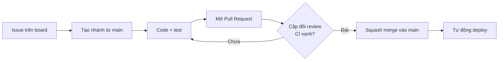

# Quy tắc đóng góp

## 1. Luồng làm việc



1. Mỗi việc là một **issue** trên board của nhóm.
2. Tạo nhánh từ `main` theo quy tắc đặt tên bên dưới.
3. Mở **Pull Request** sớm (có thể để Draft) để người khác thấy tiến độ.
4. Cần **1 người duyệt** (mặc định là cặp đôi) và **CI xanh** mới được merge.
5. Merge bằng **Squash and merge** để lịch sử `main` gọn.

**Không push thẳng vào `main`.**

## 2. Đặt tên nhánh

```
<loại>/<số-issue>-<mô-tả-ngắn>
```

| Loại | Dùng khi | Ví dụ |
|---|---|---|
| `feat` | Tính năng mới | `feat/12-transfer-idempotency` |
| `fix` | Sửa lỗi | `fix/31-daily-limit-race` |
| `docs` | Tài liệu, ADR | `docs/5-adr-04-locking` |
| `infra` | Terraform, CI/CD | `infra/8-rds-module` |
| `test` | Chỉ thêm/sửa test | `test/20-concurrent-transfer` |
| `chore` | Việc lặt vặt | `chore/2-eslint-config` |

## 3. Commit message

Theo [Conventional Commits](https://www.conventionalcommits.org/):

```
<loại>(<module>): <mô tả ngắn, thể mệnh lệnh>
```

Ví dụ:
- `feat(ledger): lock accounts in id order before transfer`
- `fix(risk): count recipients per sliding window`
- `docs(adr): add ADR-05 idempotency in postgres`

Module: `ledger`, `accounts`, `identity`, `risk`, `audit`, `notification`, `worker`, `infra`, `ci`, `docs`.

## 4. Định nghĩa "xong"

Một Pull Request chỉ được merge khi:

- [ ] Code chạy được ở local với `docker compose`
- [ ] Có test cho logic mới; test liên quan đến tiền chạy trên **PostgreSQL thật** (Testcontainers), không mock
- [ ] CI xanh
- [ ] Không có secret trong code, log hay commit
- [ ] Nếu đổi thiết kế: cập nhật tài liệu trong `docs/` hoặc thêm ADR
- [ ] Nếu đổi API: OpenAPI (Swagger) được cập nhật

## 5. Quy tắc bắt buộc khi làm với tiền

- Tiền là `bigint`/string (đơn vị đồng), **không bao giờ** dùng `number` có phần thập phân.
- Mọi thay đổi số dư đi qua `ledger`, trong **một transaction**, kèm bút toán kép và nhật ký.
- Không sửa, không xóa `ledger_entries` và `audit_log`.
- Không đưa số dư vào Redis.

Chi tiết: [docs/03_HIGH_LEVEL_ARCHITECTURE.md](docs/03_HIGH_LEVEL_ARCHITECTURE.md) mục 6 và 9.

## 6. Bảo mật repo

- **Không commit**: `.env`, key AWS, `*.tfvars`, `terraform.tfstate`, file `.pem`/`.key`. Các mẫu này đã có trong `.gitignore`.
- Lỡ commit secret: **báo ngay cho #5**, thu hồi (rotate) key trước rồi mới xóa khỏi lịch sử git. Xóa commit thôi là chưa đủ vì key đã bị lộ.
- GitHub Actions kết nối AWS qua **OIDC**, không lưu access key trong GitHub Secrets.
- Không dùng trigger `pull_request_target` cho workflow chạy code từ fork.

## 7. ADR

Mỗi quyết định kiến trúc quan trọng là một file trong `docs/adr/`, theo [mẫu](docs/adr/0000-template.md). Viết ngay khi chốt quyết định; #1 duyệt.
