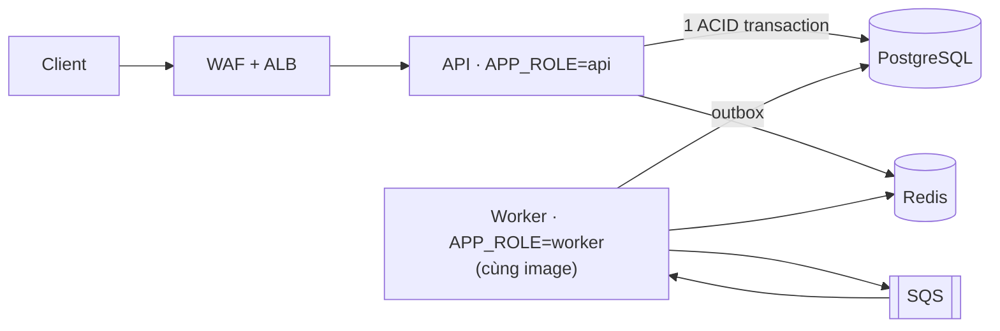

# Digital Banking Simulator

> Educational digital banking backend: double-entry ledger, idempotent transfers, rule-based fraud detection & immutable audit trail.
> NestJS · PostgreSQL · Redis · AWS (ECS Fargate, SQS) · Terraform.

⚠️ **Mô phỏng phục vụ học tập** — đồ án môn *Cloud Application Development* (đề tài #4). Không xử lý tiền thật, không dùng dữ liệu cá nhân thật.

## Hệ thống làm gì

Backend cho một ngân hàng số quy mô nhỏ, tập trung vào 4 điều mà một ngân hàng không được làm sai:

| | Cam kết | Cách làm |
|---|---|---|
| 💰 | **Tiền không bao giờ sai** | Sổ cái bút toán kép; mọi thay đổi số dư nằm trong một transaction PostgreSQL |
| 🔁 | **Không bao giờ trừ tiền hai lần** | Mã yêu cầu (`Idempotency-Key`) lưu cùng transaction với giao dịch |
| 🔍 | **Truy vết được mọi thao tác** | Nhật ký kiểm toán chỉ cho ghi thêm, ghi cùng transaction với nghiệp vụ |
| 🚨 | **Phát hiện gian lận trong vài giây** | 6 luật chạy bất đồng bộ sau mỗi giao dịch; nhân viên review và quyết định |

## Kiến trúc



Modular monolith (NestJS): **một ứng dụng, một image**, chạy thành `api` hoặc `worker` theo biến `APP_ROLE` ([ADR-13](docs/adr/0013-one-app-app-role.md)). Chi tiết và lý do ở [docs/03_HIGH_LEVEL_ARCHITECTURE.md](docs/03_HIGH_LEVEL_ARCHITECTURE.md).

## Cấu trúc repo

```
digital-banking-simulator/
├── backend/              # ứng dụng NestJS duy nhất — xem backend/README.md
│   ├── src/
│   │   ├── common/       # app-role, ErrorCode, filter lỗi, middleware, utils
│   │   ├── config/       # cấu hình + validate biến môi trường lúc khởi động
│   │   ├── database/     # kết nối, TransactionService, migrations
│   │   ├── libs/         # adapter: redis, sqs, cognito
│   │   ├── modules/      # identity, accounts, ledger, risk, audit, outbox, notification, health
│   │   └── scripts/      # seed, công cụ chạy một lần
│   ├── test/             # e2e
│   └── Dockerfile        # một image cho cả api và worker
├── infra/
│   ├── terraform/        # hạ tầng AWS
│   └── local/            # cấu hình cho môi trường local (ElasticMQ...)
├── docs/
│   ├── 01_BUSINESS_ANALYSIS.md
│   ├── 02_REQUIREMENTS_AND_DOMAIN_MODEL.md
│   ├── 03_HIGH_LEVEL_ARCHITECTURE.md
│   ├── DEPLOYMENT_OPTIONS_VPS_VS_CLOUD.md
│   ├── README.md         # bản đồ tài liệu: đọc gì trước, một sự thật ở một chỗ
│   ├── adr/              # Architecture Decision Records
│   ├── plan/             # kế hoạch 10 tuần + playbook theo vai
│   ├── components/       # tài liệu từng component: concept, architecture, ...
│   ├── deliverables/     # 5 bản nộp P1–P5
│   ├── notes/            # ghi chú lập luận, chưa chốt
│   └── superpowers/plans/ # implementation plan (master roadmap)
├── load-tests/           # kịch bản k6
├── .github/              # CI/CD, PR template
└── docker-compose.yml    # PostgreSQL, Valkey, ElasticMQ cho dev local
```

## Chạy local

**Yêu cầu:** Docker, Node.js ≥ 24.

```bash
# 1. Hạ tầng local: PostgreSQL, Valkey (Redis), ElasticMQ (SQS)
cp .env.example .env
docker compose up -d

# 2. Ứng dụng
cd backend
npm install
cp env/.env.example env/.env.development
npm run start:dev          # http://localhost:3000/health/ready · http://localhost:3000/docs
```

Trước khi mở Pull Request: `npm run lint:check && npm run typecheck && npm test && npm run test:e2e` (trong `backend/`). Chi tiết, quy ước và các lệnh khác: [backend/README.md](backend/README.md).

| Dịch vụ | Địa chỉ |
|---|---|
| PostgreSQL | `localhost:5432` |
| Valkey (Redis) | `localhost:6379` |
| ElasticMQ (SQS API) | `http://localhost:9324` |
| ElasticMQ (giao diện xem queue) | `http://localhost:9325` |

## Tài liệu

| Tài liệu | Nội dung |
|---|---|
| [01 — Business Analysis](docs/01_BUSINESS_ANALYSIS.md) | Bài toán, mục tiêu, stakeholder, quy trình, quy tắc nghiệp vụ |
| [02 — Requirements & Domain Model](docs/02_REQUIREMENTS_AND_DOMAIN_MODEL.md) | Use case, FR, NFR, tiêu chí chấp nhận, workload, domain model |
| [03 — High-Level Architecture](docs/03_HIGH_LEVEL_ARCHITECTURE.md) | Kiến trúc, luồng chuyển tiền, dữ liệu, Redis, sự kiện, bảo mật, triển khai |
| [ADR](docs/adr/README.md) | Các quyết định kiến trúc và lý do |
| [Kế hoạch 10 tuần](docs/plan/10_WEEK_PLAN.md) | Phân vai, lịch tuần, quy tắc làm việc |
| [Deployment options](docs/DEPLOYMENT_OPTIONS_VPS_VS_CLOUD.md) | So sánh VPS tự quản và cloud managed services |
| [Bản đồ tài liệu](docs/README.md) | Đọc gì trước, cấu trúc `docs/`, quy tắc một sự thật ở một chỗ |
| [Components](docs/components/index.md) | Mục lục từng module và thành phần hạ tầng, mỗi cái có concept brief và architecture |
| [Master roadmap](docs/superpowers/plans/2026-10-02-master-roadmap.md) | Roadmap 10 tuần: task, phụ thuộc, cổng ra theo tuần |
| [Deliverables P1–P5](docs/deliverables/README.md) | Năm bản nộp và nguồn của từng bản |

## Nhóm

| Vai trò | Thành viên |
|---|---|
| Ledger & Transfer | _TBD_ |
| Identity & Accounts | _TBD_ |
| Async, Events & Audit | _TBD_ |
| Risk & Fraud | _TBD_ |
| Platform & Security | _TBD_ |
| Quality & Observability | _TBD_ |

## Đóng góp

Đọc [CONTRIBUTING.md](CONTRIBUTING.md) trước khi mở Pull Request. Tóm tắt:
- Không push thẳng vào `main`; mọi thay đổi qua Pull Request, cần 1 người duyệt.
- **Không bao giờ commit secret** (`.env`, key AWS, `*.tfvars`, `terraform.tfstate`).
