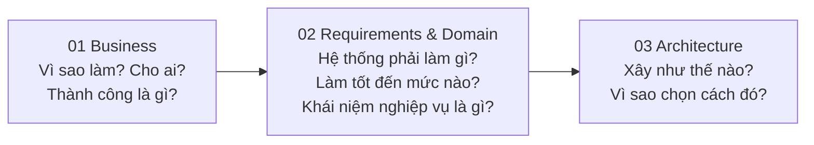
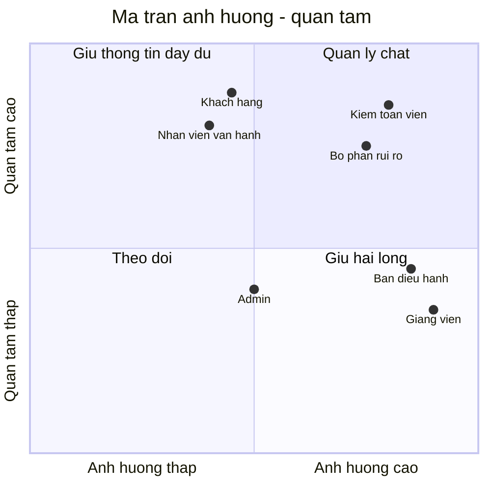
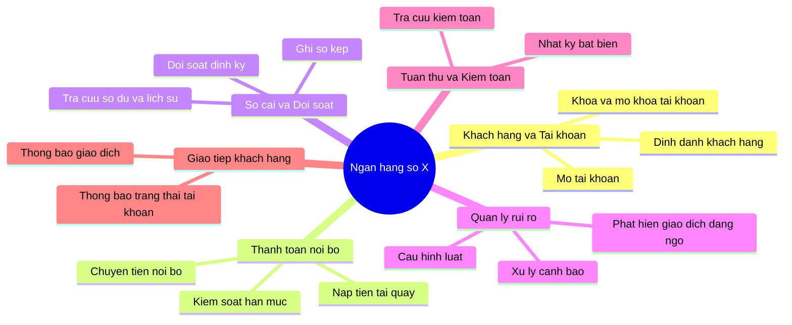
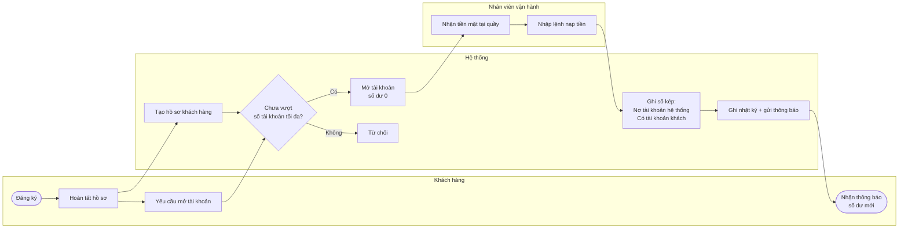
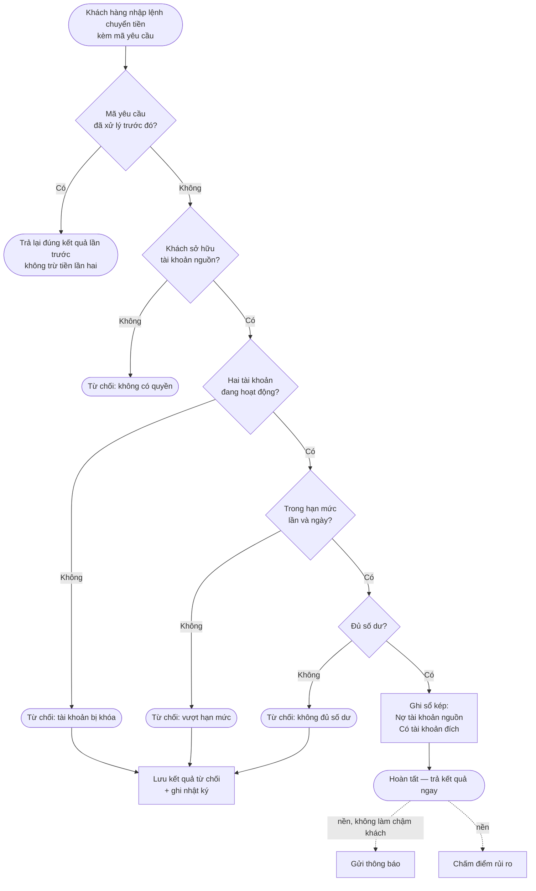
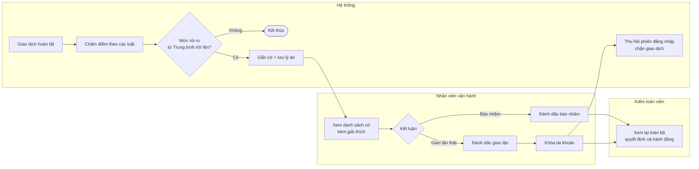
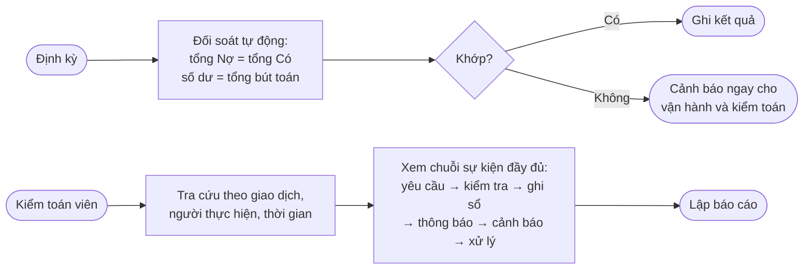

# 01 — Business Analysis: Digital Banking Simulator

| Thuộc tính | Giá trị |
|---|---|
| Tài liệu | 01 / 03 — Phân tích nghiệp vụ |
| Phiên bản | 1.0 — bản nháp để nhóm review |
| Đề tài | #4 Digital Banking Simulator — môn Cloud Application Development |
| Tài liệu tiếp theo | [02_REQUIREMENTS_AND_DOMAIN_MODEL.md](02_REQUIREMENTS_AND_DOMAIN_MODEL.md) → [03_HIGH_LEVEL_ARCHITECTURE.md](03_HIGH_LEVEL_ARCHITECTURE.md) |
| Lưu ý | Mô phỏng giáo dục, không có giao dịch tài chính thật. Mọi con số đánh dấu *(GĐ)* là giả định cần nhóm xác nhận |

**Thứ tự của bộ tài liệu** (theo nguyên tắc *Business first, Technology second* của bài giảng P1):

Tài liệu này **không nhắc tới công nghệ**. Mọi quyết định kỹ thuật nằm ở tài liệu 03.

---

## 1. Bối cảnh

### 1.1 Tình huống *(giả định để mô phỏng)*

**Ngân hàng số X** là một ngân hàng quy mô nhỏ với khoảng **50.000 khách hàng** đã đăng ký, trong đó khoảng **5.000 người** dùng dịch vụ mỗi ngày. Nghiệp vụ cốt lõi gồm mở tài khoản, nạp tiền tại quầy và chuyển tiền nội bộ giữa các khách hàng của ngân hàng.

Hệ thống hiện tại gặp các vấn đề sau:

| # | Vấn đề hiện tại | Hậu quả nghiệp vụ |
|---|---|---|
| P-1 | Khách bấm "chuyển" lần hai khi ứng dụng chậm phản hồi, hệ thống trừ tiền hai lần | Khiếu nại, hoàn tiền thủ công, mất uy tín |
| P-2 | Hai giao dịch xảy ra cùng lúc trên một tài khoản đôi khi làm số dư sai hoặc âm | Sai lệch sổ sách, phải đối soát và sửa tay |
| P-3 | Đối soát số dư làm thủ công vào cuối ngày | Phát hiện sai lệch muộn, tốn nhân sự |
| P-4 | Nhật ký thao tác rời rạc, có thể bị sửa | Không đáp ứng yêu cầu kiểm toán; khó điều tra sự cố |
| P-5 | Giao dịch đáng ngờ chỉ được phát hiện qua báo cáo ngày hôm sau | Tiền gian lận đã đi xa trước khi có người xem |
| P-6 | Tài khoản bị khóa vẫn còn dùng được trong một khoảng thời gian | Kẻ gian tiếp tục thao tác sau khi đã bị phát hiện |

### 1.2 Problem statement

Theo mẫu của bài giảng P1: *"Our organization needs to ______ because ______."*

> **Ngân hàng số X cần** một nền tảng quản lý tài khoản và chuyển tiền nội bộ **không bao giờ sai số dư, không bao giờ trừ tiền hai lần, và truy vết được mọi thao tác**,
> **bởi vì** sai sót về tiền là rủi ro nghiêm trọng nhất của ngân hàng, và kiểm toán yêu cầu chứng minh được ai đã làm gì, khi nào.
>
> **Người dùng chính** là khách hàng cá nhân, nhân viên vận hành và kiểm toán viên.
>
> **Kết quả kỳ vọng:** 0 sai lệch số dư, 0 lần trừ tiền trùng, 100% thao tác có nhật ký, và giao dịch đáng ngờ được đưa tới nhân viên trong vài giây thay vì ngày hôm sau.

---

## 2. Mục tiêu nghiệp vụ và chỉ số thành công

| ID | Mục tiêu | Chỉ số đo | Mục tiêu số | Giải quyết vấn đề |
|---|---|---|---|---|
| **BG-1** | Tiền luôn đúng | Số lần sai lệch số dư phát hiện qua đối soát | **0** | P-2, P-3 |
| **BG-2** | Không bao giờ trừ tiền hai lần | Số giao dịch trùng khi khách gửi lại yêu cầu | **0** | P-1 |
| **BG-3** | Truy vết đầy đủ cho kiểm toán | Tỉ lệ thao tác thay đổi dữ liệu có nhật ký | **100%** | P-4 |
| | | Thời gian kiểm toán viên truy ra toàn bộ diễn biến của một giao dịch | **< 5 phút** *(GĐ)* | P-4 |
| **BG-4** | Phát hiện gian lận sớm | Thời gian từ lúc giao dịch hoàn tất tới lúc có cảnh báo | **< 5 giây** (95% trường hợp) | P-5 |
| | | Số cảnh báo trên 1.000 giao dịch (gánh nặng cho nhân viên) | **≤ 10** *(GĐ)* | P-5 |
| **BG-5** | Phản ứng ngay khi phát hiện rủi ro | Thời gian từ lúc khóa tài khoản tới lúc chủ tài khoản mất quyền truy cập | **Ngay yêu cầu kế tiếp** | P-6 |
| **BG-6** | Trải nghiệm khách hàng tốt | Thời gian phản hồi lệnh chuyển tiền | **< 300 ms** (95% trường hợp) | — |
| | | Mức sẵn sàng của dịch vụ | **99,9%** | — |
| **BG-7** | Chi phí vận hành hợp lý | Chi phí hạ tầng hằng tháng (môi trường phát triển) | **≤ $150–200** | — |

Các mục tiêu này được chuyển thành yêu cầu đo được ở tài liệu 02 (NFR) và được kiểm chứng bằng 5 demo bắt buộc của đề bài.

---

## 3. Stakeholder và người dùng

### 3.1 Danh sách stakeholder

| Stakeholder | Vai trò | Quan tâm chính | Mức ảnh hưởng | Mức quan tâm |
|---|---|---|---|---|
| **Khách hàng** | Người dùng cuối | Tiền đúng, chuyển nhanh, dữ liệu riêng tư | Trung bình | Cao |
| **Nhân viên vận hành** (Bank Operator) | Người dùng nội bộ | Công cụ nạp tiền, xử lý cảnh báo, khóa tài khoản nhanh | Trung bình | Cao |
| **Kiểm toán viên** (Auditor) | Người dùng nội bộ | Nhật ký đầy đủ, không sửa được, tra cứu nhanh | Cao | Cao |
| **Quản trị hệ thống** (Admin) | Người dùng nội bộ | Quản lý người dùng nội bộ, cấu hình hạn mức và luật | Trung bình | Trung bình |
| **Ban điều hành** *(giả định)* | Nhà tài trợ dự án | Giảm rủi ro, chi phí hợp lý | Cao | Trung bình |
| **Bộ phận rủi ro / tuân thủ** *(giả định)* | Chủ sở hữu luật gian lận | Tỉ lệ phát hiện, tỉ lệ báo nhầm | Cao | Cao |
| **Đội kỹ thuật** (nhóm 6 người) | Xây dựng và vận hành | Phạm vi khả thi trong 10 tuần | Trung bình | Cao |
| **Giảng viên / hội đồng** | Đánh giá | Kiến trúc có lý do, đo được, bảo vệ được | Cao | Trung bình |

### 3.2 Ma trận ảnh hưởng – quan tâm

Cách dùng: nhóm "Quản lý chặt" (kiểm toán, rủi ro) quyết định phần audit và phát hiện gian lận nên được ưu tiên rà soát kỹ nhất.

### 3.3 Chân dung người dùng (persona)

| | 👤 Khách hàng | 🧑‍💼 Nhân viên vận hành | 🔍 Kiểm toán viên |
|---|---|---|---|
| **Mục tiêu** | Chuyển tiền cho người thân, bạn bè nhanh và chắc chắn | Phục vụ khách tại quầy; xử lý cảnh báo trong ca làm việc | Chứng minh hệ thống và con người hoạt động đúng quy định |
| **Tần suất** | Vài lần mỗi ngày đến vài lần mỗi tuần | Liên tục trong ca | Định kỳ và khi có sự cố |
| **Nỗi lo** | Bị trừ tiền hai lần; không biết giao dịch đã thành công chưa | Quá nhiều cảnh báo nhầm; thiếu thông tin để quyết định | Nhật ký thiếu hoặc bị sửa; phải ghép dữ liệu từ nhiều nơi |
| **Cần từ hệ thống** | Kết quả rõ ràng ngay lập tức; gửi lại an toàn | Cảnh báo có giải thích "vì sao đáng ngờ"; khóa tài khoản một bước | Tra cứu theo người, thời gian, mã giao dịch; nhật ký không sửa được |
| **Không được phép** | Xem dữ liệu người khác; biết mình bị gắn cờ | Sửa trực tiếp số dư | Thay đổi bất kỳ dữ liệu nào |

---

## 4. Bản đồ năng lực nghiệp vụ (Business Capability Map)

Năng lực nghiệp vụ là **"ngân hàng phải làm được gì"**, chưa phải "hệ thống gồm những service nào". Bài giảng P2 nhấn mạnh: mỗi năng lực không nhất thiết là một microservice.

| Năng lực | Mức độ quan trọng | Lý do |
|---|---|---|
| **Sổ cái và đối soát** | 🔴 Cốt lõi — tự xây, đầu tư nhiều nhất | Đây là nơi quyết định tiền đúng hay sai (BG-1, BG-2) |
| **Thanh toán nội bộ** | 🔴 Cốt lõi | Nghiệp vụ tạo ra giá trị trực tiếp cho khách |
| **Quản lý rủi ro** | 🟠 Hỗ trợ quan trọng — tự xây | Điểm khác biệt, là thành phần AI/Data của đề tài (BG-4) |
| **Tuân thủ và kiểm toán** | 🟠 Hỗ trợ quan trọng | Yêu cầu bắt buộc của ngân hàng (BG-3) |
| **Khách hàng và tài khoản** | 🟡 Hỗ trợ | Cần có nhưng không phải điểm khác biệt |
| **Giao tiếp khách hàng** | ⚪ Chung — dùng dịch vụ có sẵn nếu được | Không tạo khác biệt; v1 chỉ giả lập |

---

## 5. Quy trình nghiệp vụ (to-be)

Các sơ đồ dưới đây chia theo "làn" (swimlane) của từng vai trò.

### 5.1 Quy trình mở tài khoản và nạp tiền

### 5.2 Quy trình chuyển tiền nội bộ (quy trình cốt lõi)

**Điểm nghiệp vụ quan trọng:**
- Mọi nhánh "từ chối" vì lý do nghiệp vụ đều được lưu lại. Gửi lại cùng mã yêu cầu sẽ nhận lại đúng lời từ chối đó (BR-07).
- Ghi nợ và ghi có xảy ra **cùng lúc hoặc không xảy ra**: không bao giờ có trạng thái "đã trừ bên gửi, chưa cộng bên nhận" (BR-02).
- Thông báo và chấm điểm rủi ro chạy ở nền, không bắt khách chờ.

### 5.3 Quy trình xử lý cảnh báo gian lận

**Nguyên tắc:** hệ thống chỉ **gắn cờ**, không tự khóa tài khoản (BR-11). Báo nhầm gây hại thật cho khách hàng, nên con người ra quyết định cuối cùng. Kết luận "báo nhầm / gian lận thật" của nhân viên trở thành dữ liệu để chỉnh luật về sau.

### 5.4 Quy trình kiểm toán và đối soát

---

## 6. Quy tắc nghiệp vụ (Business Rules)

Đây là các quy tắc **không phụ thuộc công nghệ**. Mọi yêu cầu và thiết kế ở tài liệu 02, 03 phải tuân theo.

| ID | Nhóm | Quy tắc | Ví dụ |
|---|---|---|---|
| **BR-01** | Tiền | Một loại tiền duy nhất (VND), tính bằng **số nguyên đồng**, không có phần lẻ | 1.500.000đ, không có 1.500.000,5đ |
| **BR-02** | Sổ cái | Mọi biến động số dư phải đi qua **bút toán kép**: mỗi giao dịch có một bên Nợ và một bên Có bằng nhau. Không ai được sửa trực tiếp số dư | Chuyển 500k: Nợ TK A 500k, Có TK B 500k |
| **BR-03** | Sổ cái | Số dư tài khoản khách hàng **không được âm** (không thấu chi) | TK còn 300k thì không chuyển được 500k |
| **BR-04** | Nạp tiền | Tiền chỉ vào hệ thống qua nghiệp vụ **nạp tiền do nhân viên thực hiện**, ghi Nợ một tài khoản nội bộ của ngân hàng. Tài khoản nội bộ này được phép âm | Nạp 1 triệu: Nợ TK ngân hàng 1tr, Có TK khách 1tr |
| **BR-05** | Chuyển tiền | Chỉ chủ tài khoản được chuyển tiền đi; tài khoản nguồn và đích phải **đang hoạt động** và khác nhau | Không chuyển từ TK của người khác; không chuyển cho chính TK đó |
| **BR-06** | Hạn mức | Mỗi lần chuyển ≤ **50.000.000đ** *(GĐ)*; tổng tiền chuyển đi trong ngày (giờ Việt Nam) ≤ **200.000.000đ** *(GĐ)*. Hạn mức phải đúng **kể cả khi nhiều lệnh đến cùng lúc** | Đã chuyển 180tr trong ngày thì lệnh 30tr bị từ chối |
| **BR-07** | Chống trùng | Một yêu cầu (nhận diện bằng **mã yêu cầu do khách tạo**) chỉ được thực hiện **tối đa một lần**; gửi lại bao nhiêu lần cũng nhận cùng một kết quả | Mạng chậm, ứng dụng gửi lại 3 lần → chỉ trừ tiền 1 lần |
| **BR-08** | Bất biến | Giao dịch đã hoàn tất **không được sửa hay xóa**. Sai sót được xử lý bằng một giao dịch mới (ngoài phạm vi v1) | — |
| **BR-09** | Kiểm toán | Mọi thao tác thay đổi dữ liệu phải được ghi lại **ai — làm gì — khi nào — trên đối tượng nào**; nhật ký không sửa, không xóa được. Không ghi được nhật ký thì thao tác không được thực hiện | — |
| **BR-10** | Quyền xem | Khách chỉ xem dữ liệu của mình. Nhân viên xem dữ liệu khách khi xử lý nghiệp vụ và việc xem đó được ghi lại. Kiểm toán viên chỉ đọc | — |
| **BR-11** | Gian lận | Giao dịch đáng ngờ được **gắn cờ để nhân viên xem**, không tự động chặn hay đảo; chỉ nhân viên được khóa tài khoản | — |
| **BR-12** | Khóa tài khoản | Tài khoản bị khóa **không gửi và không nhận** được tiền; chủ tài khoản **mất quyền truy cập ngay**; dữ liệu không bị xóa | — |
| **BR-13** | Bảo mật thông tin | Khách hàng **không được biết** mình đang bị gắn cờ nghi ngờ (tránh cảnh báo cho kẻ gian) | — |
| **BR-14** | Tài khoản | Mỗi khách hàng có tối đa **3 tài khoản** *(GĐ)* | — |

---

## 7. Phạm vi

### 7.1 Trong phạm vi và ngoài phạm vi

| ✅ Trong phạm vi (v1) | ❌ Ngoài phạm vi |
|---|---|
| Đăng ký, hồ sơ khách hàng, mở tài khoản | Xác minh danh tính thật (eKYC) |
| Nạp tiền tại quầy (giả lập) | Rút tiền, nạp qua ngân hàng khác, cổng thanh toán |
| Chuyển tiền nội bộ trong ngân hàng | Chuyển liên ngân hàng (NAPAS, SWIFT) |
| Xem số dư, lịch sử, trạng thái giao dịch | Sao kê PDF, báo cáo tài chính |
| Nhật ký kiểm toán và tra cứu | Báo cáo theo chuẩn cơ quan quản lý |
| Phát hiện giao dịch đáng ngờ theo luật, nhân viên xử lý cảnh báo | Mô hình học máy (để mở rộng), chặn giao dịch theo thời gian thực |
| Khóa / mở khóa tài khoản | Đảo giao dịch, hoàn tiền (để mở rộng) |
| Thông báo giả lập | Gửi SMS / email thật |
| Một loại tiền (VND) | Đa tiền tệ, tỉ giá |
| Giao tiếp qua API (kiểm thử bằng công cụ) | Ứng dụng di động, giao diện web hoàn chỉnh |

### 7.2 Lý do khoanh phạm vi như vậy

Đề bài yêu cầu *"một vertical slice đủ sâu — không xây cả hệ thống enterprise"*. Phạm vi trên giữ trọn một luồng tiền từ lúc vào hệ thống (nạp tiền) đến lúc di chuyển (chuyển tiền), được giám sát (gắn cờ) và được kiểm toán. Đó đúng là những phần đề bài chấm: tính nhất quán, chống trùng, bảo mật và truy vết.

---

## 8. Giả định và ràng buộc

### 8.1 Giả định nghiệp vụ

| ID | Giả định | Ảnh hưởng nếu sai |
|---|---|---|
| A-1 | 50.000 khách đăng ký, 5.000 khách hoạt động mỗi ngày | Phải tính lại tải ở tài liệu 02 |
| A-2 | Mỗi khách hoạt động gửi khoảng 20 yêu cầu/ngày, khoảng 2 lệnh chuyển tiền | Phải tính lại tải và dung lượng |
| A-3 | Giờ cao điểm (ngày lương, buổi trưa) tải gấp ~10 lần trung bình | Phải tính lại mức tải thiết kế |
| A-4 | Hạn mức 50tr/lần, 200tr/ngày; tối đa 3 tài khoản/khách | Đổi quy tắc BR-06, BR-14 |
| A-5 | Khoảng 1% giao dịch là gian lận (dùng cho dữ liệu đánh giá) | Đổi cách đánh giá phần phát hiện gian lận |

### 8.2 Ràng buộc dự án

| Ràng buộc | Giá trị |
|---|---|
| Nhân sự | 6 sinh viên |
| Thời gian | 10 tuần (môn học 12 tuần) |
| Ngân sách hạ tầng | ≤ $150–200/tháng, ưu tiên dùng credit miễn phí |
| Tính chất | Mô phỏng giáo dục; không xử lý tiền và dữ liệu cá nhân thật |
| Bàn giao | 5 bản nộp P1–P5 và buổi bảo vệ kiến trúc |

---

## 9. Rủi ro nghiệp vụ

| Rủi ro | Khả năng | Tác động | Cách giảm thiểu (chi tiết ở tài liệu 03) |
|---|---|---|---|
| Trừ tiền hai lần khi khách gửi lại yêu cầu | Cao | Rất cao | BR-07: mã yêu cầu, chỉ thực hiện một lần |
| Số dư sai khi nhiều giao dịch cùng lúc | Trung bình | Rất cao | BR-02, BR-03: ghi sổ kép nguyên tử, khóa tài khoản khi ghi sổ |
| Vượt hạn mức nhờ gửi nhiều lệnh song song | Trung bình | Cao | BR-06: kiểm tra hạn mức trong cùng bước ghi sổ |
| Nhật ký bị thiếu hoặc bị sửa | Thấp | Cao | BR-09: không ghi được nhật ký thì không thực hiện thao tác |
| Kẻ gian tiếp tục dùng tài khoản sau khi bị phát hiện | Trung bình | Cao | BR-12: thu hồi quyền truy cập ngay khi khóa |
| Quá nhiều cảnh báo nhầm làm nhân viên bỏ qua cảnh báo thật | Cao | Trung bình | BG-4: giới hạn ≤ 10 cảnh báo/1.000 giao dịch; luật có giải thích; đo tỉ lệ báo nhầm |
| Lộ dữ liệu khách này cho khách khác | Thấp | Rất cao | BR-10: kiểm tra quyền sở hữu ở mọi truy vấn |

---

## 10. Thuật ngữ

| Thuật ngữ | Giải thích |
|---|---|
| **Sổ cái** (ledger) | Danh sách mọi bút toán ghi Nợ / ghi Có. Số dư của một tài khoản là tổng các bút toán của nó |
| **Bút toán kép** (double-entry) | Mỗi giao dịch luôn có ít nhất một bên Nợ và một bên Có với tổng bằng nhau; nhờ đó tổng toàn hệ thống luôn cân bằng |
| **Tài khoản nội bộ / hệ thống** | Tài khoản của chính ngân hàng, dùng làm "nguồn" khi nạp tiền. Được phép âm |
| **Mã yêu cầu** (idempotency key) | Mã duy nhất do ứng dụng của khách tạo cho mỗi lệnh; hệ thống dùng nó để nhận ra lệnh gửi lại |
| **Hạn mức** | Giới hạn số tiền mỗi lần và mỗi ngày của một tài khoản |
| **Đối soát** (reconciliation) | Kiểm tra tổng Nợ = tổng Có và số dư mỗi tài khoản khớp với sổ cái |
| **Cờ gian lận** (fraud flag) | Đánh dấu một giao dịch đáng ngờ kèm danh sách luật đã kích hoạt |
| **Báo nhầm** (false positive) | Giao dịch hợp lệ nhưng bị gắn cờ |
| **Nhật ký kiểm toán** (audit trail) | Bản ghi bất biến về ai làm gì, khi nào, trên đối tượng nào |
| **Giao dịch bị từ chối** (rejected) | Lệnh không được thực hiện vì vi phạm quy tắc nghiệp vụ; vẫn được lưu lại |

---

## 11. Liên kết sang tài liệu tiếp theo

| Từ tài liệu này | Được chuyển thành ở tài liệu 02 |
|---|---|
| Mục tiêu BG-1 … BG-7 | Yêu cầu phi chức năng (NFR) đo được |
| Quy trình mục 5 | Use case và đặc tả use case |
| Quy tắc BR-01 … BR-14 | Yêu cầu chức năng (FR), tiêu chí chấp nhận và bất biến của domain model |
| Năng lực mục 4 | Bounded context của domain model |
| Giả định mục 8.1 | Phân tích workload |
