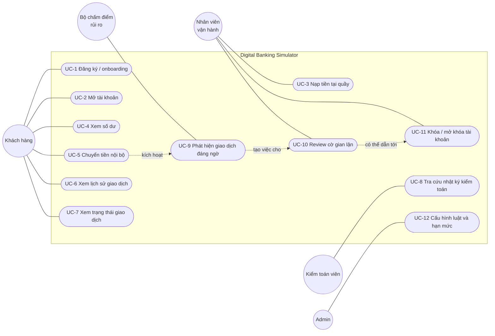
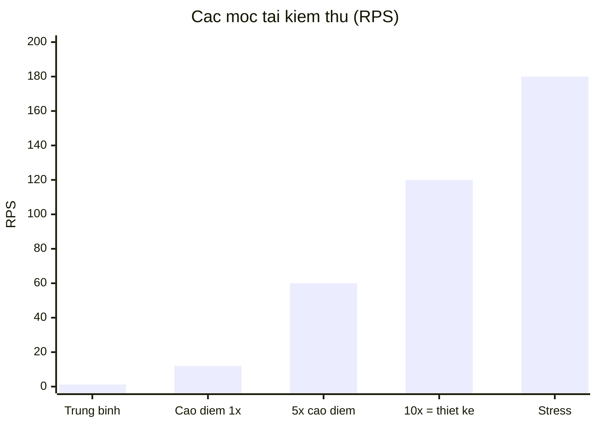
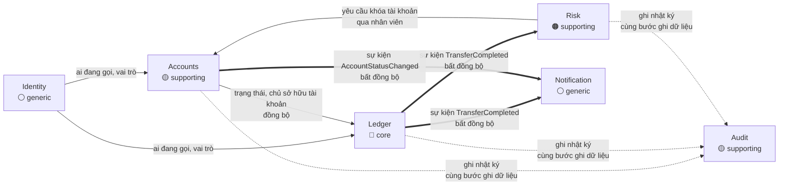
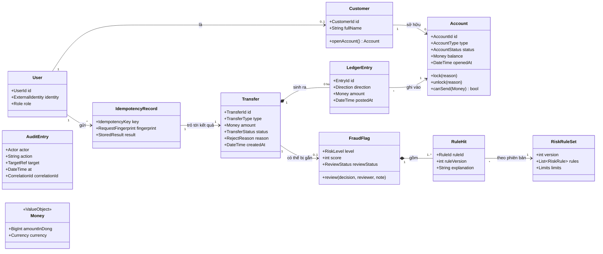
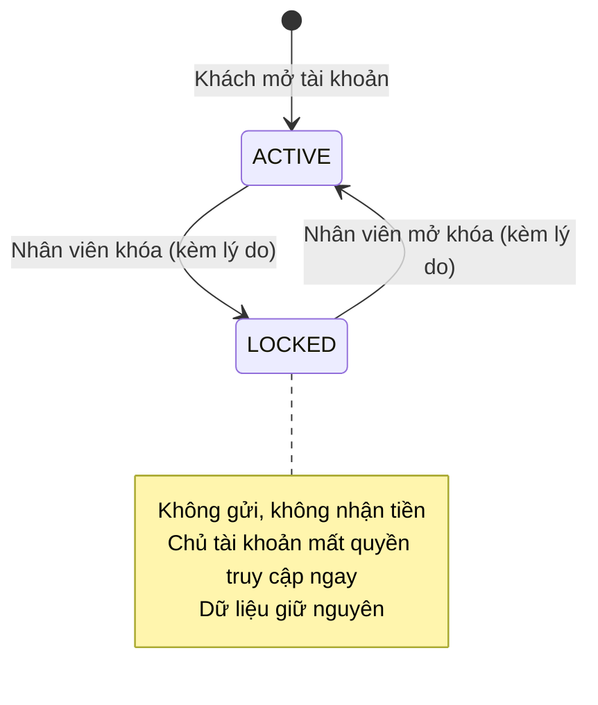
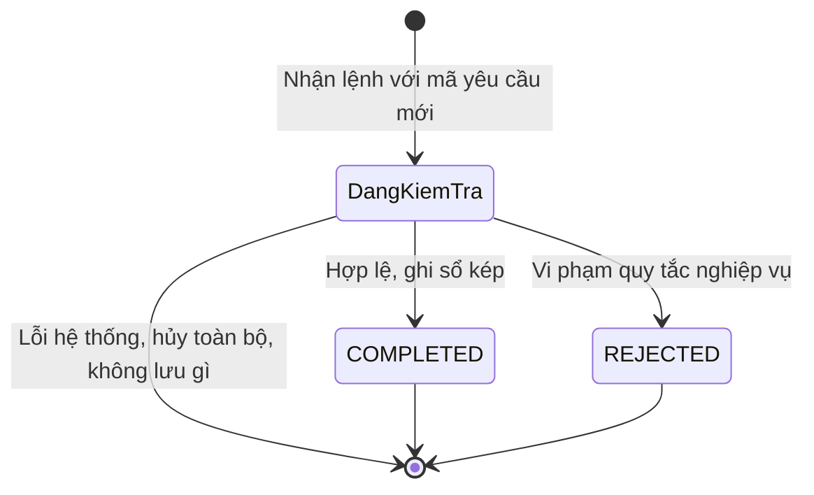
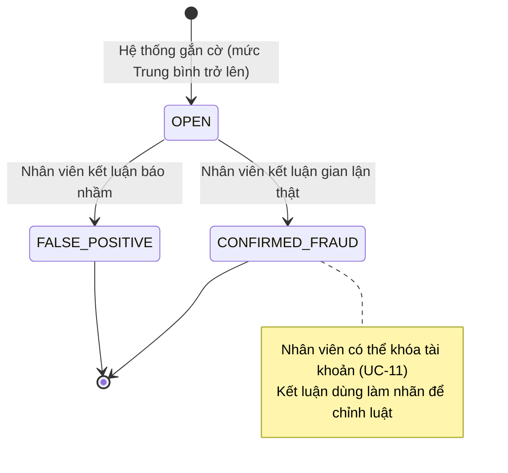

# 02 — Requirements & Domain Model: Digital Banking Simulator

| Thuộc tính | Giá trị |
|---|---|
| Tài liệu | 02 / 03 — Yêu cầu và mô hình miền nghiệp vụ |
| Phiên bản | 1.0 — bản nháp để nhóm review |
| Dựa trên | [01_BUSINESS_ANALYSIS.md](01_BUSINESS_ANALYSIS.md) (mục tiêu BG, quy tắc BR, quy trình) |
| Tài liệu tiếp theo | [03_HIGH_LEVEL_ARCHITECTURE.md](03_HIGH_LEVEL_ARCHITECTURE.md) |
| Quy ước ID | **UC** use case · **FR** yêu cầu chức năng · **NFR** yêu cầu phi chức năng · **AC** tiêu chí chấp nhận · **BR / BG** lấy từ tài liệu 01 |
| Mức ưu tiên | **MoSCoW**: Must (bắt buộc) · Should (nên có) · Could (có thì tốt) · Won't (không làm ở v1) |

Tài liệu gồm hai phần:
- **Phần A — Requirements:** hệ thống phải làm gì và làm tốt đến mức nào.
- **Phần B — Domain Model:** các khái niệm nghiệp vụ, quan hệ, trạng thái và bất biến.

Vẫn chưa chọn công nghệ ở tài liệu này.

---

# PHẦN A — REQUIREMENTS

## 1. Use case

### 1.1 Sơ đồ use case

### 1.2 Danh sách use case

| ID | Use case | Actor | Ưu tiên | Quy tắc liên quan | UC đề bài |
|---|---|---|---|---|---|
| UC-1 | Đăng ký / onboarding | Khách hàng | Must | BR-10 | 1. Customer/account management |
| UC-2 | Mở tài khoản | Khách hàng | Must | BR-14 | 1 |
| UC-3 | Nạp tiền tại quầy | Nhân viên vận hành | Must | BR-01, 02, 04, 07, 09 | 1 |
| UC-4 | Xem số dư | Khách hàng | Must | BR-10 | 2. View account balance |
| UC-5 | **Chuyển tiền nội bộ** | Khách hàng | **Must** | BR-01 … 07, 09, 12 | 3. Internal money transfer |
| UC-6 | Xem lịch sử giao dịch | Khách hàng | Must | BR-10 | 4. Transaction history |
| UC-7 | Xem trạng thái giao dịch | Khách hàng | Must | BR-10 | 5. Transaction status |
| UC-8 | Tra cứu nhật ký kiểm toán | Kiểm toán viên | Must | BR-09, 10 | 6. Audit trail |
| UC-9 | Phát hiện giao dịch đáng ngờ | Bộ chấm điểm (tự động) | Must | BR-11, 13 | 7. Suspicious-transaction detection |
| UC-10 | Review cờ gian lận | Nhân viên vận hành | Must | BR-11 | 7 |
| UC-11 | Khóa / mở khóa tài khoản | Nhân viên vận hành | Must | BR-12 | 1, 7 |
| UC-12 | Cấu hình luật và hạn mức | Admin | Could | BR-06 | — (hỗ trợ UC-9) |

Ngoài phạm vi v1 (**Won't**): đảo giao dịch, rút tiền, chuyển liên ngân hàng, đóng tài khoản, sao kê.

### 1.3 Đặc tả use case chi tiết

#### UC-5 — Chuyển tiền nội bộ *(use case cốt lõi, đặc tả đầy đủ)*

| Mục | Nội dung |
|---|---|
| **Actor chính** | Khách hàng |
| **Mục tiêu** | Chuyển một số tiền từ tài khoản của mình sang một tài khoản khác trong ngân hàng |
| **Tiền điều kiện** | Khách đã đăng nhập; có ít nhất một tài khoản; ứng dụng đã tạo **mã yêu cầu** mới cho lệnh này |
| **Đầu vào** | Tài khoản nguồn, tài khoản đích, số tiền, mã yêu cầu |
| **Hậu điều kiện — thành công** | Có một giao dịch `COMPLETED`; số dư nguồn giảm và đích tăng đúng bằng số tiền; có 2 bút toán (Nợ / Có); có nhật ký; thông báo và chấm điểm rủi ro được kích hoạt |
| **Hậu điều kiện — bị từ chối** | Có một giao dịch `REJECTED` kèm lý do; **không** có bút toán; số dư không đổi; có nhật ký |
| **Hậu điều kiện — lỗi hệ thống** | Không có gì thay đổi; khách có thể gửi lại an toàn với cùng mã yêu cầu |

**Luồng chính:**

| Bước | Khách hàng | Hệ thống |
|---|---|---|
| 1 | Chọn tài khoản nguồn, nhập tài khoản đích và số tiền, xác nhận | |
| 2 | | Kiểm tra mã yêu cầu chưa từng được xử lý cho khách này |
| 3 | | Kiểm tra khách là chủ tài khoản nguồn |
| 4 | | Kiểm tra số tiền > 0 và tài khoản nguồn khác tài khoản đích |
| 5 | | Khóa hai tài khoản để không lệnh nào khác chen vào |
| 6 | | Kiểm tra hai tài khoản đang hoạt động, số tiền trong hạn mức lần và ngày, đủ số dư |
| 7 | | Ghi nợ tài khoản nguồn và ghi có tài khoản đích **trong cùng một bước nguyên tử**, kèm nhật ký |
| 8 | | Lưu kết quả gắn với mã yêu cầu; trả về mã giao dịch và trạng thái `COMPLETED` |
| 9 | Thấy kết quả thành công | Ở nền: gửi thông báo, chấm điểm rủi ro |

**Luồng thay thế và ngoại lệ:**

| Mã | Tại bước | Điều kiện | Hệ thống xử lý |
|---|---|---|---|
| 2a | 2 | Mã yêu cầu đã được xử lý xong, cùng nội dung | Trả lại **đúng** kết quả lần trước; không làm gì thêm |
| 2b | 2 | Mã yêu cầu đã dùng với **nội dung khác** | Từ chối: dùng sai mã yêu cầu |
| 2c | 2 | Lệnh cùng mã đang được xử lý | Chờ lệnh kia xong rồi trả cùng kết quả của nó |
| 3a | 3 | Khách không sở hữu tài khoản nguồn | Từ chối: không có quyền; ghi nhật ký truy cập bị từ chối |
| 4a | 4 | Số tiền ≤ 0 hoặc nguồn = đích | Từ chối: dữ liệu không hợp lệ |
| 6a | 6 | Một trong hai tài khoản bị khóa hoặc không tồn tại | `REJECTED`: tài khoản không hợp lệ |
| 6b | 6 | Vượt hạn mức mỗi lần hoặc mỗi ngày | `REJECTED`: vượt hạn mức |
| 6c | 6 | Không đủ số dư | `REJECTED`: không đủ số dư |
| E1 | Bất kỳ | Lỗi hệ thống (mất kết nối, sự cố máy chủ) | Hủy toàn bộ thay đổi; báo lỗi tạm thời; khách gửi lại với **cùng** mã yêu cầu |

#### UC-3 — Nạp tiền tại quầy

| Mục | Nội dung |
|---|---|
| Actor | Nhân viên vận hành |
| Đầu vào | Tài khoản khách, số tiền, mã yêu cầu |
| Luồng chính | Nhân viên nhập lệnh → hệ thống kiểm tra quyền nhân viên và tài khoản đang hoạt động → ghi **Nợ tài khoản nội bộ ngân hàng / Có tài khoản khách** → nhật ký → thông báo khách |
| Khác UC-5 | Không kiểm tra số dư và hạn mức của tài khoản nội bộ (BR-04); vẫn chống trùng theo mã yêu cầu |
| Ngoại lệ | Người gọi không phải nhân viên → từ chối; tài khoản khách bị khóa → `REJECTED` |

#### UC-10 — Review cờ gian lận

| Mục | Nội dung |
|---|---|
| Actor | Nhân viên vận hành |
| Tiền điều kiện | Có cờ đang ở trạng thái `OPEN` |
| Luồng chính | Xem danh sách cờ (lọc theo mức rủi ro, thời gian) → mở một cờ, thấy giao dịch, các luật đã kích hoạt và giải thích → kết luận **Gian lận thật** hoặc **Báo nhầm**, kèm ghi chú → hệ thống lưu kết luận, người review, thời điểm và ghi nhật ký |
| Ngoại lệ | Cờ đã được review → không cho review lại; người gọi không phải nhân viên → từ chối |

#### UC-11 — Khóa / mở khóa tài khoản

| Mục | Nội dung |
|---|---|
| Actor | Nhân viên vận hành |
| Luồng chính | Chọn tài khoản → nhập lý do → khóa → hệ thống đổi trạng thái sang `LOCKED`, **thu hồi ngay phiên đăng nhập của chủ tài khoản**, ghi nhật ký, thông báo khách (không nêu lý do gian lận — BR-13) |
| Mở khóa | Tương tự, đổi về `ACTIVE`; chủ tài khoản đăng nhập lại được |
| Ngoại lệ | Tài khoản đã ở trạng thái đích → không làm gì, trả trạng thái hiện tại |

#### Các use case còn lại (dạng rút gọn)

| ID | Đầu vào | Đầu ra | Quy tắc chính |
|---|---|---|---|
| UC-1 | Danh tính sau khi đăng ký, họ tên | Mã khách hàng | Mỗi danh tính gắn đúng một khách hàng; gọi lại lần hai trả khách hàng cũ |
| UC-2 | Loại tài khoản | Mã tài khoản, trạng thái `ACTIVE`, số dư 0 | Chỉ mở cho chính mình; tối đa 3 tài khoản |
| UC-4 | Mã tài khoản | Số dư hiện tại | Chỉ chủ tài khoản; luôn là số mới nhất |
| UC-6 | Mã tài khoản, khoảng thời gian, trang | Danh sách giao dịch vào/ra, mới nhất trước | Chỉ chủ tài khoản |
| UC-7 | Mã giao dịch | `COMPLETED` / `REJECTED` + lý do | Chỉ người gửi và người nhận |
| UC-8 | Bộ lọc: người thực hiện, hành động, thời gian, mã liên kết | Danh sách bản ghi nhật ký | Chỉ đọc; chính việc tra cứu cũng được ghi |
| UC-9 | Giao dịch vừa hoàn tất | Cờ (nếu có) với mức rủi ro và danh sách luật | Không chặn, không khóa; không tạo cờ trùng |
| UC-12 | Tham số luật, trọng số, hạn mức | Phiên bản cấu hình mới | Mỗi lần đổi tạo phiên bản mới, không sửa phiên bản cũ; có nhật ký |

---

## 2. Yêu cầu chức năng (FR)

| ID | Yêu cầu: hệ thống phải… | UC | BR | Ưu tiên |
|---|---|---|---|---|
| **Định danh và phân quyền** |||||
| FR-ID-01 | Cho phép người dùng đăng ký, đăng nhập qua một nhà cung cấp danh tính | UC-1 | — | Must |
| FR-ID-02 | Tạo hồ sơ khách hàng lần đầu và trả lại hồ sơ cũ nếu gọi lại | UC-1 | — | Must |
| FR-ID-03 | Phân quyền theo vai trò: khách hàng, nhân viên, kiểm toán viên, admin | Tất cả | BR-10 | Must |
| FR-ID-04 | Kiểm tra quyền sở hữu ở **mọi** thao tác theo tài khoản | UC-4 … 7 | BR-10 | Must |
| FR-ID-05 | Thu hồi quyền truy cập của chủ tài khoản ngay khi tài khoản bị khóa | UC-11 | BR-12 | Must |
| **Tài khoản** |||||
| FR-ACC-01 | Mở tài khoản với số dư 0, tối đa 3 tài khoản/khách | UC-2 | BR-14 | Must |
| FR-ACC-02 | Trả số dư mới nhất của tài khoản | UC-4 | BR-10 | Must |
| FR-ACC-03 | Khóa và mở khóa tài khoản kèm lý do | UC-11 | BR-12 | Must |
| **Sổ cái và giao dịch** |||||
| FR-LED-01 | Nạp tiền bằng bút toán kép từ tài khoản nội bộ | UC-3 | BR-02, 04 | Must |
| FR-LED-02 | Chuyển tiền bằng bút toán kép nguyên tử (Nợ và Có cùng thành công hoặc cùng không xảy ra) | UC-5 | BR-02 | Must |
| FR-LED-03 | Từ chối giao dịch làm số dư khách âm | UC-5 | BR-03 | Must |
| FR-LED-04 | Kiểm tra hạn mức lần và ngày, đúng kể cả khi nhiều lệnh đến cùng lúc | UC-5 | BR-06 | Must |
| FR-LED-05 | Nhận mã yêu cầu cho mọi lệnh nạp/chuyển; thực hiện tối đa một lần; trả cùng kết quả khi gửi lại; từ chối nếu cùng mã khác nội dung | UC-3, 5 | BR-07 | Must |
| FR-LED-06 | Lưu cả giao dịch bị từ chối kèm lý do | UC-5, 7 | BR-07 | Must |
| FR-LED-07 | Không cho sửa hoặc xóa giao dịch và bút toán đã ghi | — | BR-08 | Must |
| FR-LED-08 | Trả lịch sử giao dịch theo trang và khoảng thời gian | UC-6 | BR-10 | Must |
| FR-LED-09 | Trả trạng thái và lý do của một giao dịch | UC-7 | BR-10 | Must |
| FR-LED-10 | Đối soát định kỳ: tổng Nợ = tổng Có, số dư = tổng bút toán; cảnh báo khi lệch | — | BR-02 | Should |
| **Rủi ro và gian lận** |||||
| FR-RSK-01 | Chấm điểm mọi giao dịch hoàn tất **sau khi** giao dịch xong, không làm chậm khách | UC-9 | BR-11 | Must |
| FR-RSK-02 | Áp dụng 6 luật R1–R6 (mục 2.1) với tham số cấu hình được | UC-9 | — | Must |
| FR-RSK-03 | Tạo cờ khi điểm từ mức Trung bình trở lên, lưu danh sách luật đã kích hoạt làm giải thích | UC-9 | BR-11 | Must |
| FR-RSK-04 | Không tạo cờ trùng khi cùng giao dịch được chấm điểm nhiều lần | UC-9 | — | Must |
| FR-RSK-05 | Cho nhân viên xem, lọc và kết luận cờ (Gian lận thật / Báo nhầm) | UC-10 | BR-11 | Must |
| FR-RSK-06 | Không để khách hàng thấy cờ của mình | — | BR-13 | Must |
| FR-RSK-07 | Quản lý cấu hình luật và hạn mức theo phiên bản | UC-12 | — | Could |
| **Kiểm toán** |||||
| FR-AUD-01 | Ghi nhật ký cho mọi thao tác thay đổi dữ liệu; không ghi được thì hủy thao tác | Tất cả | BR-09 | Must |
| FR-AUD-02 | Ghi nhật ký cho việc xem dữ liệu nhạy cảm và các lần bị từ chối quyền | UC-8, 10 | BR-10 | Must |
| FR-AUD-03 | Cho kiểm toán viên tra cứu theo người, hành động, thời gian, mã liên kết | UC-8 | BR-09 | Must |
| FR-AUD-04 | Không cho sửa hoặc xóa nhật ký | — | BR-09 | Must |
| **Thông báo** |||||
| FR-NOT-01 | Thông báo (giả lập) khi giao dịch hoàn tất và khi tài khoản đổi trạng thái | UC-3, 5, 11 | BR-13 | Should |

### 2.1 Danh mục luật phát hiện gian lận (đầu vào cho FR-RSK-02)

| ID | Luật | Ý tưởng | Tham số mặc định *(GĐ)* |
|---|---|---|---|
| R1 | Tần suất cao (velocity) | Quá nhiều lệnh chuyển từ một tài khoản trong thời gian ngắn | > 5 lệnh / 10 phút |
| R2 | Số tiền bất thường | Số tiền lớn hơn nhiều lần mức thường ngày của chính tài khoản đó | > 5 × trung vị 30 ngày |
| R3 | Tài khoản mới chuyển lớn | Tài khoản mới mở đã chuyển số tiền lớn | Tuổi < 24 giờ và số tiền > 10tr |
| R4 | Chuyển vòng | A chuyển cho B rồi B chuyển lại cho A trong thời gian ngắn | Trong 1 giờ |
| R5 | Phân tán (mule) | Một tài khoản chuyển cho nhiều người nhận **mới** | ≥ 5 người nhận mới / 1 giờ |
| R6 | Rút cạn | Chuyển gần hết số dư trong một lần | ≥ 90% số dư trước giao dịch |

Mỗi luật có **trọng số**. Tổng điểm quy ra mức `THẤP / TRUNG BÌNH / CAO`; từ Trung bình trở lên thì tạo cờ.

---

## 3. Tiêu chí chấp nhận (Acceptance Criteria)

Viết theo dạng **Given – When – Then** để chuyển thẳng thành test tự động. Đây cũng là nội dung của các demo bắt buộc.

### UC-5 Chuyển tiền

| ID | Given (cho trước) | When (khi) | Then (thì) |
|---|---|---|---|
| AC-5.1 | A có 1.000.000đ, B có 0đ, cả hai `ACTIVE` | A chuyển 300.000đ cho B | `COMPLETED`; A = 700.000đ, B = 300.000đ; có 2 bút toán; có nhật ký |
| AC-5.2 | A có 100.000đ | A chuyển 300.000đ | `REJECTED` "không đủ số dư"; số dư không đổi; không có bút toán |
| AC-5.3 | Lệnh mã K đã `COMPLETED` | Gửi lại mã K cùng nội dung | Trả đúng kết quả cũ; tổng số giao dịch không đổi |
| AC-5.4 | Chưa có lệnh mã K | Gửi **10 lệnh mã K song song** | Chỉ 1 giao dịch, 2 bút toán; cả 10 phản hồi giống nhau |
| AC-5.5 | Lệnh mã K đã xử lý | Gửi mã K với số tiền khác | Bị từ chối "dùng sai mã yêu cầu" |
| AC-5.6 | A đã chuyển 180tr trong ngày, hạn mức ngày 200tr | Gửi **song song 2 lệnh 15tr** | Đúng 1 lệnh `COMPLETED`, 1 lệnh `REJECTED` "vượt hạn mức"; tổng trong ngày ≤ 200tr |
| AC-5.7 | B đang `LOCKED` | A chuyển cho B | `REJECTED` "tài khoản không hợp lệ" |
| AC-5.8 | A đăng nhập | A chuyển tiền từ tài khoản của C | Từ chối quyền; không lộ thông tin tài khoản C; có nhật ký truy cập bị từ chối |
| AC-5.9 | Nhiều khách chuyển chéo nhau **đồng thời**, gồm 1 tài khoản nhận rất nhiều lệnh | Kết thúc đợt chạy | Tổng Nợ = tổng Có; tổng số dư toàn hệ thống = 0; không tài khoản khách nào âm |
| AC-5.10 | Hệ thống bị ngắt giữa lúc xử lý lệnh mã K | Khách gửi lại mã K | Lệnh được thực hiện đúng một lần |

### UC-11 Khóa tài khoản

| ID | Given | When | Then |
|---|---|---|---|
| AC-11.1 | Khách A đang đăng nhập, tài khoản `ACTIVE` | Nhân viên khóa tài khoản A | Yêu cầu kế tiếp của A bị từ chối (không chờ phiên hết hạn) |
| AC-11.2 | Tài khoản A `LOCKED` | Khách B chuyển tiền cho A | `REJECTED` |
| AC-11.3 | Bất kỳ | Nhân viên khóa hoặc mở khóa | Có nhật ký ghi người thực hiện, lý do, thời điểm |

### UC-8, UC-9, UC-10

| ID | Given | When | Then |
|---|---|---|---|
| AC-8.1 | Kiểm toán viên đăng nhập | Thử sửa hoặc xóa bất kỳ dữ liệu nào | Bị từ chối |
| AC-8.2 | Một giao dịch đã hoàn tất | Kiểm toán viên tra theo mã liên kết | Thấy đủ chuỗi: yêu cầu → ghi sổ → thông báo → (cờ → review) |
| AC-9.1 | Giao dịch khớp luật R6 | Chấm điểm xong | Có cờ nêu rõ luật R6 |
| AC-9.2 | Cùng một giao dịch được chấm điểm 2 lần | Chấm điểm xong | Chỉ có 1 cờ |
| AC-10.1 | Cờ đã được kết luận | Nhân viên kết luận lại | Bị từ chối |
| AC-10.2 | Khách có giao dịch bị gắn cờ | Khách xem lịch sử, trạng thái | Không thấy bất kỳ thông tin nào về cờ |

---

## 4. Yêu cầu phi chức năng (NFR)

| ID | Nhóm | Yêu cầu | Mục tiêu | Cách kiểm chứng | Từ BG |
|---|---|---|---|---|---|
| NFR-COR-01 | Tính đúng | Không mất, không nhân đôi tiền dưới tải đồng thời và gửi lại | 0 sai lệch | AC-5.3, 5.4, 5.9, 5.10 | BG-1, 2 |
| NFR-COR-02 | Tính đúng | Bất biến sổ cái luôn đúng | Tổng Nợ = tổng Có; tổng số dư = 0; số dư khách ≥ 0 | Đối soát sau mỗi load test và định kỳ | BG-1 |
| NFR-COR-03 | Tính đúng | Hạn mức không bị vượt khi đồng thời | 0 lần vượt | AC-5.6 | BG-1 |
| NFR-PERF-01 | Hiệu năng | Thời gian phản hồi chuyển tiền | p95 < 300 ms ở 120 RPS | Load test | BG-6 |
| NFR-PERF-02 | Hiệu năng | Thời gian xem số dư, lịch sử | p95 < 150 ms | Load test | BG-6 |
| NFR-SCAL-01 | Khả năng mở rộng | Chịu tải thiết kế | 120 RPS liên tục 15 phút, lỗi < 0,1% *(GĐ)* | Load test | BG-6 |
| NFR-SCAL-02 | Khả năng mở rộng | Tài khoản "nóng" nhận nhiều lệnh cùng lúc | 20 lệnh/giây vào 1 tài khoản vẫn đúng, p95 < 1 giây *(GĐ)* | Load test riêng | BG-1 |
| NFR-AVL-01 | Sẵn sàng | Mức sẵn sàng ở cấu hình production | 99,9% (≈ 43,8 phút/tháng) | Theo dõi SLO; demo failover | BG-6 |
| NFR-REC-01 | Phục hồi | Lượng dữ liệu tối đa có thể mất (RPO) | ≤ 5 phút | Diễn tập khôi phục | BG-1 |
| NFR-REC-02 | Phục hồi | Thời gian khôi phục dịch vụ (RTO) | ≤ 30 phút | Diễn tập khôi phục | BG-6 |
| NFR-SEC-01 | Bảo mật | Cách ly dữ liệu giữa khách hàng | 0 truy cập chéo | AC-5.8; security test | — |
| NFR-SEC-02 | Bảo mật | Thu hồi truy cập khi khóa tài khoản | Ngay yêu cầu kế tiếp | AC-11.1 | BG-5 |
| NFR-SEC-03 | Bảo mật | Mã hóa dữ liệu khi truyền và khi lưu | 100% kết nối mã hóa; mọi nơi lưu đều mã hóa | Rà cấu hình | — |
| NFR-SEC-04 | Bảo mật | Không có bí mật (mật khẩu, khóa) trong mã nguồn | 0 | Quét mã nguồn trong CI | — |
| NFR-SEC-05 | Bảo mật | Giới hạn tần suất gọi theo người dùng và địa chỉ | 10 lệnh chuyển/phút/khách; 100 yêu cầu/phút/IP *(GĐ)* | Load test vượt ngưỡng | — |
| NFR-SEC-06 | Bảo mật | Mỗi thành phần chỉ có quyền tối thiểu cần thiết | — | Rà phân quyền | — |
| NFR-AUD-01 | Kiểm toán | Thao tác ghi có nhật ký | 100% | Test tự động + rà nhật ký | BG-3 |
| NFR-AUD-02 | Kiểm toán | Truy vết một giao dịch end-to-end | < 5 phút | AC-8.2 | BG-3 |
| NFR-OBS-01 | Quan sát | Mỗi yêu cầu có mã liên kết xuyên suốt mọi thành phần | 100% | Tra log theo mã liên kết | BG-3 |
| NFR-OBS-02 | Quan sát | Có dashboard và cảnh báo tự động cho chỉ số chính | — | Demo dashboard | — |
| NFR-FRD-01 | Gian lận | Thời gian từ giao dịch tới khi có cờ | p95 < 5 giây | Đo trên hệ thống thật | BG-4 |
| NFR-FRD-02 | Gian lận | Số cảnh báo trên 1.000 giao dịch | ≤ 10 *(GĐ)* | Đánh giá trên dữ liệu tổng hợp | BG-4 |
| NFR-FRD-03 | Gian lận | Báo cáo precision, recall, F1 trên tập dữ liệu giữ lại | Có báo cáo | Báo cáo P5 | BG-4 |
| NFR-MNT-01 | Vận hành | Triển khai tự động từ commit | ≤ 15 phút *(GĐ)* | CI/CD | — |
| NFR-MNT-02 | Vận hành | Quay lui về phiên bản trước | ≤ 10 phút *(GĐ)* | Demo rollback | — |
| NFR-COST-01 | Chi phí | Chi phí hạ tầng môi trường phát triển | ≤ $150–200/tháng | Hóa đơn thực tế | BG-7 |

---

## 5. Phân tích workload

### 5.1 Ước lượng tải

| Đại lượng | Giá trị | Cách tính |
|---|---|---|
| Khách đăng ký | 50.000 | A-1 |
| Khách hoạt động mỗi ngày | 5.000 | A-1 |
| Yêu cầu / khách / ngày | ~20 | A-2 |
| Yêu cầu / ngày | 100.000 | 5.000 × 20 |
| Tải trung bình | ≈ 1,2 RPS | 100.000 ÷ 86.400 |
| Hệ số cao điểm | 10 | A-3 |
| **Tải cao điểm** | **≈ 12 RPS** | 1,2 × 10 |
| **Tải thiết kế** | **≈ 120 RPS** | 10 × cao điểm, chừa biên cho tăng trưởng |
| Tỉ lệ đọc / ghi | 80% / 20% | 96 đọc + 24 ghi ở 120 RPS |
| Lệnh chuyển tiền ở tải thiết kế | ≈ 25 / giây | Cận trên: coi mọi thao tác ghi là chuyển tiền |

**Loại workload:** giao dịch trực tuyến (OLTP) — ưu tiên tính nhất quán, giao dịch nguyên tử và độ trễ thấp. Không phải streaming hay phân tích dữ liệu lớn.

### 5.2 Các mốc tải dùng cho kiểm thử

| Mốc | RPS | Mục đích |
|---|---|---|
| 1× cao điểm | 12 | Tải thực tế giờ cao điểm |
| 5× cao điểm | 60 | Tăng trưởng trung hạn |
| 10× cao điểm | 120 | Tải thiết kế — phải đạt NFR-PERF |
| Stress | > 120, tăng dần | Tìm điểm gãy và thành phần gãy trước |

### 5.3 Ước lượng dữ liệu

| Đại lượng | Ước lượng |
|---|---|
| Lệnh chuyển tiền / ngày | ~10.000 |
| Bút toán | ~20.000 dòng/ngày ≈ 7,3 triệu dòng/năm |
| Nhật ký kiểm toán | Nhiều hơn bút toán (mọi thao tác ghi + truy cập nhạy cảm + lần bị từ chối) |
| Mã yêu cầu | ~10.000 dòng/ngày, giữ ≥ 7 ngày |
| Tổng dung lượng | < ~10 GB/năm kể cả chỉ mục — không phải nút thắt |

**Nút thắt thật** không nằm ở dung lượng hay tổng RPS mà ở **tài khoản nóng**: nhiều lệnh vào cùng một tài khoản phải xếp hàng chờ nhau (NFR-SCAL-02).

---

# PHẦN B — DOMAIN MODEL

## 6. Phân vùng miền nghiệp vụ (subdomain và bounded context)

| Bounded context | Loại subdomain | Năng lực nghiệp vụ (tài liệu 01) | Trách nhiệm | Chiến lược |
|---|---|---|---|---|
| **Ledger** | 🔴 Core | Thanh toán nội bộ; Sổ cái và đối soát | Nạp tiền, chuyển tiền, bút toán, hạn mức, chống trùng, đối soát | Tự xây, đầu tư nhiều nhất, test kỹ nhất |
| **Risk** | 🟠 Supporting (điểm khác biệt) | Quản lý rủi ro | Chấm điểm, cờ, review, cấu hình luật | Tự xây |
| **Accounts** | 🟡 Supporting | Khách hàng và tài khoản | Hồ sơ khách, tài khoản, trạng thái khóa | Tự xây, đơn giản |
| **Audit** | 🟡 Supporting | Tuân thủ và kiểm toán | Nhật ký bất biến, tra cứu | Thư viện dùng chung + API tra cứu |
| **Identity** | ⚪ Generic | — | Đăng nhập, vai trò, thu hồi phiên | Dùng dịch vụ có sẵn |
| **Notification** | ⚪ Generic | Giao tiếp khách hàng | Gửi thông báo | Giả lập ở v1 |

### 6.1 Context map

- **Mũi tên liền:** gọi đồng bộ, cần kết quả ngay.
- **Mũi tên đậm:** sự kiện bất đồng bộ, bên phát không chờ bên nhận.
- **Mũi tên đứt:** dùng chung thư viện audit.

## 7. Mô hình miền (domain class diagram)

### 7.1 Aggregate và bất biến

**Aggregate** là cụm đối tượng luôn được thay đổi cùng nhau và luôn phải thỏa các bất biến của nó.

| Aggregate (gốc) | Gồm | Bất biến phải luôn đúng | Quy tắc |
|---|---|---|---|
| **Account** | Account | Số dư tài khoản khách ≥ 0; số dư = tổng bút toán của tài khoản; chỉ chuyển trạng thái theo sơ đồ mục 8.1 | BR-03, 12 |
| **Transfer** | Transfer + LedgerEntry | `COMPLETED` có **đúng 2** bút toán, một Nợ một Có, cùng số tiền; `REJECTED` có **0** bút toán; không đổi sau khi tạo | BR-02, 08 |
| **IdempotencyRecord** | IdempotencyRecord | Duy nhất theo (người gửi, mã yêu cầu); đã có kết quả thì không đổi | BR-07 |
| **Customer** | Customer | Tối đa 3 tài khoản | BR-14 |
| **FraudFlag** | FraudFlag + RuleHit | Mỗi giao dịch tối đa 1 cờ; mỗi luật xuất hiện tối đa 1 lần trong cờ; chỉ review một lần | BR-11 |
| **RiskRuleSet** | RiskRuleSet | Mỗi phiên bản bất biến; thay đổi = phiên bản mới | — |
| **AuditEntry** | AuditEntry | Chỉ thêm, không sửa, không xóa | BR-09 |

**Ngoại lệ có chủ đích:** theo lý thuyết DDD, mỗi lần chỉ nên thay đổi một aggregate. Chuyển tiền lại thay đổi **hai Account và tạo một Transfer** cùng lúc. Nhóm chấp nhận ngoại lệ này và gom cả ba vào **một giao dịch nguyên tử** do một *domain service* (`TransferService`) điều phối. Lý do: BR-02 không chấp nhận trạng thái trung gian "đã trừ, chưa cộng". Chia nhỏ rồi bù trừ sau (saga) sẽ phức tạp hơn mà không đem lại lợi ích ở quy mô này. Quyết định kỹ thuật tương ứng nằm ở tài liệu 03.

### 7.2 Value object

| Value object | Mô tả | Ràng buộc |
|---|---|---|
| **Money** | Số tiền | Số nguyên đồng, ≥ 0 khi là số tiền giao dịch; một loại tiền VND (BR-01) |
| **IdempotencyKey** | Mã yêu cầu do khách tạo | Chuỗi duy nhất, độ dài giới hạn; chỉ có nghĩa trong phạm vi một người gửi |
| **RequestFingerprint** | Dấu vân tay nội dung yêu cầu | Dùng để phát hiện "cùng mã, khác nội dung" |
| **RejectReason** | Lý do từ chối | Một trong: không đủ số dư, vượt hạn mức, tài khoản không hợp lệ |
| **CorrelationId** | Mã liên kết | Gắn với một yêu cầu, đi theo mọi bước xử lý và mọi bản ghi nhật ký |

### 7.3 Quy tắc ghi sổ (posting rules)

Quy ước đơn giản hóa: **Nợ = tiền ra khỏi tài khoản** (số dư giảm), **Có = tiền vào tài khoản** (số dư tăng).

| Nghiệp vụ | Nợ | Có | Điều kiện |
|---|---|---|---|
| Nạp tiền (UC-3) | Tài khoản nội bộ `funding` của ngân hàng | Tài khoản khách | Tài khoản khách `ACTIVE` |
| Chuyển tiền (UC-5) | Tài khoản nguồn | Tài khoản đích | BR-03, 05, 06 |
| Đảo giao dịch *(v2)* | Tài khoản đã nhận | Tài khoản đã gửi | Giao dịch mới, không sửa giao dịch cũ |

**Ví dụ chạy tay** — kiểm chứng bất biến "tổng số dư = 0":

| Bước | `funding` | A | B | Tổng |
|---|---|---|---|---|
| Ban đầu | 0 | 0 | 0 | 0 |
| Nạp 1.000.000đ cho A | −1.000.000 | 1.000.000 | 0 | **0** |
| A chuyển 300.000đ cho B | −1.000.000 | 700.000 | 300.000 | **0** |
| A chuyển 900.000đ cho B → `REJECTED` | −1.000.000 | 700.000 | 300.000 | **0** |

Tài khoản `funding` âm đúng bằng tổng tiền đã đưa vào hệ thống. Tổng mọi số dư luôn bằng 0; nếu khác 0 nghĩa là có lỗi và đối soát phải báo động.

## 8. Vòng đời trạng thái

### 8.1 Tài khoản

Đóng tài khoản nằm ngoài phạm vi v1.

### 8.2 Giao dịch

- `DangKiemTra` (đang kiểm tra) chỉ tồn tại **trong lúc xử lý**, không bao giờ được lưu lại.
- `COMPLETED` và `REJECTED` là **trạng thái cuối**, không chuyển tiếp được (BR-08).
- Lỗi hệ thống không tạo ra trạng thái nào. Khách gửi lại cùng mã yêu cầu và lệnh được xử lý như lần đầu.

### 8.3 Cờ gian lận

## 9. Sự kiện nghiệp vụ (domain events)

| Sự kiện | Phát ra khi | Dữ liệu chính | Bên quan tâm |
|---|---|---|---|
| `TransferCompleted` | Nạp tiền hoặc chuyển tiền hoàn tất | Mã giao dịch, loại, hai tài khoản, số tiền, **số dư nguồn trước giao dịch**, **thời điểm mở của hai tài khoản**, thời điểm, mã liên kết | Risk, Notification |
| `TransferRejected` | Lệnh bị từ chối vì quy tắc nghiệp vụ | Mã giao dịch, tài khoản nguồn, lý do | Risk (tín hiệu tùy chọn) |
| `AccountStatusChanged` | Tài khoản bị khóa hoặc mở khóa | Mã tài khoản, trạng thái mới, người thực hiện | Notification (việc thu hồi phiên làm ngay trong lệnh khóa, không chờ sự kiện) |
| `FraudFlagRaised` | Cờ mới được tạo | Mã giao dịch, mức rủi ro, các luật | (Dashboard nhân viên) |
| `FraudFlagReviewed` | Nhân viên kết luận cờ | Mã cờ, kết luận, người review | Kiểm toán, đánh giá luật |

**Vì sao sự kiện mang "ảnh chụp" dữ liệu** (số dư trước giao dịch, thời điểm mở tài khoản): bên nhận xử lý sau vài giây, lúc đó số dư đã thay đổi. Luật R3 và R6 phải đánh giá theo dữ liệu **tại thời điểm giao dịch**, nên dữ liệu đó phải nằm sẵn trong sự kiện.

---

## 10. Ma trận truy vết (traceability)

Mỗi mục tiêu nghiệp vụ được truy tới yêu cầu và cách chứng minh.

| Mục tiêu (01) | Quy tắc (01) | Use case | Yêu cầu chức năng | Yêu cầu phi chức năng | Chứng minh bằng |
|---|---|---|---|---|---|
| BG-1 Tiền luôn đúng | BR-02, 03, 06 | UC-3, 5 | FR-LED-01 … 04, 10 | NFR-COR-01 … 03, SCAL-02 | Demo **concurrent transfer** (AC-5.6, 5.9) |
| BG-2 Không trừ hai lần | BR-07 | UC-3, 5 | FR-LED-05, 06 | NFR-COR-01 | Demo **duplicate request** (AC-5.3, 5.4, 5.10) |
| BG-3 Truy vết đầy đủ | BR-09, 10 | UC-8 | FR-AUD-01 … 04 | NFR-AUD-01, 02, OBS-01 | Demo **security & audit review** (AC-8.1, 8.2) |
| BG-4 Phát hiện gian lận sớm | BR-11, 13 | UC-9, 10 | FR-RSK-01 … 07 | NFR-FRD-01 … 03 | Báo cáo đánh giá P5 (AC-9.x, 10.x) |
| BG-5 Phản ứng ngay | BR-12 | UC-11 | FR-ID-05, ACC-03 | NFR-SEC-02 | Demo khóa tài khoản (AC-11.1) |
| BG-6 Trải nghiệm tốt | — | UC-4 … 7 | FR-ACC-02, LED-08, 09 | NFR-PERF, SCAL, AVL, REC | Demo **load test** và **failure / recovery** |
| BG-7 Chi phí hợp lý | — | — | — | NFR-COST-01 | Hóa đơn thực tế, báo cáo P4 |

---

## 11. Liên kết sang tài liệu tiếp theo

| Từ tài liệu này | Được dùng ở tài liệu 03 để |
|---|---|
| NFR (mục 4) | Xác định **architecture drivers** — các yêu cầu quyết định kiến trúc |
| Workload (mục 5) | Chọn loại database, tính tài nguyên, kế hoạch load test |
| Bounded context (mục 6) | Chia module của ứng dụng |
| Aggregate và bất biến (mục 7) | Thiết kế transaction, khóa dữ liệu, ràng buộc database |
| Domain events (mục 9) | Thiết kế luồng bất đồng bộ và event contract |
| Tiêu chí chấp nhận (mục 3) | Kế hoạch test và 5 demo bắt buộc |
