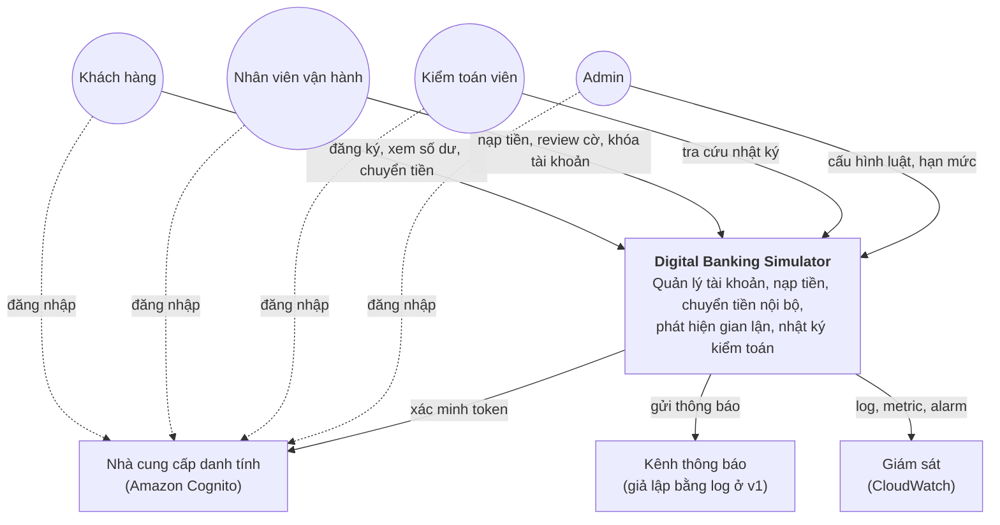
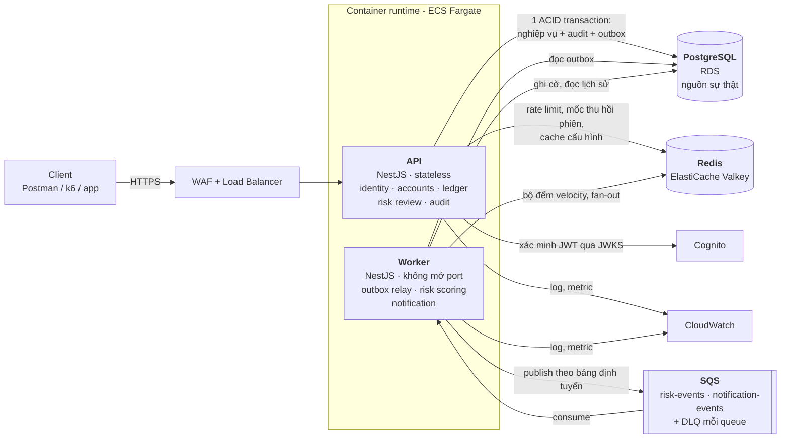
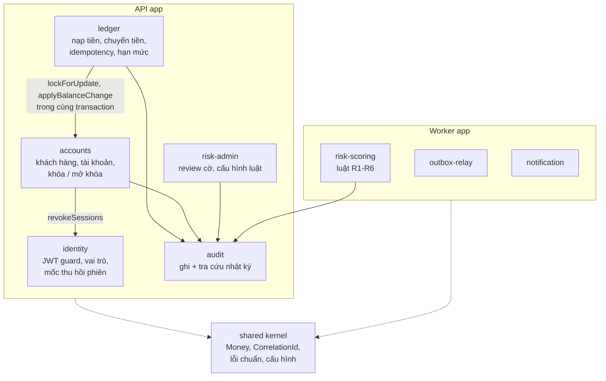
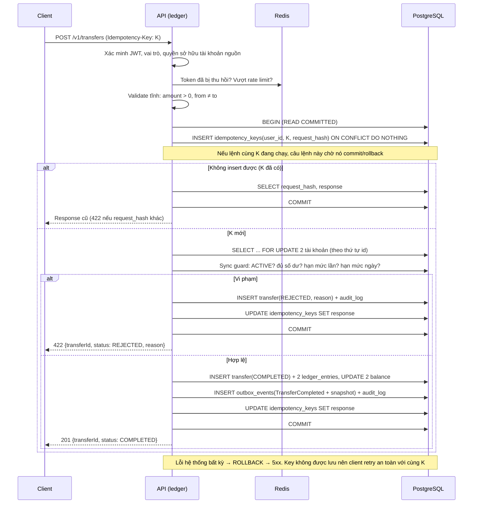
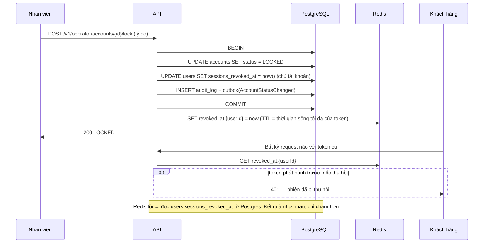
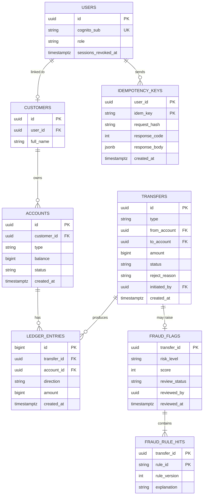
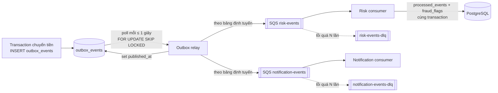
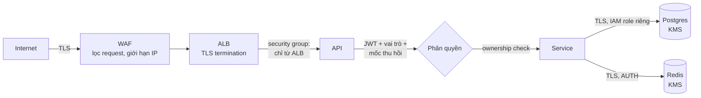
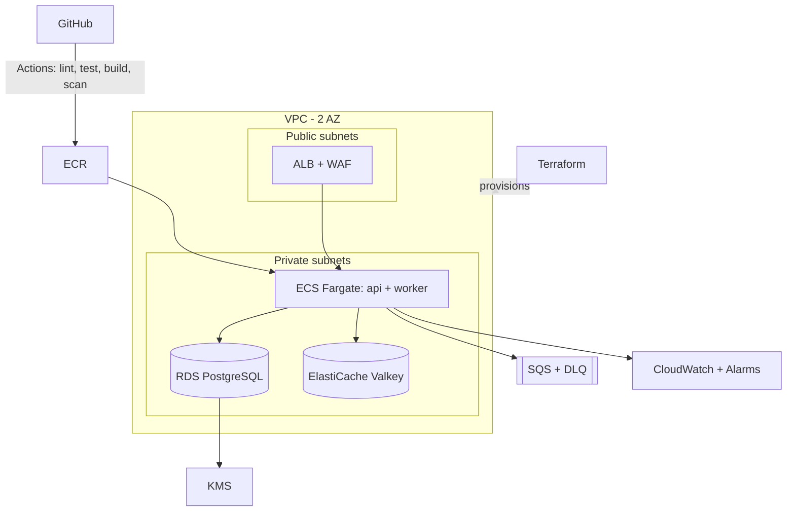
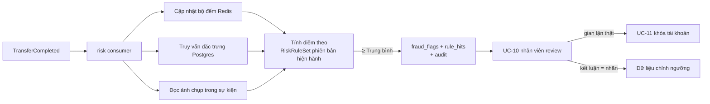

# 03 — High-Level Architecture: Digital Banking Simulator

| Thuộc tính | Giá trị |
|---|---|
| Tài liệu | 03 / 03 — Kiến trúc tổng thể |
| Phiên bản | 1.0 — bản nháp để nhóm review (kế thừa `HIGH_LEVEL_ARCHITECTURE.md` v0.3) |
| Dựa trên | [01_BUSINESS_ANALYSIS.md](01_BUSINESS_ANALYSIS.md) (BG, BR) · [02_REQUIREMENTS_AND_DOMAIN_MODEL.md](02_REQUIREMENTS_AND_DOMAIN_MODEL.md) (UC, FR, NFR, domain model) |
| Tài liệu liên quan | [DEPLOYMENT_OPTIONS_VPS_VS_CLOUD.md](DEPLOYMENT_OPTIONS_VPS_VS_CLOUD.md) (ADR-11) · [plan/10_WEEK_PLAN.md](plan/10_WEEK_PLAN.md) · [adr/](adr/README.md) |
| Lưu ý | Mọi con số đánh dấu *(GĐ)* là giả định. Giá cloud là giá tham khảo, cần kiểm lại theo region |

Tài liệu này trả lời câu hỏi **"xây như thế nào và vì sao"**. Mỗi quyết định đều truy về một yêu cầu ở tài liệu 02.

---

## 1. Architecture drivers

Không phải yêu cầu nào cũng ảnh hưởng tới kiến trúc như nhau. Các yêu cầu dưới đây **quyết định hình dạng** của hệ thống.

| # | Driver | Nguồn | Hệ quả lên kiến trúc |
|---|---|---|---|
| D-1 | Tiền không bao giờ sai, kể cả khi đồng thời | NFR-COR-01…03, BR-02, 03, 06 | Database quan hệ có ACID và khóa hàng; ghi sổ trong **một transaction**; hạn mức kiểm tra trong cùng transaction |
| D-2 | Chống trừ tiền hai lần khi gửi lại | NFR-COR-01, BR-07 | Bảng mã yêu cầu nằm **trong cùng database và cùng transaction** với giao dịch |
| D-3 | Truy vết 100% | NFR-AUD-01, 02, BR-09 | Nhật ký ghi trong cùng transaction; bảng chỉ cho INSERT; mã liên kết xuyên suốt |
| D-4 | Phản hồi chuyển tiền < 300 ms; gian lận phát hiện < 5 giây | NFR-PERF-01, NFR-FRD-01 | Đường đồng bộ chỉ làm phần bắt buộc; thông báo và chấm điểm chạy **bất đồng bộ** qua hàng đợi |
| D-5 | Không mất sự kiện khi sự cố | NFR-FRD-01, FR-RSK-04 | Mẫu **transactional outbox** + hàng đợi có DLQ + consumer idempotent |
| D-6 | Thu hồi truy cập ngay khi khóa tài khoản | NFR-SEC-02, BR-12 | Mốc thu hồi phiên lưu ở DB, cache ở Redis, kiểm tra ở mọi request |
| D-7 | 99,9% ở cấu hình production; RPO ≤ 5 phút, RTO ≤ 30 phút | NFR-AVL-01, REC-01, 02 | Dịch vụ managed có Multi-AZ và PITR; app stateless chạy ≥ 2 bản |
| D-8 | Đội 6 người, 10 tuần, ≤ $150–200/tháng | Ràng buộc dự án (01 §8.2), NFR-COST-01 | **Modular monolith**, ưu tiên managed services, hai cấu hình dev/production, dựng/xóa theo giờ |

## 2. Phong cách kiến trúc và nguyên tắc

**Quyết định:** *modular monolith* — một ứng dụng triển khai được, chia module rõ theo bounded context ở tài liệu 02 — cộng **một worker** xử lý bất đồng bộ dùng chung codebase. **Không dùng microservices** (ADR-01).

| Phương án | Ưu | Nhược với bài toán này | Kết luận |
|---|---|---|---|
| Monolith không chia module | Đơn giản nhất | Code dính chặt, khó giao việc cho 6 người, khó tách sau này | ❌ |
| **Modular monolith + worker** | Một transaction cho chuyển tiền; module rõ ràng; một lần deploy | Scale theo cả khối (chấp nhận được ở 120 RPS) | ✅ |
| Microservices | Scale và deploy độc lập | Chuyển tiền trải qua nhiều service → cần saga, mất ACID đơn giản; vận hành nặng cho 6 người | ❌ |

**Nguyên tắc thiết kế:**

| # | Nguyên tắc | Ý nghĩa |
|---|---|---|
| P-1 | **PostgreSQL là nguồn sự thật duy nhất** | Redis và hàng đợi chỉ phục vụ tốc độ và tách rời; mất chúng không làm sai dữ liệu |
| P-2 | **Đường đồng bộ ngắn nhất có thể** | Request chuyển tiền chỉ làm: xác thực → một transaction DB → trả kết quả |
| P-3 | **Mọi thứ có thể chạy lại đều idempotent** | Lệnh của khách (mã yêu cầu), sự kiện (mã sự kiện), cờ gian lận (khóa theo giao dịch) |
| P-4 | **Module chỉ nói chuyện qua interface** | Không module nào đọc/ghi bảng của module khác trực tiếp |
| P-5 | **Concept first, vendor second** | Thiết kế theo năng lực (database, queue, cache); dịch vụ AWS cụ thể chỉ là một cách hiện thực (ADR-11) |

---

## 3. C4 — Mức 1: System Context



## 4. C4 — Mức 2: Container



| Container | Trách nhiệm | Công nghệ | Trạng thái | Scale |
|---|---|---|---|---|
| **WAF + ALB** | TLS, chặn request độc hại, chia tải, health check | AWS WAF, ALB | — | Managed |
| **API** | Toàn bộ use case đồng bộ; ghi DB trong transaction | NestJS (Node.js, TypeScript) | Stateless | Ngang: 1 → N task |
| **Worker** | Đưa sự kiện từ outbox ra hàng đợi; chấm điểm rủi ro; gửi thông báo | NestJS standalone | Stateless | 1–2 task |
| **PostgreSQL** | Dữ liệu nghiệp vụ, sổ cái, mã yêu cầu, nhật ký, outbox | Amazon RDS for PostgreSQL | **Nguồn sự thật** | Dọc; Multi-AZ ở production |
| **Redis** | Rate limit, mốc thu hồi phiên, bộ đếm gian lận, cache cấu hình | ElastiCache for Valkey | Tạm, dựng lại được | Managed |
| **SQS + DLQ** | Mỗi consumer một queue (`risk-events`, `notification-events`), mỗi queue một DLQ giữ message lỗi | Amazon SQS | Bền vững | Managed |
| **Cognito** | Đăng ký, đăng nhập, cấp JWT, nhóm vai trò | Amazon Cognito | — | Managed |
| **CloudWatch** | Log, metric, dashboard, alarm | Amazon CloudWatch | — | Managed |

---

## 5. Mức 3: Module bên trong ứng dụng

Mỗi module tương ứng một bounded context ở tài liệu 02 §6.



**Quy tắc phụ thuộc giữa module:**
- `ledger` **không** đọc hay ghi bảng `accounts` trực tiếp. Nó gọi các hàm được `accounts` export (`lockForUpdate`, `applyBalanceChange`) và **truyền transaction hiện tại** vào. Nhờ vậy chuyển tiền vẫn là một transaction mà quyền sở hữu dữ liệu không bị phá (P-4).
- `audit` là thư viện được mọi module ghi gọi **trong transaction của chính module đó**.
- Không có phụ thuộc vòng. Dùng lint rule (ví dụ `eslint-plugin-boundaries`) để chặn import sai.

---

## 6. Luồng xử lý quan trọng

### 6.1 Chuyển tiền (UC-5) — critical path



**Các quy tắc của luồng:**

| Quy tắc | Vì sao |
|---|---|
| **Một transaction** cho mã yêu cầu, khóa tài khoản, kiểm tra, bút toán, số dư, nhật ký, outbox | Debit và credit cùng thành công hoặc cùng không xảy ra (BR-02). Không có trạng thái "đã trừ, chưa cộng" |
| Mã yêu cầu **scope theo user**: `UNIQUE(user_id, key)` | Nếu unique toàn cục, user A dùng trùng mã của B sẽ nhận response của B — lộ dữ liệu |
| `INSERT … ON CONFLICT DO NOTHING` | Ở READ COMMITTED, câu lệnh chờ transaction đang giữ cùng key kết thúc. Nó commit → câu lệnh không insert, `SELECT` sau thấy response đã lưu. Nó rollback → câu lệnh insert và xử lý như lệnh mới. Không phát sinh lỗi `23505` nên transaction không bị hủy (AC-5.4) |
| Khóa hai tài khoản **theo thứ tự id** | Hai lệnh A→B và B→A không khóa chéo nhau gây deadlock |
| Sync guard đặt **sau** `FOR UPDATE` | Hạn mức ngày = tổng tiền đi hôm nay của tài khoản nguồn. Tài khoản nguồn đang bị khóa nên lệnh khác phải chờ; không thể hai lệnh cùng lọt hạn mức (AC-5.6) |
| Lưu cả kết quả `REJECTED` cùng mã yêu cầu | Cùng mã luôn trả cùng kết quả (BR-07) |
| Không lưu trạng thái lỗi hệ thống | Rollback thì không có gì để lưu; client gửi lại cùng mã (AC-5.10) |
| READ COMMITTED + `FOR UPDATE`, không dùng SERIALIZABLE | Đủ an toàn nhờ khóa hàng; không phải xử lý lỗi `40001`. Chỉ retry có giới hạn khi deadlock `40P01` hoặc mất kết nối |
| Redis chỉ đứng trước cửa | Mọi kiểm tra quyết định đúng-sai của tiền nằm trong Postgres; tắt Redis thì luồng vẫn đúng |

**Nạp tiền (UC-3)** dùng cùng luồng với `type = DEPOSIT`: tài khoản nguồn là tài khoản SYSTEM `funding`, chỉ vai trò `operator` gọi được, bỏ qua kiểm tra số dư và hạn mức của tài khoản SYSTEM nhưng vẫn có idempotency, bút toán kép, nhật ký và outbox. Script tạo dữ liệu demo cũng gọi API này thay vì sửa số dư trực tiếp, để bất biến luôn đúng.

### 6.2 Khóa tài khoản và thu hồi phiên (UC-11)

JWT được xác minh tại chỗ bằng khóa công khai (JWKS), nên API không tự biết token đã bị thu hồi. Cách xử lý: lưu **mốc thu hồi phiên** của user; token nào phát hành trước mốc đó thì bị từ chối.



- **Nguồn sự thật là cột `users.sessions_revoked_at` trong Postgres.** Redis chỉ là bản cache để không phải đọc DB ở mọi request (P-1).
- Khách đăng nhập lại thì nhận token mới (phát hành sau mốc) và dùng được các tài khoản khác; tài khoản bị khóa vẫn bị chặn bởi kiểm tra `ACTIVE` trong transaction.
- Thu hồi phiên làm **đồng bộ trong lệnh khóa**, không chờ sự kiện, để đạt AC-11.1 ("yêu cầu kế tiếp bị từ chối").

---

## 7. API (tổng quan)

Đặc tả đầy đủ sinh tự động bằng OpenAPI (Swagger) — đây là artifact "API Specification" của P2.

| Method | Path | Vai trò | UC | Ghi chú |
|---|---|---|---|---|
| POST | `/v1/customers/me` | customer | UC-1 | Idempotent: gọi lại trả hồ sơ cũ |
| GET | `/v1/customers/me` | customer | UC-1 | |
| POST | `/v1/accounts` | customer | UC-2 | Tối đa 3 tài khoản |
| GET | `/v1/accounts` | customer | UC-4 | Chỉ tài khoản của mình |
| GET | `/v1/accounts/{id}` | customer | UC-4 | Số dư mới nhất, đọc từ DB |
| GET | `/v1/accounts/{id}/transactions` | customer | UC-6 | Phân trang bằng cursor; lọc thời gian |
| POST | `/v1/transfers` | customer | UC-5 | **Bắt buộc** header `Idempotency-Key` |
| GET | `/v1/transfers/{id}` | customer | UC-7 | Chỉ người gửi / người nhận |
| POST | `/v1/operator/deposits` | operator | UC-3 | **Bắt buộc** header `Idempotency-Key` |
| POST | `/v1/operator/accounts/{id}/lock` | operator | UC-11 | Thu hồi phiên ngay |
| POST | `/v1/operator/accounts/{id}/unlock` | operator | UC-11 | |
| GET | `/v1/operator/fraud-flags` | operator | UC-10 | Lọc theo trạng thái, mức rủi ro |
| POST | `/v1/operator/fraud-flags/{transferId}/review` | operator | UC-10 | Chỉ review một lần |
| GET | `/v1/audit/entries` | auditor | UC-8 | Lọc theo người, hành động, thời gian, `correlationId` |
| GET | `/v1/admin/risk-config` | admin | UC-12 | Phiên bản hiện hành |
| POST | `/v1/admin/risk-config/versions` | admin | UC-12 | Tạo phiên bản mới, không sửa phiên bản cũ |
| GET | `/health/live`, `/health/ready` | — | — | Cho load balancer |

**Quy ước chung:**
- Tiền trong request/response là **string** chứa số nguyên đồng (ví dụ `"500000"`).
- Lỗi trả theo chuẩn `application/problem+json` (RFC 7807), kèm `correlationId`.
- Truy cập tài khoản không thuộc mình trả **404** thay vì 403 để không tiết lộ tài khoản đó có tồn tại (AC-5.8).
- Mọi response có header `X-Correlation-Id`.

---

## 8. Data architecture

### 8.1 Dữ liệu nằm ở đâu

| Loại dữ liệu | Nơi lưu | Lý do |
|---|---|---|
| Nghiệp vụ: khách hàng, tài khoản, giao dịch, bút toán, mã yêu cầu | PostgreSQL | ACID, ràng buộc, khóa hàng — nguồn sự thật |
| Sự kiện chờ gửi | Bảng `outbox_events` → SQS | Không mất sự kiện khi sự cố sau commit |
| Nhật ký kiểm toán | PostgreSQL, bảng chỉ INSERT, ghi **cùng transaction** (tùy chọn export S3 Object Lock) | Bất biến, không có thao tác ghi nào thiếu nhật ký |
| Dữ liệu nóng, tạm thời | Redis | Có TTL, dựng lại được (mục 9). **Không chứa số dư** |
| Backup | RDS automated backup + PITR + snapshot | RPO ≤ 5 phút, RTO ≤ 30 phút. Redis không cần backup |

**Vì sao PostgreSQL** (ADR-02):

| Tiêu chí (từ tài liệu 02) | PostgreSQL | DynamoDB | MongoDB |
|---|---|---|---|
| Transaction nhiều hàng, nhiều bảng | ✅ Tự nhiên | ⚠️ Có nhưng giới hạn, đắt | ⚠️ Có từ v4, phức tạp hơn |
| Khóa hàng `SELECT … FOR UPDATE` | ✅ | ❌ Phải dùng điều kiện ghi | ⚠️ Hạn chế |
| Ràng buộc (UNIQUE, CHECK, FK) để bảo vệ bất biến | ✅ | ❌ | ⚠️ Một phần |
| Truy vấn lịch sử, đối soát, đặc trưng gian lận bằng SQL | ✅ | ❌ Phải thiết kế trước theo truy vấn | ⚠️ |
| Scale ngang | ⚠️ Khó hơn | ✅ | ✅ |
| **Kết luận** | ✅ Phù hợp workload OLTP 120 RPS | Thừa khả năng scale, thiếu thứ cần nhất | Không có lợi thế rõ |

### 8.2 Mô hình dữ liệu vật lý (rút gọn)



Các bảng kỹ thuật không vẽ trong sơ đồ: `outbox_events`, `processed_events`, `audit_log`, `risk_rule_sets`.

| Domain (tài liệu 02) | Bảng | Ràng buộc bảo vệ bất biến |
|---|---|---|
| Account | `accounts` | `CHECK (type = 'SYSTEM' OR balance >= 0)` |
| Transfer + LedgerEntry | `transfers`, `ledger_entries` | `amount > 0`; quyền DB thu hồi UPDATE/DELETE trên `ledger_entries` |
| IdempotencyRecord | `idempotency_keys` | `PRIMARY KEY (user_id, idem_key)` |
| FraudFlag + RuleHit | `fraud_flags`, `fraud_rule_hits` | Khóa chính theo `transfer_id` và `(transfer_id, rule_id)` → không cờ trùng |
| AuditEntry | `audit_log` | Chỉ cấp quyền INSERT và SELECT |
| Customer (tối đa 3 tài khoản) | `accounts` | Kiểm tra trong transaction mở tài khoản, khóa hàng `customers` |

**Quy ước:**
- Tiền là `BIGINT` (đồng), không dùng kiểu số thực.
- Tài khoản SYSTEM `funding` được âm; `SUM(balance mọi tài khoản) = 0` luôn đúng (ví dụ ở tài liệu 02 §7.3).
- Job đối soát định kỳ kiểm tra: tổng Nợ = tổng Có; `balance` mỗi tài khoản = tổng bút toán của nó; tổng số dư = 0.
- Index chính: `ledger_entries(account_id, created_at)` cho lịch sử và hạn mức ngày; `transfers(from_account, created_at)`, `transfers(to_account, created_at)` cho luật gian lận.

---

## 9. Cache & Redis strategy

Theo P2 (slide 30–31), câu hỏi không phải "có dùng Redis không?" mà là **data nào cache được, TTL bao nhiêu, khi nào invalidate, và Redis hỏng thì sao**. Nhóm dùng Redis cho 4 việc, mỗi việc giải quyết một vấn đề cụ thể mà Postgres hoặc bộ nhớ trong từng task không làm tốt.

**Engine:** Valkey trên Amazon ElastiCache (tương thích Redis, mã nguồn mở). Dev local dùng container Valkey. Chọn Serverless hay node cố định ở ADR-12.

### 9.1 Bốn mục đích sử dụng

| # | Mục đích | Không có Redis thì | Cấu trúc | TTL / invalidate | Phục vụ |
|---|---|---|---|---|---|
| **R-1** | **Rate limit toàn cục** theo user và IP | Mỗi task đếm riêng: 2 task → giới hạn thực tế gấp đôi | Counter theo cửa sổ, `INCR` + `EXPIRE` | Hết hạn theo cửa sổ (60 giây) | NFR-SEC-05 |
| **R-2** | **Cache mốc thu hồi phiên** | Mọi request phải đọc `users` từ DB để biết token còn hợp lệ không | `revoked_at:{userId}` | TTL = thời gian sống tối đa của access token; ghi đè khi khóa | NFR-SEC-02 |
| **R-3** | **Bộ đếm đặc trưng gian lận** cho R1 (velocity) và R5 (fan-out) | Mỗi sự kiện phải quét lịch sử bằng SQL; ở 120 RPS là tải phụ đáng kể lên RDS | Sorted set `risk:vel:{accountId}` (member = `transferId`, score = thời điểm); set người nhận `risk:fan:{accountId}` | Cửa sổ trượt bằng `ZREMRANGEBYSCORE`; TTL 1–2 giờ | NFR-FRD-01 |
| **R-4** | **Cache cấu hình** luật và hạn mức | Mỗi lệnh và mỗi sự kiện đọc lại cấu hình từ DB | Key chứa version: `cfg:risk:v{n}` | Cache-aside, TTL 60 giây; đổi cấu hình = version mới | UC-12 |

R-3 an toàn với sự kiện trùng: member của sorted set là `transferId`, nhận cùng sự kiện hai lần vẫn chỉ có một phần tử.

### 9.2 Những gì **không** đưa vào Redis

| Dữ liệu | Lý do |
|---|---|
| **Số dư** | Cache số dư = có lúc khách thấy số cũ, hoặc tệ hơn, một logic nào đó dùng số cũ để quyết định chuyển tiền. Đọc theo khóa chính trong Postgres đã đủ nhanh cho p95 < 150 ms |
| **Trạng thái, lịch sử giao dịch** | Phải đúng ngay sau khi chuyển tiền; truy vấn có index đã đủ nhanh |
| **Mã yêu cầu** | Phải nằm cùng transaction với giao dịch mới đảm bảo "chỉ một lần". Đặt ở Redis sẽ có khe hở giữa Redis và DB |
| **Session** | JWT là stateless; Redis chỉ cache mốc thu hồi |
| **Dữ liệu cá nhân** | Redis chỉ chứa id, số đếm, mốc thời gian và cấu hình |

### 9.3 Nguyên tắc và chế độ khi Redis lỗi

> **Xóa sạch Redis bất kỳ lúc nào, hệ thống vẫn đúng — chỉ chậm hơn hoặc rate limit tạm lỏng hơn.**

| Mục đích | Khi Redis không trả lời | Lý do |
|---|---|---|
| R-1 Rate limit | **Fail-open** + alarm; WAF vẫn giới hạn theo IP ở biên | Không để một lớp bảo vệ phụ làm sập API |
| R-2 Mốc thu hồi | **Đọc `users.sessions_revoked_at` từ Postgres** | Kết quả như nhau, chậm hơn vài ms |
| R-3 Bộ đếm | **Truy vấn SQL** trên `transfers` | Kết quả như nhau, tốn tải DB hơn |
| R-4 Cấu hình | **Đọc thẳng Postgres** | Bảng nhỏ |

Client Redis đặt timeout ngắn (≤ 50 ms *(GĐ)*) và circuit breaker để Redis chậm không kéo latency API vượt SLO. Số lần rơi về đường dự phòng là một metric (mục 14).

### 9.4 Đo được lợi ích

| Mục đích | Thí nghiệm ở P4/P5 |
|---|---|
| R-1 | Load test vượt giới hạn với 2 task API: có Redis → số request được chấp nhận đúng bằng giới hạn; không Redis → gấp đôi |
| R-2 | Thời gian từ lúc khóa tài khoản đến lúc request kế tiếp bị từ chối |
| R-3 | CPU và số truy vấn RDS, p95 thời gian gắn cờ ở 120 RPS, khi bật và tắt bộ đếm Redis |

---

## 10. Bất đồng bộ: outbox và event



**Mỗi consumer một queue riêng.** Một queue SQS giao mỗi message cho **một** consumer duy nhất. Nếu risk và notification đọc chung một queue, mỗi sự kiện chỉ tới được một trong hai. Vì vậy relay gửi mỗi sự kiện tới **mọi queue quan tâm** theo bảng định tuyến (bảng sự kiện bên dưới), và mỗi queue có DLQ riêng để lỗi của consumer này không chặn consumer kia.

| Thành phần | Thiết kế | Đảm bảo |
|---|---|---|
| **Outbox** | Sự kiện ghi trong cùng transaction với nghiệp vụ | Commit thì chắc chắn có sự kiện; rollback thì không có |
| **Relay** | `SELECT … WHERE published_at IS NULL ORDER BY id LIMIT n FOR UPDATE SKIP LOCKED` → gửi tới từng queue theo bảng định tuyến → set `published_at`; job dọn sau 7 ngày *(GĐ)* | Nhiều task không lấy trùng; sự cố giữa chừng thì gửi lại cho mọi queue (**at-least-once**) |
| **SQS standard** | Mỗi consumer một queue + một DLQ; visibility timeout; chuyển DLQ sau N lần lỗi *(GĐ: 5)* | Không mất message; consumer lỗi không ảnh hưởng consumer khác; không đảm bảo thứ tự |
| **Phương án thay thế** | SNS topic fan-out ra các queue (relay chỉ publish một lần) | Tách producer khỏi danh sách consumer, đổi lại thêm một dịch vụ và khó giả lập ở local. Nhóm chọn bảng định tuyến vì chỉ có 2 consumer và chạy giống hệt nhau ở local (ElasticMQ) lẫn AWS. Ghi trong ADR-03 |
| **Consumer** | Ghi `processed_events(consumer, event_id)` cùng transaction với tác động | Sự kiện trùng bị bỏ qua (**effectively-once**) |
| **Thứ tự** | Không consumer nào phụ thuộc thứ tự sự kiện | An toàn với SQS standard |

**Event là contract**, mang **ảnh chụp tại thời điểm giao dịch** để consumer không đọc trạng thái hiện tại (đã đổi):

```json
{
  "eventId": "uuid",
  "eventType": "TransferCompleted",
  "occurredAt": "2026-10-01T10:00:00Z",
  "correlationId": "uuid",
  "transferId": "uuid",
  "type": "TRANSFER",
  "fromAccountId": "uuid",
  "toAccountId": "uuid",
  "amount": "500000",
  "fromBalanceBefore": "520000",
  "fromAccountCreatedAt": "2026-09-30T08:00:00Z",
  "toAccountCreatedAt": "2026-01-15T08:00:00Z"
}
```

**Bảng định tuyến sự kiện** (relay dùng bảng này):

| Event | Phát ra khi | Gửi tới queue |
|---|---|---|
| `TransferCompleted` | Nạp tiền hoặc chuyển tiền hoàn tất | `risk-events`, `notification-events` |
| `TransferRejected` | Lệnh bị từ chối | `risk-events` (tín hiệu tùy chọn) |
| `AccountStatusChanged` | Khóa / mở khóa tài khoản | `notification-events` |

---

## 11. Xử lý sự cố

| Kịch bản | Cơ chế | Bằng chứng |
|---|---|---|
| Ghi nợ xong, ghi có lỗi | Một transaction → rollback toàn bộ | Kill task giữa transfer |
| Client timeout rồi gửi lại | Mã yêu cầu → trả kết quả cũ | AC-5.3, 5.10 |
| Hai lệnh cùng mã đến đồng thời | `ON CONFLICT DO NOTHING` chờ lệnh đầu | AC-5.4 |
| Lệnh bị REJECTED rồi gửi lại cùng mã | Trả lại REJECTED cũ | AC-5.3 |
| Ghi nhật ký lỗi | Cả transaction rollback (fail-closed) | Test tự động |
| Sự cố sau commit, trước khi gửi sự kiện | Outbox: relay gửi lại | Kill worker rồi bật lại |
| Consumer nhận sự kiện trùng | `processed_events`; bộ đếm Redis dùng `transferId` làm member | AC-9.2 |
| Consumer lỗi liên tục | Retry + backoff → DLQ + alarm | Inject lỗi consumer |
| Hai lệnh đồng thời trên cùng tài khoản | Khóa hàng theo thứ tự id; retry có giới hạn khi deadlock | AC-5.9 |
| **Redis down hoặc chậm** | Timeout ngắn + circuit breaker; chế độ dự phòng mục 9.3 | Tắt Redis giữa load test |
| **Redis mất dữ liệu** (restart, failover) | Bộ đếm và cache tự dựng lại; mốc thu hồi đọc lại từ Postgres | Flush Redis rồi chạy AC-11.1 |
| Dịch vụ thông báo lỗi | Bất đồng bộ, không ảnh hưởng chuyển tiền; circuit breaker | Inject lỗi notification |
| DB primary lỗi | RDS Multi-AZ failover (cấu hình production) | Demo failover tuần 8 |

---

## 12. Bảo mật



| Lớp | Biện pháp | NFR |
|---|---|---|
| **Biên** | WAF; rate limit toàn cục theo user/IP (R-1) | NFR-SEC-05 |
| **Định danh** | Cognito với nhóm `customer` / `operator` / `auditor` / `admin`; JWT xác minh bằng JWKS; access token sống ngắn *(GĐ: 15 phút)* | FR-ID-01, 03 |
| **Thu hồi** | Mốc `sessions_revoked_at` trong DB + cache Redis (mục 6.2) | NFR-SEC-02 |
| **Phân quyền** | Guard theo vai trò **cộng** kiểm tra sở hữu trong service ở mọi truy vấn theo tài khoản; mã yêu cầu scope theo user; trả 404 cho tài nguyên không thuộc mình | NFR-SEC-01 |
| **Mã hóa** | TLS ở ALB, tới RDS, tới ElastiCache; mã hóa at-rest bằng KMS cho RDS, ElastiCache, S3 | NFR-SEC-03 |
| **Bí mật** | Secrets Manager; không có bí mật trong repo hay image; quét bí mật trong CI | NFR-SEC-04 |
| **Quyền tối thiểu** | IAM role riêng cho task API và worker; DB role riêng cho risk consumer (chỉ đọc giao dịch, chỉ ghi cờ); Redis và RDS chỉ mở cho security group của app | NFR-SEC-06 |
| **Kiểm toán** | Nhật ký ghi trong transaction; ghi cả truy cập nhạy cảm và lần bị từ chối; kiểm toán viên chỉ đọc | NFR-AUD-01 |
| **Threat model** | STRIDE cho luồng chuyển tiền và nạp tiền (P3) | — |

---

## 13. Triển khai (baseline AWS)



### 13.1 Hai cấu hình môi trường

| | Local | Dev (cloud) | Production (demo HA, đo SLO) |
|---|---|---|---|
| Chạy ở | `docker compose` trên máy cá nhân | AWS, dựng/xóa theo giờ làm việc | AWS, bật trong các đợt demo và đo |
| PostgreSQL | Container | RDS Single-AZ, instance nhỏ | RDS Multi-AZ |
| Redis | Container Valkey | 1 node nhỏ hoặc Serverless | Có replica (Serverless có sẵn Multi-AZ) |
| API | 1 process | 1 task | ≥ 2 task trên 2 AZ |
| Worker | 1 process | 1 task | 1–2 task |
| Hàng đợi | ElasticMQ (tương thích SQS) | SQS | SQS |
| Mục tiêu availability | — | Không cam kết | 99,9% |

### 13.2 Chi phí và các lựa chọn ảnh hưởng chi phí

| Hạng mục | Lựa chọn | Ghi chú |
|---|---|---|
| Redis | Node `cache.t4g.micro` ≈ $9/tháng hoặc Serverless Valkey tối thiểu ≈ $6/tháng | ADR-12 |
| Egress mạng | NAT Gateway (≈ $30+/tháng) · VPC endpoints · task ở public subnet chỉ nhận traffic từ ALB | ADR-10; mỗi IPv4 public đều tính phí theo giờ |
| Tổng cấu hình dev 24/7 | ≈ $70–85/tháng (US East, ước lượng) | Chi tiết ở `DEPLOYMENT_OPTIONS_VPS_VS_CLOUD.md` |
| Dựng/xóa theo giờ làm việc | ≈ $45–75 cho 10 tuần | Nằm trong credit AWS $200 |

**Connection pool:** `số task × pool size ≤ max_connections` của RDS. Instance nhỏ có `max_connections` thấp nên chốt pool nhỏ và tính tổng cho cả cấu hình production.

### 13.3 Deploy và rollback

| Bước | Cách làm |
|---|---|
| Build | Mỗi commit vào nhánh chính → lint, test (gồm Testcontainers), build image, quét lỗ hổng, đẩy lên ECR với tag = commit SHA |
| Migration | Chạy như một bước riêng trước deploy, theo kiểu backward-compatible: **expand → migrate → contract** |
| Deploy | ECS rolling update; task mới phải qua health check `/health/ready` mới nhận traffic |
| Rollback | Cập nhật service về task definition trước đó (image cũ); migration kiểu expand nên schema vẫn tương thích |

---

## 14. Quan sát và SLI/SLO

| SLI | Đo ở đâu | SLO đề xuất |
|---|---|---|
| Tỉ lệ chuyển tiền thành công (không tính REJECTED) | API | ≥ 99,9% |
| Latency chuyển tiền p95 / p99 | API | p95 < 300 ms |
| Latency đọc p95 | API | < 150 ms |
| Thời gian từ giao dịch tới khi có cờ p95 | Worker | < 5 giây |
| Độ sâu hàng đợi, tuổi message cũ nhất, số message trong DLQ | SQS | DLQ = 0 |
| Kết quả đối soát sổ cái | Job đối soát | 0 lệch |
| Latency Redis, số lần rơi về đường dự phòng, số request bị rate limit | API, Worker | Theo dõi |

- **Log:** JSON có cấu trúc, mỗi dòng có `correlationId`; mã này đi từ API → outbox → sự kiện → consumer → nhật ký kiểm toán.
- **Dashboard:** CloudWatch (hoặc Grafana) theo các SLI trên.
- **Alarm:** error rate, latency vượt SLO, DLQ > 0, đối soát lệch, Redis không truy cập được.
- **Health check:** `/health/ready` báo Redis ở trạng thái *degraded* chứ không *down*, vì hệ thống vẫn chạy được khi không có Redis.

---

## 15. Kiến trúc phát hiện gian lận (P5)

Danh mục luật R1–R6 định nghĩa ở tài liệu 02 §2.1. Phần này mô tả **cách chạy** các luật.

### 15.1 Hai tầng

| Tầng | Chạy khi nào | Hành động | Ví dụ |
|---|---|---|---|
| **Sync guard** (module `ledger`) | Trong transaction, sau `FOR UPDATE` | Chặn cứng → `REJECTED` | Vượt hạn mức lần/ngày, tài khoản bị khóa |
| **Async detection** (worker `risk-scoring`) | Sau commit, qua sự kiện `TransferCompleted` | Chỉ **gắn cờ** | R1–R6 |

Sync guard phải rẻ (chỉ đọc tài khoản đang khóa và tổng tiền đi trong ngày, ≤ 5 ms) và không được làm hỏng giao dịch. Phân tích lịch sử chạy bất đồng bộ nên không ảnh hưởng SLO chuyển tiền. Đánh đổi: giao dịch đáng ngờ đã chuyển xong khi bị phát hiện. V1 chấp nhận vì có nhân viên review; giữ tiền chờ duyệt là hướng mở rộng.

### 15.2 Nguồn dữ liệu cho từng luật

| Luật | Nguồn dữ liệu | Vì sao |
|---|---|---|
| R1 Velocity | Bộ đếm Redis (R-3), dự phòng SQL | Truy vấn lặp lại nhiều nhất |
| R2 Số tiền bất thường | SQL lịch sử 30 ngày + `amount` trong sự kiện | Cần thống kê trên lịch sử dài |
| R3 Tài khoản mới chuyển lớn | Ảnh chụp `fromAccountCreatedAt` trong sự kiện | Phải đúng tại thời điểm giao dịch |
| R4 Chuyển vòng | SQL lịch sử 1 giờ | Truy vấn theo cặp tài khoản |
| R5 Fan-out | Bộ đếm Redis (R-3), dự phòng SQL | Truy vấn lặp lại nhiều |
| R6 Rút cạn | Ảnh chụp `fromBalanceBefore` trong sự kiện | Số dư hiện tại đã thay đổi khi consumer chạy |

### 15.3 Luồng dữ liệu



### 15.4 Đánh giá

| Hạng mục | Nội dung |
|---|---|
| **Bộ dữ liệu** | Generator sinh ~100k giao dịch bình thường (số tiền log-normal, mỗi user có thói quen riêng, có nhiễu) và chèn ~1% gian lận theo kịch bản (velocity, mule, rút cạn, chuyển vòng…) kèm nhãn. Chia tập tune và tập giữ lại |
| **Chỉ số chất lượng** | Precision, recall, F1, tỉ lệ báo nhầm, **số cảnh báo / 1.000 giao dịch**, đóng góp từng luật, đường precision–recall khi quét ngưỡng |
| **Chỉ số vận hành** | p95 thời gian chấm điểm, p95 thời gian tới khi có cờ, tải RDS khi bật/tắt bộ đếm Redis |
| **Chống tự chấm bài** | Người viết generator khác người viết luật; có kịch bản luật không cố ý phủ; có giao dịch hợp lệ trông giống gian lận; nêu rõ giới hạn của dữ liệu tổng hợp. Có thể bổ sung bộ dữ liệu công khai (ví dụ PaySim — cần kiểm tra giấy phép) |

### 15.5 Guardrails và chi phí

- **Human-in-the-loop:** hệ thống không tự khóa tài khoản; chỉ nhân viên khóa, mọi hành động có nhật ký.
- **Quyền:** nhân viên xem/kết luận cờ, kiểm toán viên chỉ đọc, khách không thấy cờ (BR-13).
- **Dữ liệu:** không ghi số tài khoản đầy đủ hay thông tin cá nhân vào log của consumer hay vào Redis.
- **Xử lý tiền khi gian lận thật:** ngoài phạm vi v1; hướng mở rộng là giao dịch `REVERSAL` mới qua sổ cái.
- **Chi phí:** rule-based không tốn token; chi phí là CPU worker, truy vấn DB và Redis. Nếu sau này thêm LLM để viết giải thích cho nhân viên thì mới cần phân tích token.

---

## 16. NFR được đáp ứng thế nào

| NFR (tài liệu 02) | Cơ chế kiến trúc | Mục |
|---|---|---|
| NFR-COR-01 Không mất / nhân đôi tiền | Một transaction; mã yêu cầu cùng transaction; khóa hàng theo thứ tự | 6.1 |
| NFR-COR-02 Bất biến sổ cái | Bút toán kép; `CHECK` trên số dư; tài khoản SYSTEM; job đối soát | 8.2 |
| NFR-COR-03 Hạn mức đúng khi đồng thời | Sync guard sau `FOR UPDATE` | 6.1 |
| NFR-PERF-01, 02 Latency | Đường đồng bộ ngắn; tác vụ phụ bất đồng bộ; không gọi dịch vụ ngoài trong request chuyển tiền | 6.1, 10 |
| NFR-SCAL-01 120 RPS | API stateless scale ngang; pool kết nối có giới hạn; Redis giảm tải đọc lặp | 4, 9, 13 |
| NFR-SCAL-02 Tài khoản nóng | Khóa hàng giữ ngắn (transaction chỉ vài câu lệnh); đo riêng bằng load test | 6.1 |
| NFR-AVL-01 99,9% | RDS Multi-AZ, ≥ 2 task trên 2 AZ, health check ALB, Redis có replica | 13.1 |
| NFR-REC-01, 02 RPO / RTO | RDS PITR + snapshot; Redis không cần khôi phục | 8.1 |
| NFR-SEC-01 Cách ly khách | Ownership check ở service; mã yêu cầu theo user; 404 cho tài nguyên không thuộc mình | 7, 12 |
| NFR-SEC-02 Thu hồi ngay | `sessions_revoked_at` + cache Redis | 6.2 |
| NFR-SEC-03…06 | TLS, KMS, Secrets Manager, IAM role riêng, rate limit Redis + WAF | 12 |
| NFR-AUD-01, 02 | Nhật ký trong transaction; chỉ INSERT; `correlationId` xuyên suốt | 8, 14 |
| NFR-OBS-01, 02 | Log JSON có `correlationId`; dashboard; alarm | 14 |
| NFR-FRD-01…03 | Outbox poll ≤ 1 giây; SQS; bộ đếm Redis; bộ đánh giá riêng | 10, 15 |
| NFR-MNT-01, 02 | CI/CD tự động; ECS rolling update; rollback bằng task definition | 13.3 |
| NFR-COST-01 | Cấu hình dev/production; dựng/xóa theo giờ; tránh NAT | 13.2 |

## 17. Demo bắt buộc

| Demo đề bài | Cách làm | Tiêu chí chấp nhận |
|---|---|---|
| **Concurrent transfer** | Nạp tiền qua API; N luồng chuyển chéo nhau gồm một tài khoản nóng; kiểm tra bất biến sau khi chạy | AC-5.6, 5.9 |
| **Duplicate request** | Gửi cùng mã yêu cầu nhiều lần, **song song** | AC-5.3, 5.4, 5.5 |
| **Failure / recovery** | Kill task giữa lệnh; kill worker rồi bật lại, outbox xử lý bù; consumer lỗi → DLQ; **tắt Redis giữa load test, bất biến vẫn đúng** | AC-5.10 |
| **Security & audit review** | A truy cập dữ liệu B → 404 và có nhật ký; dùng lại mã yêu cầu của B không lộ gì; **khóa tài khoản → request kế tiếp bị từ chối**; kiểm toán viên chỉ đọc; truy vết một giao dịch theo `correlationId` | AC-5.8, 8.1, 8.2, 11.1 |
| **Load test** | k6 ở 12 → 60 → 120 RPS + tài khoản nóng; stress vượt 120 RPS tìm điểm gãy; so sánh tải RDS khi bật/tắt bộ đếm Redis | NFR-PERF, SCAL |

## 18. Architecture Decision Records

Tối thiểu 3 ADR theo đề bài; nhóm dự kiến 12.

| # | Quyết định | Phương án so sánh | Driver |
|---|---|---|---|
| ADR-01 | Modular monolith + worker | Monolith thuần · Microservices | D-1, D-8 |
| ADR-02 | PostgreSQL làm sổ cái | DynamoDB · MongoDB | D-1, D-2 |
| ADR-03 | Chuyển tiền đồng bộ, tác vụ phụ bất đồng bộ (outbox + SQS) | Full async / saga · Đồng bộ toàn bộ | D-4, D-5 |
| ADR-04 | Khóa `FOR UPDATE` theo thứ tự id ở READ COMMITTED | Optimistic version · SERIALIZABLE | D-1 |
| ADR-05 | Idempotency trong Postgres, scope theo user, `ON CONFLICT DO NOTHING` | Redis · Không idempotency | D-2 |
| ADR-06 | Cognito; ECS Fargate | JWT tự quản; EKS | D-8 |
| ADR-07 | NestJS/TypeScript và tầng truy cập dữ liệu | Spring Boot · FastAPI; TypeORM vs Kysely vs Prisma | D-8 |
| ADR-08 | Fraud rule-based, gắn cờ bất đồng bộ | ML từ đầu · Chặn đồng bộ · Không phát hiện | D-4 |
| ADR-09 | Nạp tiền qua tài khoản SYSTEM, đi qua sổ cái | Sửa số dư trực tiếp · Không có nạp tiền | D-1 |
| ADR-10 | Egress mạng cho Fargate | NAT Gateway · VPC endpoints · Public subnet + security group | D-8 |
| ADR-11 | Cloud managed services | VPS tự quản · Kết hợp | D-7, D-8 |
| ADR-12 | Redis (Valkey) cho rate limit, mốc thu hồi, bộ đếm, cấu hình; **không** cache số dư | Không cache · Bộ nhớ từng task · Cache cả số dư; Serverless vs node | D-6, D-4 |

## 19. Tech stack

| Mảng | Lựa chọn | Ghi chú |
|---|---|---|
| Runtime / ngôn ngữ | Node.js LTS + TypeScript (strict) | Một ngôn ngữ cho API và worker |
| Framework | NestJS, monorepo | Mỗi module Nest = một module ở mục 5 |
| Truy cập DB | TypeORM (CRUD, migration) + **SQL tường minh trong `QueryRunner` cho luồng chuyển tiền** | Cần `ON CONFLICT`, `FOR UPDATE`, thứ tự khóa; Kysely là phương án thay thế (ADR-07) |
| Migration | TypeORM migrations, expand → migrate → contract | Bước riêng trong pipeline |
| Redis | `ioredis` + storage Redis cho `@nestjs/throttler` | Timeout ngắn, circuit breaker, mọi key có TTL |
| Validation | `class-validator` + `ValidationPipe` (whitelist) | |
| API doc | `@nestjs/swagger` | Artifact API Specification của P2 |
| Auth | Cognito JWT (JWKS) + guard vai trò + mốc thu hồi + ownership check | |
| Queue | `@aws-sdk/client-sqs`, long polling | |
| Resilience | `opossum` (circuit breaker), retry có backoff | Cho Redis và notification |
| Log / metric | `nestjs-pino`, `prom-client` hoặc CloudWatch EMF, `@nestjs/terminus` | |
| Test | Jest + Supertest + **Testcontainers (Postgres, Valkey thật)** | Test đồng thời không được mock DB |
| Load test | k6 | |
| CI/CD, IaC | GitHub Actions, Terraform | |

**Lưu ý với Node/TypeScript khi xử lý tiền:**
- Driver `pg` trả `BIGINT` dạng **string**. Tiền luôn là `bigint`/string ở domain, API và event; không dùng `number` có phần thập phân.
- Node là single-thread, nhưng đúng-sai của đồng thời nằm ở **khóa trong DB**, không ở code ứng dụng hay Redis. Nhiều task chạy song song vẫn an toàn nhờ `FOR UPDATE`.
- Bắt deadlock `40P01` và mất kết nối để retry có giới hạn.

## 20. Câu hỏi còn mở

| # | Câu hỏi | Ảnh hưởng |
|---|---|---|
| 1 | Deadline chính thức của P1–P5? | [plan/10_WEEK_PLAN.md](plan/10_WEEK_PLAN.md) |
| 2 | TypeORM hay Kysely? | ADR-07 |
| 3 | NAT, VPC endpoints hay public subnet? | ADR-10, chi phí |
| 4 | ElastiCache Serverless hay node `cache.t4g.micro`? | ADR-12, chi phí |
| 5 | Nhóm có tài khoản cloud với credit không, hay phải dùng VPS? | ADR-11 |
| 6 | Giá trị: hạn mức, ngưỡng rate limit, thời gian sống token, thời gian giữ mã yêu cầu, tham số luật | BR-06, NFR-SEC-05, FR-RSK-02 |

## 21. Lịch sử thay đổi

| Phiên bản | Thay đổi chính |
|---|---|
| v0.1 | Bản nháp đầu: modular monolith, Postgres, outbox, fraud rule-based |
| v0.2 | Tài khoản SYSTEM + nạp tiền; sync guard sau `FOR UPDATE`; idempotency theo user với `ON CONFLICT`; bỏ trạng thái FAILED; audit chỉ trong transaction; event có ảnh chụp; cấu hình dev/production |
| v0.3 | Thêm Redis với 4 mục đích, danh sách không cache, chế độ khi Redis lỗi |
| **1.0** | Sửa luồng sự kiện: mỗi consumer một queue SQS riêng (một queue chung chỉ giao mỗi message cho một consumer). Tách bộ tài liệu thành 01 Business → 02 Requirements & Domain → 03 Architecture. Thêm architecture drivers, C4 mức 1–3, bảng API, so sánh database, bảng NFR → cơ chế. Thu hồi phiên chuyển sang mốc `sessions_revoked_at` trong DB (Redis chỉ cache). Tách `fraud_flags` và `fraud_rule_hits` |
