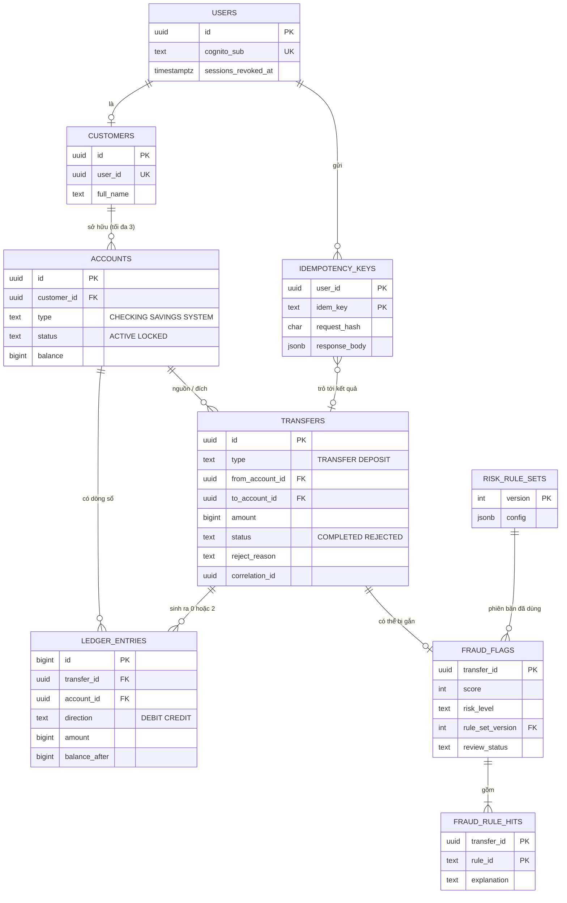

# Database Design

> **Status:** Draft (đề xuất, chờ #1 duyệt) · **Owner:** #1 (schema và migration) · **Cặp đôi:** #3 (outbox, audit), #4 (fraud), #5 (role, RDS) · **Verified against code:** n/a (chưa có migration nào) · **Cập nhật:** 2026-10-06

Tài liệu này chốt **hình dạng cơ sở dữ liệu** của cả hệ thống: bảng nào, cột nào, ràng buộc nào, index nào, ai được ghi, dọn dữ liệu ra sao. Nó phục vụ ba người: #1 viết migration đầu tiên (tuần 1), mọi người review migration của nhau, và P2 (Data Architecture).

Nguồn: [docs/03 §8](../../03_HIGH_LEVEL_ARCHITECTURE.md) (data architecture), [docs/02 §7–8](../../02_REQUIREMENTS_AND_DOMAIN_MODEL.md) (aggregate, bất biến, vòng đời), [FRAUD_DETECTION_GUIDE §5.3](../risk/FRAUD_DETECTION_GUIDE.md) (bảng fraud). Chỗ nào khác các tài liệu đó đều nằm ở [§13](#13-điểm-khác-với-tài-liệu-hiện-tại-và-việc-cần-chốt).

---

## 1. Tóm tắt: 10 quy tắc

| # | Quy tắc | Vì sao |
|---|---|---|
| 1 | **PostgreSQL là nguồn sự thật duy nhất.** Redis và SQS mất thì dựng lại được | P-1 trong docs/03 |
| 2 | **Tiền là `bigint` (đồng)**, luôn `CHECK (amount > 0)` cho số tiền giao dịch | BR-01; `numeric`/`float` sinh sai số |
| 3 | **Bất biến nằm ở DB**, không chỉ ở code: `CHECK`, `UNIQUE`, `FK`, trigger chặn sửa/xóa | Code có lỗi hoặc bị bỏ qua, ràng buộc DB thì không |
| 4 | **Bảng ghi một lần (append-only):** `ledger_entries`, `transfers`, `audit_log`, `risk_rule_sets` bị chặn `UPDATE`/`DELETE` bằng quyền **và** trigger | BR-08, BR-09 |
| 5 | **Trạng thái và loại là `text` + `CHECK`**, không dùng kiểu `ENUM` của Postgres | `ENUM` khó đổi (thêm/bớt giá trị) khi làm migration kiểu expand → contract |
| 6 | **Mọi thời điểm là `timestamptz`**, DB chạy UTC; ranh giới ngày tính bằng `AT TIME ZONE 'Asia/Ho_Chi_Minh'` | Hạn mức ngày theo giờ Việt Nam (BR-06) |
| 7 | **Khóa chính `uuid`** cho thực thể nghiệp vụ, **`bigint identity`** cho bảng chỉ thêm (`ledger_entries`, `audit_log`, `outbox_events`) | uuid khó đoán, lộ ra ngoài API được; identity cho thứ tự và phân trang |
| 8 | **Không có `ON DELETE CASCADE`.** Ngân hàng không xóa dữ liệu; mọi `FK` là `RESTRICT` | Xóa dây chuyền = mất dấu vết |
| 9 | **Mỗi bảng có đúng một module sở hữu**; module khác không đọc/ghi trực tiếp | P-4; xem [§3](#3-bảng-nào-thuộc-module-nào) |
| 10 | **Index theo truy vấn thật**, không theo cảm giác; cái nào cố ý *không* tạo cũng được ghi rõ | Mỗi index làm chậm mọi lệnh ghi; xem [§6](#6-index) |

---

## 2. Bức tranh: 14 bảng



**Năm bảng kỹ thuật không vẽ trong ERD** vì không có quan hệ nghiệp vụ: `outbox_events`, `processed_events`, `audit_log`, `notification_log` và `reconciliation_runs` (bảng mới, xem [§13](#13-điểm-khác-với-tài-liệu-hiện-tại-và-việc-cần-chốt)). Tổng: 9 bảng nghiệp vụ + 5 bảng kỹ thuật = **14 bảng** (chưa kể bảng `migrations` của TypeORM).

---

## 3. Bảng nào thuộc module nào

"Sở hữu" = module duy nhất được viết `INSERT/UPDATE` và quyết định hình dạng bảng. Module khác muốn dữ liệu thì gọi hàm module đó export.

| Module | Bảng sở hữu | Ghi chú |
|---|---|---|
| `identity` | `users` | `sessions_revoked_at` là nguồn sự thật của thu hồi phiên |
| `accounts` | `customers`, `accounts` | Gồm tài khoản SYSTEM `funding` (tạo bằng migration) |
| `ledger` | `transfers`, `ledger_entries`, `idempotency_keys`, `reconciliation_runs` | Duy nhất được đổi `accounts.balance`, **thông qua** `AccountsService.applyBalanceChange` |
| `outbox` | `outbox_events`, `processed_events` | Mọi module ghi sự kiện đều gọi `OutboxWriter.add` |
| `audit` | `audit_log` | Mọi module ghi qua `AuditService.record`, trong transaction của mình |
| `risk` | `fraud_flags`, `fraud_rule_hits`, `risk_rule_sets` | |
| `notification` | `notification_log` | v1 chỉ ghi log |

Ngoại lệ đáng chú ý: `risk` cần **đọc** lịch sử chuyển tiền (luật R2, R4, R5). Thay vì cho `risk` `SELECT` thẳng bảng `transfers` (vi phạm quy tắc 9), `ledger` cung cấp một **view chỉ đọc** `v_transfer_facts` làm hợp đồng dữ liệu ổn định. Xem [§8](#8-quyền-truy-cập-và-tính-bất-biến-ở-mức-db).

---

## 4. Thiết kế từng bảng

Viết dưới dạng SQL để người viết migration chép được; mọi tên đã theo quy ước ở [§11](#11-migration-và-dữ-liệu-khởi-tạo).

### 4.1 `users`, `customers`

```sql
CREATE TABLE users (
  id                  uuid PRIMARY KEY DEFAULT gen_random_uuid(),
  cognito_sub         text NOT NULL UNIQUE,
  sessions_revoked_at timestamptz,                       -- NULL = chưa từng thu hồi
  created_at          timestamptz NOT NULL DEFAULT now()
);

CREATE TABLE customers (
  id         uuid PRIMARY KEY DEFAULT gen_random_uuid(),
  user_id    uuid NOT NULL UNIQUE REFERENCES users(id), -- mỗi user đúng một customer
  full_name  text NOT NULL,
  created_at timestamptz NOT NULL DEFAULT now()
);
```

Không lưu vai trò: nguồn sự thật duy nhất là nhóm Cognito trong JWT (`cognito:groups`). Lưu thêm một cột `role` là tạo hai nơi có thể lệch nhau mà không có ai dùng; nhật ký ghi vai trò tại thời điểm thao tác ở `audit_log.actor_role`. Không lưu email, số điện thoại: Cognito giữ danh tính, DB chỉ giữ `cognito_sub`. Ít dữ liệu cá nhân hơn nghĩa là ít thứ phải bảo vệ.

### 4.2 `accounts`

```sql
CREATE TABLE accounts (
  id          uuid PRIMARY KEY DEFAULT gen_random_uuid(),
  customer_id uuid REFERENCES customers(id),            -- NULL cho tài khoản SYSTEM
  type        text NOT NULL CHECK (type IN ('CHECKING','SAVINGS','SYSTEM')),
  status      text NOT NULL DEFAULT 'ACTIVE' CHECK (status IN ('ACTIVE','LOCKED')),
  balance     bigint NOT NULL DEFAULT 0,
  created_at  timestamptz NOT NULL DEFAULT now(),
  updated_at  timestamptz NOT NULL DEFAULT now(),
  CONSTRAINT accounts_balance_non_negative CHECK (type = 'SYSTEM' OR balance >= 0),
  CONSTRAINT accounts_owner_matches_type   CHECK ((type = 'SYSTEM') = (customer_id IS NULL))
) WITH (fillfactor = 80);                                -- chừa chỗ cho HOT update, xem §9

CREATE UNIQUE INDEX accounts_single_system ON accounts (type) WHERE type = 'SYSTEM';
CREATE INDEX accounts_customer_idx ON accounts (customer_id) WHERE customer_id IS NOT NULL;
```

- `type` (`CHECKING`/`SAVINGS`) là giả định *(GĐ)*; docs chỉ nói UC-2 nhận "loại tài khoản". Đổi được bằng migration.
- **Giới hạn 3 tài khoản/khách (BR-14) không biểu diễn được bằng `CHECK`.** Nó được giữ bằng transaction mở tài khoản có `SELECT … FOR UPDATE` hàng `customers`, rồi `COUNT`. Có test đồng thời bắt buộc cho việc này.
- Lý do khóa tài khoản (UC-11) **không** nằm ở bảng này mà ở `audit_log`: một tài khoản có thể bị khóa/mở nhiều lần và mỗi lần là một sự kiện.
- Không có số tài khoản dạng người đọc được: v1 dùng `uuid` làm định danh tài khoản trong API. Chấp nhận vì đề tài là backend; thêm `account_number` sau cũng chỉ là một cột `UNIQUE`.

### 4.3 `transfers`

```sql
CREATE TABLE transfers (
  id              uuid PRIMARY KEY DEFAULT gen_random_uuid(),
  type            text NOT NULL CHECK (type IN ('TRANSFER','DEPOSIT')),
  from_account_id uuid NOT NULL REFERENCES accounts(id),
  to_account_id   uuid REFERENCES accounts(id),          -- NULL chỉ khi REJECTED và đích không tồn tại
  amount          bigint NOT NULL CHECK (amount > 0),
  status          text NOT NULL CHECK (status IN ('COMPLETED','REJECTED')),
  reject_reason   text CHECK (reject_reason IN
                    ('ACCOUNT_NOT_ACTIVE','LIMIT_PER_TX_EXCEEDED','LIMIT_PER_DAY_EXCEEDED','INSUFFICIENT_FUNDS')),
  initiated_by    uuid NOT NULL REFERENCES users(id),
  correlation_id  uuid NOT NULL,
  created_at      timestamptz NOT NULL DEFAULT clock_timestamp(),
  CONSTRAINT transfers_distinct_accounts       CHECK (to_account_id IS NULL OR from_account_id <> to_account_id),
  CONSTRAINT transfers_reason_matches_status   CHECK ((status = 'REJECTED') = (reject_reason IS NOT NULL)),
  CONSTRAINT transfers_completed_has_target    CHECK (status <> 'COMPLETED' OR to_account_id IS NOT NULL)
);
```

Hai điểm thiết kế cần giải thích:

- **`to_account_id` cho phép `NULL`.** UC-5 bước 6a: lệnh chuyển tới tài khoản **không tồn tại** vẫn phải lưu thành `REJECTED/ACCOUNT_NOT_ACTIVE` (và trả cùng lời từ chối với trường hợp tài khoản bị khóa, để không lộ tài khoản có tồn tại hay không). Nếu `to_account_id` là `NOT NULL REFERENCES`, `INSERT` này sẽ vỡ vì khóa ngoại. Id mà client đã gửi nằm trong `audit_log.metadata`. `CHECK` thứ ba bảo đảm lệnh `COMPLETED` luôn có đích.
- **`created_at` dùng `clock_timestamp()`, không phải `now()`.** `now()` trả thời điểm **bắt đầu transaction**; một lệnh phải chờ khóa tài khoản nóng 1,5 giây sẽ có `created_at` cũ hơn thời điểm ghi thật, làm sai thứ tự theo tài khoản và lệch ranh giới ngày lúc 00:00. `clock_timestamp()` được gọi sau khi đã giữ khóa nên **tăng đơn điệu theo thứ tự khóa**.

### 4.4 `ledger_entries`

```sql
CREATE TABLE ledger_entries (
  id            bigint GENERATED ALWAYS AS IDENTITY PRIMARY KEY,
  transfer_id   uuid   NOT NULL REFERENCES transfers(id),
  account_id    uuid   NOT NULL REFERENCES accounts(id),
  direction     text   NOT NULL CHECK (direction IN ('DEBIT','CREDIT')),
  amount        bigint NOT NULL CHECK (amount > 0),
  balance_after bigint NOT NULL,                          -- số dư của account_id ngay sau bút toán này
  created_at    timestamptz NOT NULL DEFAULT clock_timestamp(),
  CONSTRAINT ledger_entries_one_per_direction UNIQUE (transfer_id, direction)
);
```

- `UNIQUE (transfer_id, direction)` biến luật "**đúng một Nợ và một Có** cho mỗi giao dịch" thành ràng buộc DB. Giao dịch `REJECTED` có 0 dòng vì code không `INSERT`.
- **`balance_after` là cột nên thêm** (spec chưa có). Chi phí 8 byte/dòng, lợi ích: (1) job đối soát kiểm tra được từng bước, không chỉ tổng; (2) dựng lại số dư tại bất kỳ thời điểm nào; (3) `fromBalanceBefore` của event bằng `balance_after + amount` của dòng Nợ; (4) debug nhanh khi đối soát lệch. Không cần khóa thêm vì tài khoản đã bị khóa lúc ghi.

### 4.5 `idempotency_keys`

```sql
CREATE TABLE idempotency_keys (
  user_id       uuid NOT NULL REFERENCES users(id),
  idem_key      text NOT NULL CHECK (char_length(idem_key) BETWEEN 1 AND 128),
  request_hash  char(64) NOT NULL,                        -- sha256 hex của (from, to, amount, type)
  transfer_id   uuid REFERENCES transfers(id),
  response_code smallint,
  response_body jsonb,
  created_at    timestamptz NOT NULL DEFAULT now(),
  PRIMARY KEY (user_id, idem_key)
);
CREATE INDEX idempotency_keys_created_idx ON idempotency_keys (created_at);   -- cho job dọn
```

- **Khóa chính `(user_id, idem_key)`** chứ không phải `idem_key`: nếu unique toàn cục, user A dùng trùng mã của B sẽ nhận response của B (lộ dữ liệu).
- `response_*` cho phép `NULL` vì dòng được `INSERT … ON CONFLICT DO NOTHING` **trước** (để giữ chỗ), còn kết quả chỉ biết ở cuối transaction. Các transaction khác chỉ thấy dòng sau khi commit, lúc đó `response_*` luôn đã có. Test bắt buộc: "không bao giờ thấy dòng thiếu response sau commit".
- Lỗi hệ thống thì transaction rollback, **dòng biến mất**, nên client gửi lại cùng key là an toàn.

### 4.6 `outbox_events`, `processed_events`

```sql
CREATE TABLE outbox_events (
  id             bigint GENERATED ALWAYS AS IDENTITY PRIMARY KEY,   -- relay lấy theo thứ tự id
  event_id       uuid NOT NULL UNIQUE DEFAULT gen_random_uuid(),
  event_type     text NOT NULL,                                     -- TransferCompleted, ...
  aggregate_id   uuid NOT NULL,                                     -- transferId hoặc accountId
  payload        jsonb NOT NULL,                                    -- theo _shared/event-contract.md
  correlation_id uuid NOT NULL,
  created_at     timestamptz NOT NULL DEFAULT clock_timestamp(),
  published_at   timestamptz                                        -- NULL = chưa gửi
);

CREATE TABLE processed_events (
  consumer     text NOT NULL,                                       -- 'risk', 'notification'
  event_id     uuid NOT NULL,
  processed_at timestamptz NOT NULL DEFAULT now(),
  PRIMARY KEY (consumer, event_id)
);
```

### 4.7 `audit_log`

```sql
CREATE TABLE audit_log (
  id             bigint GENERATED ALWAYS AS IDENTITY PRIMARY KEY,
  occurred_at    timestamptz NOT NULL DEFAULT clock_timestamp(),
  actor_user_id  uuid REFERENCES users(id),               -- NULL = hệ thống (worker)
  actor_role     text NOT NULL,
  action         text NOT NULL,                           -- 'transfer.create', 'account.lock', 'audit.search', 'access.denied'...
  outcome        text NOT NULL CHECK (outcome IN ('SUCCESS','REJECTED','DENIED')),
  target_type    text NOT NULL,                           -- 'transfer', 'account', 'fraud_flag'...
  target_id      text NOT NULL,                           -- text vì có thể là id của tài khoản không tồn tại
  correlation_id uuid NOT NULL,
  metadata       jsonb NOT NULL DEFAULT '{}'              -- chỉ id, lý do, số đếm; KHÔNG tên, email, số tài khoản đầy đủ
);
```

`outcome = 'DENIED'` là lần bị từ chối quyền (A mở tài khoản của B): vẫn phải ghi (FR-AUD-02). Không dùng chuỗi hash nối các dòng (kiểu blockchain) vì mọi lệnh ghi sẽ tranh nhau cập nhật "dòng cuối", tạo nút thắt đúng ở đường chuyển tiền. Bảo vệ chống sửa bằng quyền, trigger và (tùy chọn) export sang S3 Object Lock.

### 4.8 Nhóm fraud

```sql
CREATE TABLE risk_rule_sets (
  version    int PRIMARY KEY,
  config     jsonb NOT NULL,                              -- tham số, trọng số, ngưỡng, enabled của R1–R6
  created_by uuid REFERENCES users(id),                   -- NULL cho phiên bản khởi tạo
  created_at timestamptz NOT NULL DEFAULT now()
);

CREATE TABLE fraud_flags (
  transfer_id      uuid PRIMARY KEY REFERENCES transfers(id),       -- tối đa 1 cờ / giao dịch
  score            int  NOT NULL CHECK (score >= 0),                -- tổng trọng số, có thể > 100
  risk_level       text NOT NULL CHECK (risk_level IN ('MEDIUM','HIGH')),
  rule_set_version int  NOT NULL REFERENCES risk_rule_sets(version),
  review_status    text NOT NULL DEFAULT 'OPEN'
                   CHECK (review_status IN ('OPEN','CONFIRMED_FRAUD','FALSE_POSITIVE')),
  reviewed_by      uuid REFERENCES users(id),
  reviewed_at      timestamptz,
  review_note      text,
  created_at       timestamptz NOT NULL DEFAULT clock_timestamp(),
  CONSTRAINT fraud_flags_review_consistent CHECK
    ((review_status = 'OPEN') = (reviewed_by IS NULL AND reviewed_at IS NULL))
);

CREATE TABLE fraud_rule_hits (
  transfer_id uuid NOT NULL REFERENCES fraud_flags(transfer_id),
  rule_id     text NOT NULL CHECK (rule_id IN ('R1','R2','R3','R4','R5','R6')),
  weight      int  NOT NULL,                              -- đóng góp vào score, giúp giải thích
  explanation text NOT NULL,
  PRIMARY KEY (transfer_id, rule_id)
);
```

- **Review một lần** (AC-10.1): `UPDATE fraud_flags SET review_status = $1, … WHERE transfer_id = $2 AND review_status = 'OPEN'`; 0 dòng bị ảnh hưởng nghĩa là đã được review, từ chối. Không cần khóa riêng.
- `risk_rule_sets` phải có **phiên bản 1 từ migration**, nếu không worker khởi động mà chưa có luật nào để chấm.
- Bỏ `rule_version` ở `fraud_rule_hits` (docs/03 ERD có) vì thừa so với `fraud_flags.rule_set_version`.

### 4.9 `notification_log`, `reconciliation_runs`

```sql
CREATE TABLE notification_log (
  id         bigint GENERATED ALWAYS AS IDENTITY PRIMARY KEY,
  event_id   uuid NOT NULL,
  kind       text NOT NULL,                  -- 'transfer_completed', 'account_status_changed'
  user_id    uuid REFERENCES users(id),      -- người nhận; v1 có thể NULL (xem §13, mục 14)
  message    text NOT NULL,                  -- không nêu lý do gian lận (BR-13)
  created_at timestamptz NOT NULL DEFAULT now()
);

CREATE TABLE reconciliation_runs (
  id                  bigint GENERATED ALWAYS AS IDENTITY PRIMARY KEY,
  started_at          timestamptz NOT NULL,
  finished_at         timestamptz,
  status              text NOT NULL CHECK (status IN ('OK','MISMATCH','ERROR')),
  total_debit         bigint,
  total_credit        bigint,
  total_balance       bigint,              -- phải bằng 0
  mismatched_accounts int NOT NULL DEFAULT 0,
  details             jsonb                -- danh sách tài khoản lệch (chỉ id và hai con số)
);
```

---

## 5. Ràng buộc DB bảo vệ nghiệp vụ

Cột "Bảo vệ" cho thấy luật không chỉ dựa vào code.

| Quy tắc | Ràng buộc DB | Còn cần gì ngoài DB |
|---|---|---|
| BR-01 tiền là số nguyên đồng | Kiểu `bigint` | Không dùng `number` ở code |
| BR-02 bút toán kép | `UNIQUE (transfer_id, direction)`; `amount > 0` | Cùng transaction ghi 2 dòng; job đối soát kiểm tổng |
| BR-03 số dư khách ≥ 0 | `CHECK (type = 'SYSTEM' OR balance >= 0)` | Sync guard (để trả `INSUFFICIENT_FUNDS` thay vì lỗi DB) |
| BR-05 khác tài khoản | `CHECK (from_account_id <> to_account_id)` | |
| BR-06 hạn mức | — (không biểu diễn được) | Sync guard sau `FOR UPDATE`; test AC-5.6 |
| BR-07 chống trùng | `PRIMARY KEY (user_id, idem_key)` | `ON CONFLICT DO NOTHING`; so `request_hash` |
| BR-08 giao dịch bất biến | Trigger chặn `UPDATE/DELETE` + thu quyền | |
| BR-09 audit bất biến | Trigger chặn `UPDATE/DELETE` + thu quyền | Ghi cùng transaction (fail-closed) |
| BR-11/FR-RSK-04 tối đa 1 cờ | `PRIMARY KEY (transfer_id)` ở `fraud_flags` | |
| Mỗi luật tối đa 1 lần / cờ | `PRIMARY KEY (transfer_id, rule_id)` | |
| Chỉ review một lần | `fraud_flags_review_consistent` | `UPDATE … WHERE review_status = 'OPEN'` |
| Chỉ một tài khoản SYSTEM | Unique index một phần `accounts_single_system` | |
| BR-14 tối đa 3 tài khoản | — | Khóa hàng `customers` + `COUNT` trong transaction |

---

## 6. Index

### 6.1 Index nên tạo, theo truy vấn

| Truy vấn (ai chạy) | Index | Vì sao |
|---|---|---|
| Khóa tài khoản `WHERE id = ANY($1) ORDER BY id FOR UPDATE` (ledger) | PK `accounts(id)` | Có sẵn |
| **Hạn mức ngày:** `SUM(amount)` tiền đi hôm nay của một tài khoản (ledger, **trong lúc đang giữ khóa**) | `ledger_entries (account_id, created_at) INCLUDE (amount) WHERE direction = 'DEBIT'` | Index một phần + `INCLUDE` cho phép *index-only scan*: không đọc bảng. Chạy khi đang giữ khóa nên mỗi mili-giây đều làm tài khoản nóng chậm đi |
| Lịch sử giao dịch phân trang cursor (UC-6) | `ledger_entries (account_id, created_at DESC, id DESC)` | Cursor là cặp `(created_at, id)`: ổn định khi nhiều dòng cùng thời điểm |
| Trạng thái một giao dịch (UC-7) | PK `transfers(id)` | Có sẵn |
| **R1/R2/R5** đếm lệnh, trung vị số tiền, người nhận mới (risk) | `transfers (from_account_id, created_at) INCLUDE (amount, to_account_id) WHERE status = 'COMPLETED' AND type = 'TRANSFER'` | Một index phục vụ cả ba luật, và nhỏ vì loại `REJECTED` và `DEPOSIT` |
| **R4** có lệnh chuyển ngược trong 1 giờ (risk) | `transfers (from_account_id, to_account_id, created_at) WHERE status = 'COMPLETED' AND type = 'TRANSFER'` | Truy vấn theo cặp |
| Relay lấy sự kiện chưa gửi (`outbox`) | `outbox_events (id) WHERE published_at IS NULL` | Chỉ chứa các dòng đang chờ: luôn nhỏ dù bảng lớn |
| Dọn outbox cũ | `outbox_events (published_at) WHERE published_at IS NOT NULL` | |
| Dọn idempotency cũ | `idempotency_keys (created_at)` | |
| Truy vết theo `correlationId` (UC-8, AC-8.2) | `audit_log (correlation_id)` | Truy vấn nóng nhất của kiểm toán viên |
| Lọc audit theo người, theo hành động | `audit_log (actor_user_id, occurred_at DESC)`, `audit_log (action, occurred_at DESC)` | |
| Hàng đợi cờ chưa review, HIGH lên trước (UC-10) | `fraud_flags (risk_level, created_at DESC) WHERE review_status = 'OPEN'` | Chỉ chứa cờ OPEN, cỡ nhỏ và đúng truy vấn |
| Đăng nhập / tra user | `users(cognito_sub)` (UNIQUE) | Có sẵn |
| Liệt kê tài khoản của khách | `accounts (customer_id)` | |

PostgreSQL **không tự đánh index cho cột khóa ngoại**. Các cột khóa ngoại còn lại (`ledger_entries.transfer_id`, `fraud_flags.rule_set_version`…) đều hoặc đã nằm trong một ràng buộc `UNIQUE`/index ở trên, hoặc chỉ có thao tác xóa mới cần (mà ta không xóa).

### 6.2 Index cố ý KHÔNG tạo

| Không tạo | Lý do |
|---|---|
| `accounts(balance)`, `accounts(status)` | Cập nhật cột có index làm mất **HOT update**; `accounts` là bảng bị ghi nóng nhất (xem [§9](#9-đồng-thời-và-tài-khoản-nóng-ở-tầng-db)). Truy vấn theo trạng thái hầu như không có |
| `transfers (to_account_id, created_at)` | docs/03 liệt kê, nhưng v1 không có truy vấn nào dùng (fan-in nằm ngoài phạm vi, lịch sử đọc từ `ledger_entries`). Thêm khi có luật fan-in |
| `transfers (created_at)` đơn lẻ | Không có truy vấn theo thời gian trên toàn bảng |
| GIN trên `payload`, `metadata` (jsonb) | Chỉ đọc theo khóa chính hoặc `correlation_id`, không tìm theo nội dung |
| Index mọi cột cho "chắc ăn" | Mỗi lệnh chuyển ghi 5+ dòng; thừa index = chậm đường găng |

### 6.3 Dung lượng và có cần phân vùng không

Tải thiết kế ≈ 10.000 lệnh chuyển/ngày (docs/02 §5.3) → ~20.000 dòng `ledger_entries`/ngày ≈ **7,3 triệu dòng/năm**, mỗi dòng cộng index khoảng 100–250 byte → ước lượng **~1–2 GB/năm**, khớp "< 10 GB/năm" trong docs/02. **Không cần phân vùng (partition)** ở quy mô này; ngưỡng cân nhắc là hàng trăm triệu dòng.

---

## 7. Truy vấn nóng phải được kiểm chứng bằng `EXPLAIN`

Đây là việc của #6 cùng #1 trong Task 8, và là bằng chứng cho P2/P4 ("vì sao index này"). Sinh dữ liệu đủ lớn (ví dụ `generate_series` hoặc generator fraud) rồi chạy `EXPLAIN (ANALYZE, BUFFERS)`:

| Truy vấn | Plan mong đợi | Ngưỡng |
|---|---|---|
| Hạn mức ngày, tài khoản có 1 triệu dòng | `Index Only Scan` trên `ledger_entries_daily_debit_idx`, `Heap Fetches` gần 0 | ≤ 5 ms |
| Lịch sử trang đầu, 20 dòng | `Index Scan` theo `(account_id, created_at DESC, id DESC)`, không có `Sort` | ≤ 20 ms |
| R2: trung vị 30 ngày của một tài khoản | `Index Scan` trên index `transfers` một phần | ≤ 30 ms cho cả R2+R4+R5 |
| Relay lấy 100 sự kiện chưa gửi | `Index Scan` trên `outbox_unpublished_idx` | vài ms, kể cả khi bảng có hàng triệu dòng đã gửi |
| Audit theo `correlationId` | `Index Scan` trên `audit_log (correlation_id)` | ≤ 10 ms |

Mọi `Seq Scan` xuất hiện trên bảng lớn trong các truy vấn trên là lỗi cần sửa.

---

## 8. Quyền truy cập và tính bất biến ở mức DB

### 8.1 Ba role Postgres

Ứng dụng chạy **một image, nhiều `APP_ROLE`** (ADR-13), nên role DB chia theo **tiến trình**, không theo module.

| Role Postgres | Ai dùng | Làm gì |
|---|---|---|
| `dbs_migrator` | Bước migration trong pipeline | Sở hữu bảng, chạy DDL. **Ứng dụng không bao giờ dùng role này** |
| `dbs_api` | ECS service `api` | DML nghiệp vụ, theo bảng bên dưới |
| `dbs_worker` | ECS service `worker` (relay + risk + notification + job đối soát + job dọn) | DML cho phần nền, theo bảng bên dưới |

Ma trận quyền (S = SELECT, I = INSERT, U = UPDATE, D = DELETE):

| Bảng / đối tượng | `dbs_api` | `dbs_worker` |
|---|---|---|
| `users` | S I U (`sessions_revoked_at`) | — |
| `customers` | S I | — |
| `accounts` | S I U (`balance`, `status`, `updated_at`) | S (đối soát) |
| `transfers` | S I | — (đọc qua view bên dưới) |
| `v_transfer_facts` (view) | — | S |
| `ledger_entries` | S I | S |
| `idempotency_keys` | S I U | D (dọn) |
| `outbox_events` | I | S U D |
| `processed_events` | — | S I D |
| `audit_log` | S I | I |
| `fraud_flags` | S U (cột `review_*`) | S I |
| `fraud_rule_hits` | S | S I |
| `risk_rule_sets` | S I | S |
| `notification_log` | — | I D |
| `reconciliation_runs` | S | I |

Nhìn bảng này thấy ngay: **không role nào có `UPDATE` hay `DELETE` trên `ledger_entries`, `transfers`, `audit_log`**. Với `accounts`, nên cấp `UPDATE` theo cột (`GRANT UPDATE (balance, status, updated_at)`), tương tự `fraud_flags` chỉ cho sửa các cột `review_*`.

**Giới hạn cần nói thật:** playbook/FRAUD guide muốn "DB role riêng cho risk consumer, chỉ đọc `transfers` và chỉ ghi bảng fraud". Với một process `worker` chứa cả relay, risk, notification, role đó phải là **hợp** các quyền trên. Muốn tách đúng nghĩa thì `risk` phải mở một kết nối riêng với role riêng; đó là hướng mở rộng, không làm ở v1 (ghi vào `risk/05-backlog`).

### 8.2 View `v_transfer_facts`

```sql
CREATE VIEW v_transfer_facts AS
SELECT id, type, from_account_id, to_account_id, amount, status, created_at
FROM transfers;
```

`risk` đọc view này, không đọc bảng. Nó là **hợp đồng chỉ đọc** do `ledger` sở hữu: `ledger` đổi cấu trúc bảng thì sửa view, `risk` không phải biết. `dbs_worker` chỉ được `SELECT` view này.

### 8.3 Chặn sửa/xóa bằng trigger (phòng thủ nhiều lớp)

Quyền DB chặn ứng dụng, nhưng chủ bảng (`dbs_migrator`) hay một lần cấp quyền nhầm vẫn có thể sửa. Trigger là lớp thứ hai:

```sql
CREATE FUNCTION forbid_mutation() RETURNS trigger LANGUAGE plpgsql AS $$
BEGIN
  RAISE EXCEPTION '% on % is not allowed (append-only)', TG_OP, TG_TABLE_NAME
    USING ERRCODE = '42501';
END $$;

-- Áp cho: ledger_entries, transfers, audit_log, risk_rule_sets
CREATE TRIGGER ledger_entries_append_only
  BEFORE UPDATE OR DELETE ON ledger_entries
  FOR EACH ROW EXECUTE FUNCTION forbid_mutation();
CREATE TRIGGER ledger_entries_no_truncate
  BEFORE TRUNCATE ON ledger_entries
  FOR EACH STATEMENT EXECUTE FUNCTION forbid_mutation();
```

**Test bắt buộc (cho AC-8.1):** kết nối bằng `dbs_api` thử `UPDATE`/`DELETE` các bảng trên, nhận `permission denied`; kết nối bằng `dbs_migrator` thử cũng bị trigger chặn. Test này phải chạy trên Postgres thật (Testcontainers) với các role được tạo đúng như production, nếu không sẽ không chứng minh được gì.

**Hệ quả cho test khác:** `TRUNCATE` giữa các test sẽ bị trigger chặn. Cách làm: tạo một database mới cho mỗi suite (từ template đã chạy migration) rồi bỏ cả database khi xong, thay vì dọn bảng.

---

## 9. Đồng thời và tài khoản nóng ở tầng DB

| Vấn đề | Thiết kế |
|---|---|
| Hai lệnh A→B và B→A khóa chéo nhau | `SELECT id, balance, status FROM accounts WHERE id = ANY($1::uuid[]) ORDER BY id FOR UPDATE`: **luôn khóa theo thứ tự id**. `id` không bao giờ thay đổi nên thứ tự khóa ổn định |
| Chờ khóa vô hạn làm cạn pool | `lock_timeout` 2 s, `statement_timeout` 5 s, `idle_in_transaction_session_timeout` 10 s (đặt `is_local` theo từng transaction, đã có trong `withTransaction`) |
| Tài khoản nóng: các lệnh xếp hàng chờ khóa | Giữ thời gian giữ khóa ngắn: các lệnh sau `FOR UPDATE` chỉ là sync guard (index-only), 1 `INSERT transfers`, 2 `INSERT ledger_entries`, 2 `UPDATE accounts`, `INSERT outbox`, `INSERT audit`, `UPDATE idempotency_keys`. Khoảng 9 câu lệnh, mỗi câu cỡ 1 ms trong cùng AZ, nên ước lượng trần lý thuyết cỡ vài chục lệnh/giây cho **một** tài khoản. Cần đo bằng load test hot-account (NFR-SCAL-02), không tin ước lượng này |
| `accounts` bị `UPDATE` liên tục trên cùng hàng | `fillfactor = 80` và **không** index cột `balance`/`status` để các cập nhật là HOT (không phải ghi lại index, ít bloat). Theo dõi `n_dead_tup` và autovacuum của `accounts` khi load test |
| Giữ khóa trong lúc gọi dịch vụ ngoài | Cấm: không Redis/HTTP/SQS trong transaction; sự kiện đi qua `outbox_events` |
| Pool | `DATABASE_POOL_MAX` mỗi task × số task ≤ `max_connections` của RDS. Kiểm bằng `SHOW max_connections;` trên instance thật (instance nhỏ chỉ cỡ khoảng một trăm). Chưa cần RDS Proxy/PgBouncer |

---

## 10. Vòng đời dữ liệu

| Bảng | Giữ bao lâu | Dọn bằng | Ghi chú |
|---|---|---|---|
| `ledger_entries`, `transfers`, `audit_log` | **Vĩnh viễn** | Không dọn | Dữ liệu tài chính và kiểm toán |
| `accounts`, `customers`, `users`, `risk_rule_sets`, `fraud_*` | Vĩnh viễn | Không dọn | |
| `idempotency_keys` | **≥ 7 ngày** *(GĐ)* | Job `worker` xóa `created_at < now() - 7 days` | Gửi lại sau 7 ngày với cùng key sẽ bị coi là lệnh mới; chấp nhận và nêu trong tài liệu API |
| `outbox_events` | Đã gửi + 7 ngày *(GĐ)* | Job `worker` xóa `published_at < now() - 7 days` | Dòng chưa gửi không bao giờ bị xóa |
| `processed_events` | **≥ thời gian giữ message của SQS + dư** | Job `worker` | Giữ 7 ngày nếu queue giữ 4 ngày *(GĐ)*; ngắn hơn thì một message giao lại muộn sẽ bị xử lý hai lần |
| `notification_log` | 30 ngày *(GĐ)* | Job `worker` | v1 chỉ để quan sát |
| `reconciliation_runs` | 90 ngày | Job `worker` | |

Job dọn **xóa theo lô nhỏ** (ví dụ 5.000 dòng mỗi lần, lặp), không `DELETE` một phát cả triệu dòng: một câu `DELETE` lớn giữ khóa và sinh bloat. Chúng dùng đúng các index dọn ở [§6.1](#6-index).

**Đối soát:** job đọc toàn bộ `ledger_entries` nên chạy với `statement_timeout` nâng riêng (đã hỗ trợ: `tx.run(fn, { statementTimeoutMs: 60000 })`). Khi bảng lớn, đối soát *gia tăng* (chỉ các tài khoản có dòng mới từ lần chạy trước) mỗi giờ và đối soát *toàn bộ* mỗi ngày là đủ.

Ba kiểm tra của job: (1) `SUM` Nợ = `SUM` Có; (2) với mỗi tài khoản `balance` = `SUM(Có) − SUM(Nợ)` và bằng `balance_after` của dòng cuối; (3) `SUM(balance)` mọi tài khoản = 0.

---

## 11. Migration và dữ liệu khởi tạo

### Quy ước

| Hạng mục | Quy ước |
|---|---|
| Tên bảng, cột | `snake_case`, tên bảng số nhiều (`ledger_entries`), khóa ngoại `<thực_thể>_id` |
| Tên index | `<bảng>_<mục đích>_idx`, ràng buộc `<bảng>_<quy tắc>` |
| Ánh xạ TypeORM | Dùng `SnakeNamingStrategy` (hoặc đặt `name:` tường minh cho từng cột), vì luồng chuyển tiền viết SQL tay trong `QueryRunner` và entity phải trỏ đúng cùng tên cột |
| Cột `bigint` | `pg` trả về `string`; để là `string` tới tận domain và chuyển sang `bigint` ở đó; không bao giờ `parseInt` |
| Thời gian | Luôn `timestamptz`; đặt `timezone` của DB là `UTC` (cả local và RDS) |
| Kiểu enum | `text` + `CHECK`, thêm giá trị mới bằng migration đổi `CHECK` |

### Thứ tự migration đầu tiên (một PR mỗi nhóm, #1 review tất cả)

1. `users`, `customers`, `accounts` (+ index, + tạo tài khoản SYSTEM `funding` với id cố định)
2. `transfers`, `ledger_entries`, `idempotency_keys`, view `v_transfer_facts`
3. `outbox_events`, `processed_events`, `audit_log`
4. `risk_rule_sets` (+ **seed phiên bản 1**), `fraud_flags`, `fraud_rule_hits`
5. `notification_log`, `reconciliation_runs`
6. Hàm `forbid_mutation()` và các trigger
7. Role và `GRANT` (có thể idempotent; chạy bằng tài khoản đủ quyền)

### Dữ liệu khởi tạo (seed trong migration, không phải script rời)

- Tài khoản SYSTEM `funding` (id cố định, `type = 'SYSTEM'`, `customer_id` NULL).
- `risk_rule_sets` phiên bản 1 với tham số mặc định của R1–R6.
- **Không** seed người dùng demo bằng `INSERT` trực tiếp số dư; dữ liệu demo đi qua API nạp tiền để bất biến luôn đúng (`scripts/seed.ts`).

### Nguyên tắc triển khai

- Không `synchronize`, không chạy migration lúc app khởi động (đã có trong `DatabaseModule`).
- **Expand → migrate → contract:** thêm cột/bảng mới trước (bản cũ vẫn chạy), chuyển dữ liệu, rồi mới xóa cái cũ ở bản sau. Thêm cột `NOT NULL` mới cần có `DEFAULT` hoặc làm 2 bước.
- Tạo index trên bảng đã có dữ liệu dùng `CREATE INDEX CONCURRENTLY`. Lệnh này **không chạy được trong transaction**, nên migration đó phải chạy ngoài transaction (TypeORM cho tắt transaction khi chạy migration; kiểm tra tùy chọn của phiên bản đang dùng).
- Mỗi migration phải **revert được** (`down`), trừ migration chỉ thêm dữ liệu không thể hoàn tác (ghi rõ).

### Cấu hình Postgres/RDS đáng bật

| Cấu hình | Giá trị | Lý do |
|---|---|---|
| `timezone` | `UTC` | Mọi so sánh thời gian nhất quán; **bỏ `TZ: Asia/Ho_Chi_Minh` khỏi `docker-compose.yml`** để local khớp RDS, nếu không test ranh giới ngày sẽ đúng ở máy này và sai ở máy khác |
| `log_min_duration_statement` | 200 ms | Thấy câu lệnh chậm khi load test |
| `pg_stat_statements` | bật | Bằng chứng p95 theo từng câu lệnh cho P4 |
| `rds.force_ssl` | bật | Khớp NFR-SEC-03 |
| Mã hóa lưu trữ | KMS | NFR-SEC-03 |
| Backup / PITR | bật (RDS mặc định) | RPO ≤ 5 phút |

---

## 12. Checklist review một migration (cho #1 và cặp đôi)

- [ ] Tiền là `bigint`; có `CHECK (amount > 0)` nếu là số tiền giao dịch.
- [ ] Mọi thời điểm là `timestamptz`; cột `created_at` của bảng ghi trong đường chuyển tiền dùng `clock_timestamp()`.
- [ ] Trạng thái/loại là `text` + `CHECK`, không phải `ENUM`.
- [ ] Khóa ngoại là `RESTRICT`; không có `CASCADE`.
- [ ] Mỗi index mới ghi rõ **truy vấn nào dùng nó** (một dòng trong PR); không index cột bị `UPDATE` liên tục.
- [ ] Bảng chỉ-thêm có trigger `forbid_mutation` và không cấp `UPDATE/DELETE`.
- [ ] Không có dữ liệu cá nhân thừa (tên, email, số tài khoản đầy đủ) trong `jsonb`.
- [ ] Tạo index trên bảng đã có dữ liệu dùng `CONCURRENTLY`.
- [ ] Có `down`, hoặc ghi rõ vì sao không thể.
- [ ] Bản cũ của ứng dụng vẫn chạy được với schema mới (expand → migrate → contract).
- [ ] Có test trên Postgres thật cho ràng buộc mới (vi phạm thì bị DB từ chối).

---

## 13. Điểm khác với tài liệu hiện tại và việc cần chốt

Mỗi dòng là một đề xuất sửa. Cột "Chặn" cho biết task nào phải đợi.

**Cập nhật 2026-10-06:** các điểm 1–10, 12 (phần `docker-compose.yml`) và 14 đã được sửa vào tài liệu nguồn (docs/02, docs/03, ledger brief, FRAUD guide, README module, event contract, roadmap); `SnakeNamingStrategy` làm cùng migration đầu. Bảng vẫn chờ #1 duyệt; ai thấy điểm nào sai thì mở issue.

| # | Đề xuất | Hiện tại ở đâu | Chặn |
|---|---|---|---|
| 1 | Đặt tên cột **`from_account_id`, `to_account_id`** (nhất quán hậu tố `_id`) | docs/03 §8.2, FRAUD guide §4.2 và roadmap Task 3 dùng `from_account`, `to_account` | Migration tuần 1; sửa SQL ví dụ trong FRAUD guide khi tách docs |
| 2 | **`transfers.to_account_id` cho phép NULL** để lưu lệnh REJECTED tới tài khoản không tồn tại | docs/03 ERD để ngầm là bắt buộc | Task 3 (UC-5 bước 6a) |
| 3 | Thêm **`ledger_entries.balance_after`** | Chưa có trong docs | Task 3, đối soát |
| 4 | Thêm bảng **`reconciliation_runs`** | Chưa có (docs/03 §8 chỉ nói "job đối soát") | Task 3, tab Sức khỏe của demo console |
| 5 | Bỏ `fraud_rule_hits.rule_version`, dùng `fraud_flags.rule_set_version`; thêm `weight` | docs/03 ERD có `rule_version` | Task 6 (đã ghi ở roadmap) |
| 6 | Cho `risk` đọc qua **view `v_transfer_facts`**, không `SELECT` bảng `transfers` | FRAUD guide §5.3 "chỉ SELECT trên `transfers`" | Task 6; hợp P-4 |
| 7 | **`outbox_events` thuộc module `outbox`**, không thuộc `ledger` | `ledger/README.md` ghi ledger sở hữu; `accounts` cũng ghi vào outbox | Task 4 |
| 8 | **Job đối soát chạy ở role `worker`** | `ledger/README.md` ghi "chạy ở `api` (+ job đối soát)", trái ADR-13 ("scheduler bị chặn ở role `api`") | Task 3 |
| 9 | Hai role ứng dụng **`dbs_api`, `dbs_worker`** (+ `dbs_migrator`); role riêng cho risk là hướng mở rộng | Playbook #5 và FRAUD guide §5.3 yêu cầu role riêng cho risk | Task 9 |
| 10 | **Bỏ index `transfers(to_account, created_at)`** ở v1 | docs/03 §8.2 liệt kê | — |
| 11 | `created_at` dùng **`clock_timestamp()`** ở bảng ghi trong đường chuyển tiền | Chưa nêu | Task 3 (liên quan Review Focus #2) |
| 12 | DB chạy **UTC**; bỏ `TZ` khỏi `docker-compose.yml`; dùng `SnakeNamingStrategy` | `docker-compose.yml` đang đặt `TZ: Asia/Ho_Chi_Minh` | Task 1 |
| 13 | `uuid` v4 qua `gen_random_uuid()` (có sẵn từ PG13, không cần extension); uuid v7 là tối ưu tùy chọn | Chưa nêu | — |
| 14 | Event `TransferCompleted` chỉ mang id hai **tài khoản**, chưa mang **chủ sở hữu** (user) nên `notification` chưa biết gửi cho ai | `_shared/event-contract.md` | Task 5; thêm `fromUserId`, `toUserId` vào contract |
| 15 | **Bỏ cột `users.role`**: vai trò chỉ lấy từ nhóm Cognito trong JWT | docs/03 ERD, README `identity` | Task 2 |
| 16 | Hàng `funding` bị khóa ở **mỗi** lần nạp tiền → mọi lệnh nạp xếp hàng. Chấp nhận ở v1 (nạp tiền tần suất thấp, chuyển tiền không đụng `funding`); nghẽn thì chia nhiều tài khoản funding — khi đó bỏ index `accounts_single_system` | docs/03 §6.1, ADR-09 | Task 3 (chỉ khi load test thấy nghẽn) |

**Về uuid v4:** khóa chính ngẫu nhiên làm chèn kém cục bộ hơn so với khóa tăng dần, nhưng ở ~10.000 giao dịch/ngày chênh lệch không đáng kể; các bảng nhiều dòng nhất (`ledger_entries`, `audit_log`, `outbox_events`) đã dùng `identity`.

---

## 14. Cách kiểm chứng thiết kế này

| Cần chứng minh | Cách | Task |
|---|---|---|
| Ràng buộc DB thực sự từ chối dữ liệu sai | Test tích hợp: cố `INSERT` số dư âm, 2 dòng Nợ cùng giao dịch, `from = to`, `REJECTED` thiếu lý do → DB trả lỗi | Task 3 |
| Bảng chỉ-thêm không sửa được | Test với `dbs_api` và `dbs_migrator` (xem [§8.3](#83-chặn-sửaxóa-bằng-trigger-phòng-thủ-nhiều-lớp)) | Task 4 |
| Index đúng và đủ | `EXPLAIN (ANALYZE, BUFFERS)` theo bảng [§7](#7-truy-vấn-nóng-phải-được-kiểm-chứng-bằng-explain) trên dữ liệu lớn | Task 8 |
| Hạn mức ngày đúng quanh nửa đêm | Test với DB chạy UTC và `created_at` gần 00:00 giờ Việt Nam | Task 3 |
| Đối soát bắt được sai lệch | Test cố tình sửa một `balance` bằng `dbs_migrator` rồi chạy job, mong đợi `MISMATCH` | Task 3 |
| Migration revert được | CI chạy `migration:run` rồi `migration:revert` rồi `migration:run` trên DB trống | Task 1 |
