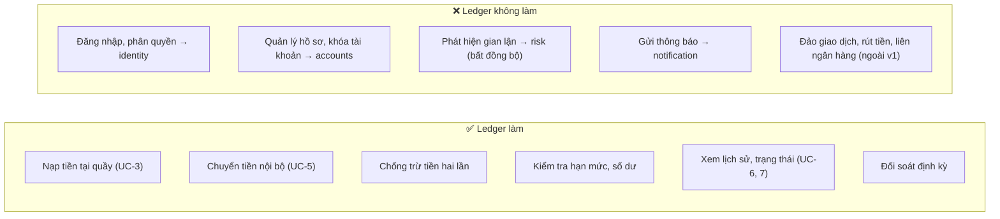
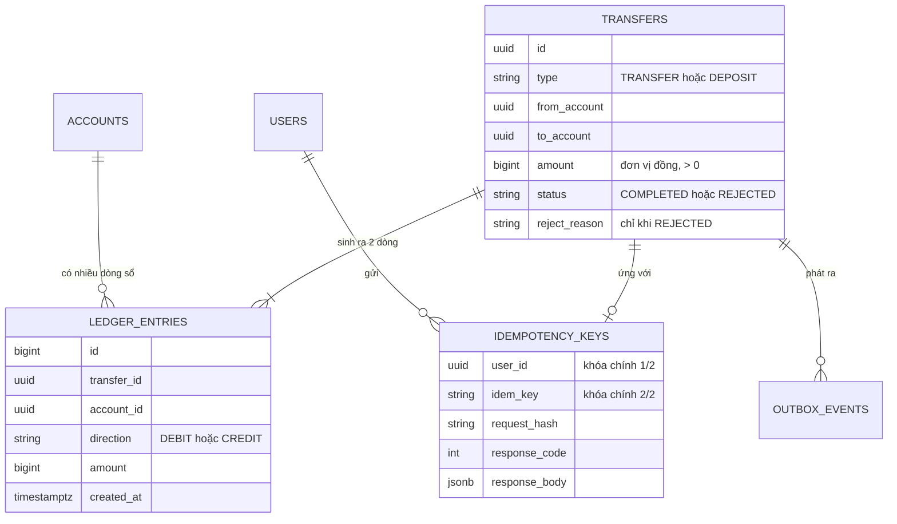
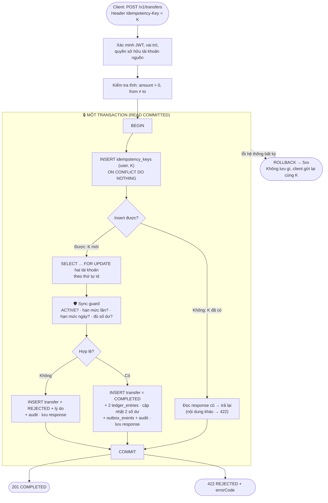
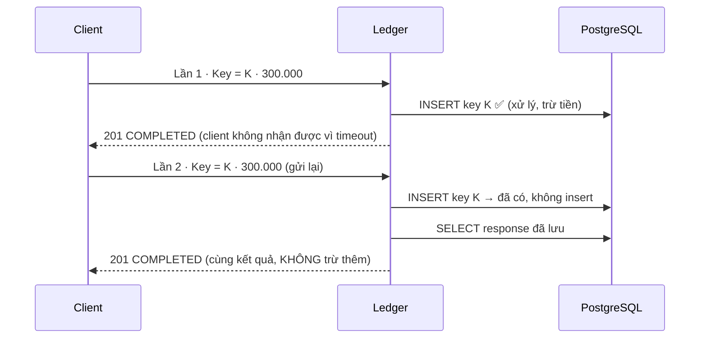
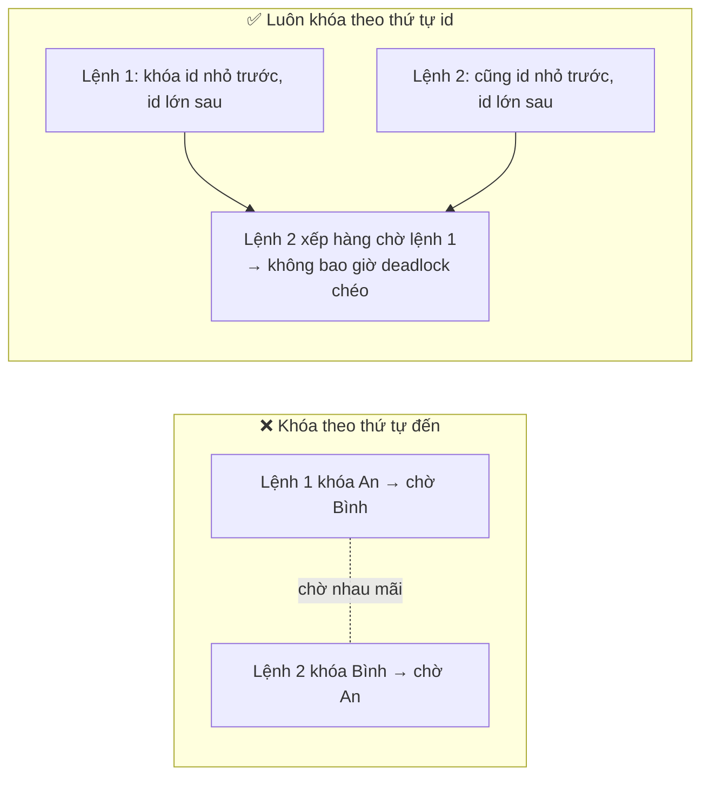
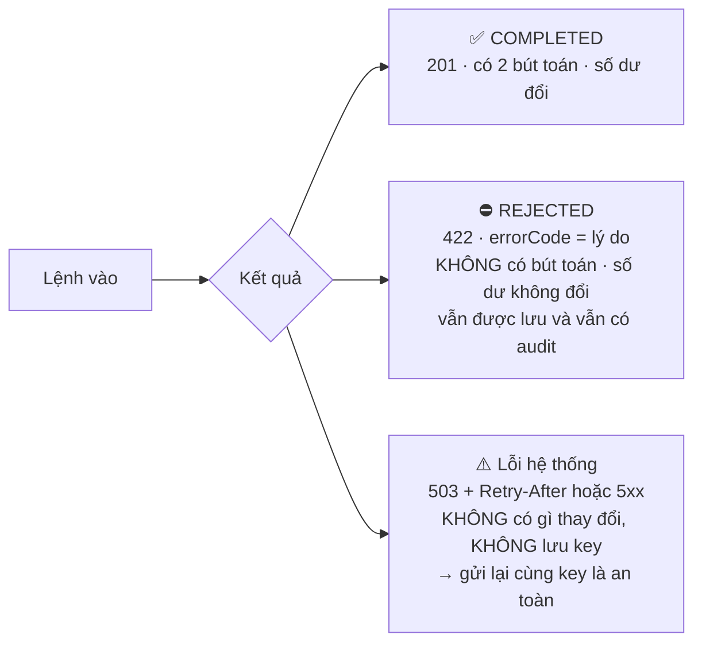
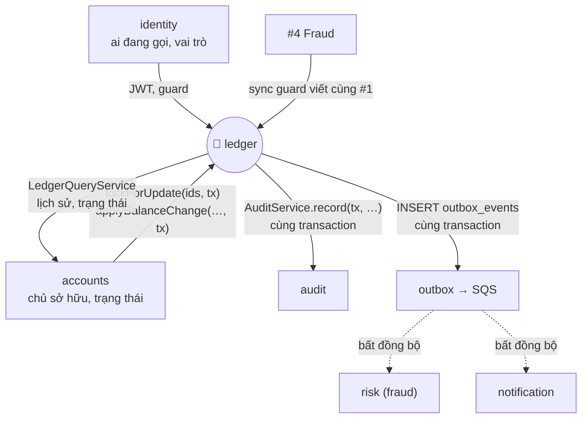

# ledger — Concept Brief

> **Status:** Draft · **Owner:** #1 · **Cặp đôi:** #4 · **Verified against code:** n/a (chưa có code) · **Cập nhật:** 2026-10-03

> Tài liệu giải thích **một module**, cho người chưa đọc docs 01–03. Đọc xong bạn biết: ledger là gì, nó giữ lời hứa nào, một lệnh chuyển tiền đi qua những bước nào, và vì sao thiết kế như vậy.
> Nguồn: `docs/03_HIGH_LEVEL_ARCHITECTURE.md` §6.1, §8 · `docs/02_REQUIREMENTS_AND_DOMAIN_MODEL.md` (AC-5.x) · `backend/src/modules/ledger/README.md`.
> Các con số đánh dấu *(GĐ)* là giả định ban đầu. Con số NFR đang chờ nhóm chốt lại.

| | |
|---|---|
| **Loại** | 🔴 Core — phần quan trọng nhất của hệ thống |
| **Owner** | #1 Ledger (cặp đôi #4 Fraud cho phần sync guard) |
| **Chạy ở** | role `api` (cộng job đối soát định kỳ) |
| **Use case** | UC-3 nạp tiền · UC-5 chuyển tiền · UC-6 lịch sử · UC-7 trạng thái giao dịch |
| **Sở hữu bảng** | `transfers` · `ledger_entries` · `idempotency_keys` · `outbox_events` |

---

## 1. Một câu

> **Ledger là nơi duy nhất được phép làm thay đổi số dư.** Mọi đồng tiền vào, ra, di chuyển đều đi qua đây, và đi theo đúng một cách: *một transaction, hai bút toán đối xứng, có nhật ký, có mã chống trùng*.

---

## 2. Hình dung bằng cuốn sổ cái

Hãy nghĩ ledger như cuốn sổ của một thủ quỹ cẩn thận:

```
┌──────────────────────── SỔ CÁI ────────────────────────┐
│  Dòng 1:  Quỹ ngân hàng  ghi NỢ   1.000.000  ─┐        │
│           Tài khoản An   ghi CÓ   1.000.000  ─┘ cân    │
│  Dòng 2:  Tài khoản An   ghi NỢ     300.000  ─┐        │
│           Tài khoản Bình ghi CÓ     300.000  ─┘ cân    │
│                                                        │
│  ✏️ Chỉ được GHI THÊM dòng mới. Không tẩy, không xóa.   │
└────────────────────────────────────────────────────────┘
```

- **Số dư của một tài khoản = tổng các dòng của nó**, không phải một con số ai đó gõ vào.
- Mỗi giao dịch luôn có **hai dòng bằng nhau, một Nợ một Có** → cộng cả sổ lại luôn bằng 0.
- Sai thì **ghi thêm dòng sửa**, không xóa dòng cũ (đảo giao dịch nằm ngoài v1).

---

## 3. Ledger làm gì, không làm gì



---

## 4. Năm khái niệm cần nhớ



| Khái niệm | Hiểu đơn giản | Quy tắc |
|---|---|---|
| **Transfer** | Một *lệnh* (chuyển hoặc nạp) và kết quả của nó | Kể cả lệnh bị từ chối cũng được lưu, kèm lý do |
| **LedgerEntry** | Một *dòng sổ*: tài khoản nào, Nợ hay Có, bao nhiêu | Chỉ INSERT; DB thu hồi quyền UPDATE/DELETE |
| **Tài khoản SYSTEM `funding`** | "Quỹ của ngân hàng", nguồn của mọi lần nạp tiền | Được phép âm, để tiền "vào" hệ thống vẫn có bút toán đối xứng |
| **Idempotency key** | Mã duy nhất do app khách tạo cho mỗi lệnh | Cùng mã → chỉ thực hiện một lần, luôn nhận cùng kết quả |
| **Outbox event** | "Tờ giấy nhắn" `TransferCompleted` ghi cùng lúc với giao dịch | Để fraud và thông báo xử lý sau, không bị mất nếu sự cố |

> **Tiền luôn là số nguyên đồng**: `BIGINT` trong DB, `string`/`bigint` trong API và event. Không bao giờ dùng số thực.

---

## 5. Ví dụ bằng số: nạp rồi chuyển

**Bước 1 — Nhân viên nạp 1.000.000đ cho An** (`type = DEPOSIT`)
**Bước 2 — An chuyển 300.000đ cho Bình** (`type = TRANSFER`)

| # | Giao dịch | Tài khoản | Nợ / Có | Số tiền |
|---|---|---|---|---:|
| 1 | Nạp | Quỹ `funding` | NỢ | 1.000.000 |
| 1 | Nạp | An | CÓ | 1.000.000 |
| 2 | Chuyển | An | NỢ | 300.000 |
| 2 | Chuyển | Bình | CÓ | 300.000 |

| Tài khoản | Số dư sau cùng |
|---|---:|
| Quỹ `funding` | **−1.000.000** (được phép âm) |
| An | 700.000 |
| Bình | 300.000 |
| **Tổng tất cả** | **0** ✅ |

Tổng số dư toàn hệ thống **luôn bằng 0**. Nếu một ngày nó khác 0, nghĩa là có lỗi, và job đối soát sẽ kêu lên.

---

## 6. Hành trình một lệnh chuyển tiền

Đây là phần quan trọng nhất. Toàn bộ khung chữ nhật là **một transaction PostgreSQL**: hoặc tất cả cùng thành công, hoặc không có gì xảy ra.



**Sau commit** (không nằm trong transaction): worker lấy `outbox_events` đưa ra SQS → `risk` chấm điểm gian lận, `notification` gửi thông báo. Khách không phải chờ phần này.

---

## 7. Ba lá chắn của ledger

### 🛡️ Lá chắn 1 — Chống trừ tiền hai lần (idempotency)

**Chuyện gì xảy ra nếu…** mạng chậm, app khách bấm gửi lại 3 lần?



| Tình huống | Kết quả |
|---|---|
| Gửi lại cùng key, cùng nội dung | Trả đúng kết quả cũ, không làm gì thêm |
| Cùng key, **khác** nội dung (số tiền khác…) | `422 IDEMPOTENCY_KEY_REUSED` |
| 10 lệnh cùng key **song song** | Đúng 1 giao dịch, 10 phản hồi giống nhau (AC-5.4) |
| Lệnh bị `REJECTED` rồi gửi lại | Nhận lại đúng lời từ chối cũ |
| Lỗi hệ thống (rollback) | Không lưu key, gửi lại cùng key là an toàn |
| Thiếu header | `400 IDEMPOTENCY_KEY_REQUIRED` |

Hai quyết định đáng nhớ:
- Key nằm **trong Postgres, cùng transaction** với giao dịch (không để ở Redis), nếu không sẽ có khe hở giữa Redis và DB.
- Key **scope theo user** `(user_id, idem_key)`: nếu unique toàn cục thì user A dùng trùng key của B sẽ nhận response của B, tức là lộ dữ liệu.

### 🛡️ Lá chắn 2 — Chống đua nhau khi nhiều lệnh đến cùng lúc

**Chuyện gì xảy ra nếu…** An chuyển cho Bình, đồng thời Bình chuyển cho An?



- Dùng `SELECT … FOR UPDATE` ở mức READ COMMITTED; đúng-sai nhờ **khóa hàng**, không nhờ isolation cao.
- Nếu vẫn dính deadlock (`40P01`): `TransactionService` chạy lại **cả transaction** tối đa 3 lần, có backoff. Còn sót thì trả `503 + Retry-After`.
- Giới hạn chờ: `lock_timeout` 2 s, `statement_timeout` 5 s, `idle_in_transaction` 10 s, để một tài khoản "nóng" không làm cạn pool kết nối của cả hệ thống.
- **Tài khoản nóng** (nhiều lệnh vào cùng một tài khoản) là nút thắt thật của hệ thống, không phải tổng RPS. Vì vậy transaction phải **ngắn**: không gọi Redis/HTTP/SQS bên trong.

### 🛡️ Lá chắn 3 — Hạn mức đúng kể cả khi gửi song song

| Quy tắc | Giá trị *(GĐ)* | Lý do từ chối |
|---|---|---|
| Mỗi lần | ≤ 50.000.000đ | `LIMIT_PER_TX_EXCEEDED` |
| Mỗi ngày (giờ Việt Nam, chỉ tiền đi) | ≤ 200.000.000đ | `LIMIT_PER_DAY_EXCEEDED` |
| Số dư | không âm (trừ tài khoản SYSTEM) | `INSUFFICIENT_FUNDS` |
| Trạng thái | cả hai tài khoản `ACTIVE` | `ACCOUNT_NOT_ACTIVE` |

**Vì sao sync guard phải chạy SAU khi khóa tài khoản?** Ví dụ AC-5.6: hạn mức ngày 200 tr, đã chuyển 180 tr, gửi **song song 2 lệnh 15 tr**.

```
❌ Kiểm tra TRƯỚC khi khóa         ✅ Kiểm tra SAU khi khóa
Lệnh 1: đã 180, +15 = 195 ✓ ┐      Lệnh 1: khóa → đã 180, +15 = 195 ✓ → ghi → nhả khóa
Lệnh 2: đã 180, +15 = 195 ✓ ┘      Lệnh 2: (chờ) → khóa → đã 195, +15 = 210 ✗ → REJECTED
→ cả hai lọt, tổng 210 > 200 💥     → đúng 1 COMPLETED, 1 REJECTED, tổng ≤ 200 ✅
```

Hạn mức ngày = tổng các dòng `DEBIT` của tài khoản nguồn từ 00:00 giờ Việt Nam (`Asia/Ho_Chi_Minh`) trong `ledger_entries`, có index `(account_id, created_at)`, ngân sách ≤ 5 ms.

---

## 8. Ba kết quả có thể xảy ra



Test theo `errorCode` (mã ổn định), **không** theo câu chữ của `detail`.

---

## 9. Ledger nói chuyện với ai



- Nét liền: gọi **đồng bộ, cùng một transaction**. Nét đứt: **bất đồng bộ**, ledger không chờ.
- `ledger` **không** đọc bảng `accounts` trực tiếp; nó gọi hàm `accounts` export và truyền transaction vào (quy tắc ranh giới module, do eslint ép).
- `risk` **không** chạm vào luồng chuyển tiền: lỗi ở fraud không thể làm hỏng một lệnh chuyển.

---

## 10. API ledger cung cấp

| Method | Đường dẫn | Ai gọi | Ghi chú |
|---|---|---|---|
| `POST` | `/v1/transfers` | customer | **Bắt buộc** `Idempotency-Key`; chỉ chuyển từ tài khoản của mình |
| `POST` | `/v1/operator/deposits` | operator | **Bắt buộc** `Idempotency-Key`; nguồn là `funding` |
| `GET` | `/v1/accounts/{id}/transactions` | customer | Phân trang cursor, lọc thời gian; chỉ tài khoản của mình |
| `GET` | `/v1/transfers/{id}` | customer | Chỉ người gửi hoặc người nhận |

Quy ước: tiền là **string** (`"500000"`); lỗi theo RFC 7807 `application/problem+json` kèm `errorCode`, `correlationId`; tài khoản không thuộc mình trả **404** (không phải 403) để không lộ rằng nó tồn tại.

---

## 11. Năm điều không bao giờ được sai (bất biến)

| # | Bất biến | Bảo vệ bằng |
|---|---|---|
| 1 | Tổng Nợ = tổng Có | Luôn ghi cặp bút toán trong một transaction |
| 2 | Tổng số dư mọi tài khoản = 0 | Tài khoản SYSTEM `funding` được âm |
| 3 | Số dư khách ≥ 0 | `CHECK (type = 'SYSTEM' OR balance >= 0)` + sync guard |
| 4 | Số dư mỗi tài khoản = tổng bút toán của nó | Chỉ đổi số dư qua ledger |
| 5 | Bút toán không bị sửa/xóa | Thu hồi `UPDATE`/`DELETE` ở mức DB |

**Job đối soát** chạy định kỳ kiểm tra 1, 2, 4 và báo động khi lệch. Sau **mỗi** lần load test cũng chạy lại đúng các kiểm tra này.

---

## 12. Những bẫy hay gặp

| ❌ Đừng | Vì sao |
|---|---|
| Dùng `number` cho tiền | Sai số, mất chữ số với số lớn. Luôn `bigint`/string |
| Kiểm tra hạn mức **trước** khi khóa | Hai lệnh song song cùng lọt (AC-5.6) |
| Để ORM tự mở transaction cho từng câu | Mất tính nguyên tử. Dùng một `QueryRunner` cho cả luồng |
| Gọi Redis/HTTP/SQS **trong** transaction | Deadlock làm callback chạy lại → lặp tác dụng phụ; khóa giữ lâu |
| Cache số dư ở Redis | Có lúc số cũ được dùng để quyết định chuyển tiền |
| `UPDATE balance` trực tiếp (kể cả để seed dữ liệu test) | Phá bất biến. Seed qua API nạp tiền |
| Unique `idem_key` toàn cục | User A nhận được response của B |
| Pool kết nối không giới hạn | `số task × pool` vượt `max_connections` khi scale |

---

## 13. Chứng minh bằng test và demo

| Tiêu chí | Kiểm chứng gì | Ghi chú |
|---|---|---|
| AC-5.1 | A 1.000.000 → B: chuyển 300.000 → A 700.000, B 300.000, 2 bút toán | |
| AC-5.2 | Không đủ số dư → `REJECTED`, không bút toán | |
| AC-5.3 | Gửi lại cùng key → cùng kết quả | |
| AC-5.4 | 10 lệnh cùng key song song → 1 giao dịch | Demo "chống trùng" |
| AC-5.5 | Cùng key, khác số tiền → từ chối | |
| AC-5.6 | 2 lệnh 15 tr song song khi còn 20 tr hạn mức → đúng 1 thành công | Demo "đồng thời" |
| AC-5.7 | Tài khoản đích `LOCKED` → `REJECTED` | |
| AC-5.8 | Chuyển từ tài khoản người khác → 404 + audit | Cùng `accounts` |
| AC-5.9 | Chuyển chéo đồng thời + tài khoản nóng → 0 lệch | Demo "đồng thời" |
| AC-5.10 | Kill giữa lúc xử lý rồi gửi lại cùng key → đúng một lần | Demo "sự cố" |

**Bắt buộc:** các test này chạy trên **PostgreSQL thật** (Testcontainers), **không mock database**. Mock cho test xanh nhưng không chứng minh được hành vi khóa của Postgres.

---

## 14. Lộ trình của module (theo roadmap)

| Tuần | Việc | Xong khi |
|---|---|---|
| 1 | ERD + migration đầu (`transfers`, `ledger_entries`, `idempotency_keys`, `outbox_events`) | Migration chạy được |
| 2 | Chuyển tiền bản thô + nạp tiền | Nạp → chuyển → xem số dư chạy trên cloud |
| 3 ⚠️ | `ON CONFLICT DO NOTHING`, khóa theo thứ tự id, lưu `REJECTED`, retry deadlock, sync guard | AC-5.1 → 5.10 xanh trong CI |
| 4 | Job đối soát | Chạy định kỳ, có alarm khi lệch |
| 5–8 | Sửa lỗi từ demo, chốt ADR, tối ưu dưới tải, hỗ trợ giả lập sự cố | Bằng chứng trên cloud |

Tuần 3 là tuần quan trọng nhất của cả dự án: chuyển tiền chưa đúng thì mọi thứ phía sau đều trễ.

---

## 15. Từ điển nhanh

| Từ | Nghĩa |
|---|---|
| **Bút toán kép** | Mỗi giao dịch có một dòng Nợ và một dòng Có bằng nhau |
| **Nợ / Có (DEBIT / CREDIT)** | Nợ: tiền ra khỏi tài khoản; Có: tiền vào tài khoản |
| **Idempotency** | Gửi cùng lệnh nhiều lần chỉ tạo một tác dụng |
| **Sync guard** | Lớp chặn cứng (trạng thái, hạn mức, số dư), chạy trong transaction |
| **Outbox** | Bảng "tờ giấy nhắn" ghi cùng transaction để không mất sự kiện |
| **Tài khoản nóng** | Tài khoản nhận rất nhiều lệnh cùng lúc, nơi các lệnh phải xếp hàng chờ nhau |
| **Đối soát** | Kiểm tra sổ cái còn cân bằng không |
| **ACID** | Giao dịch nguyên tử, nhất quán, cô lập, bền vững |

---

Tiếp theo: [`02-architecture.md`](02-architecture.md) · Quy tắc code: [`backend/src/modules/ledger/README.md`](../../../backend/src/modules/ledger/README.md).
