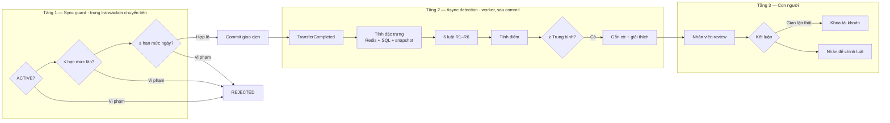
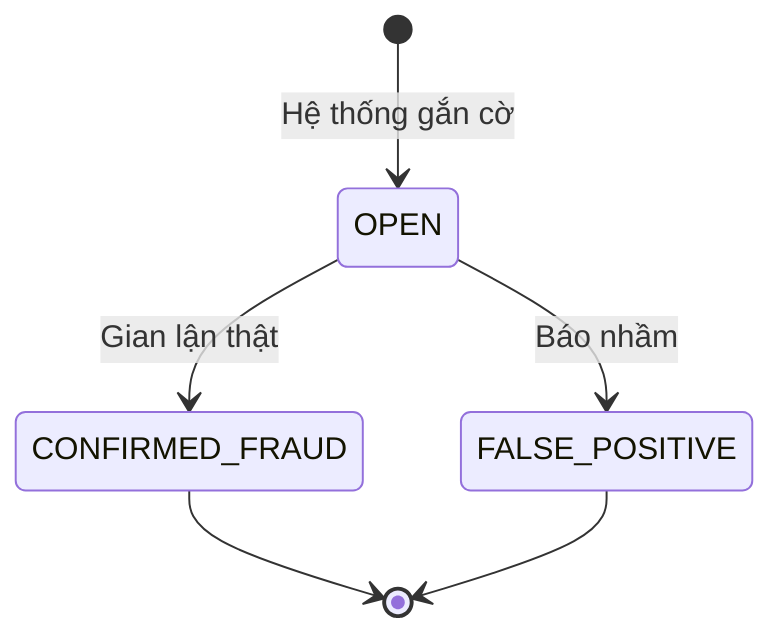
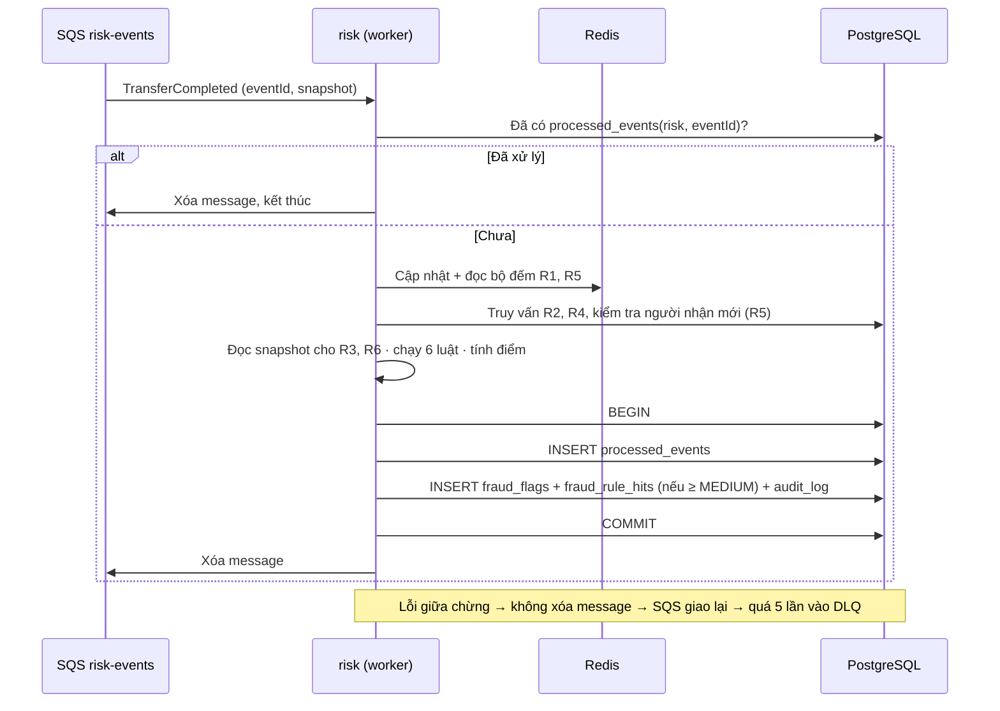
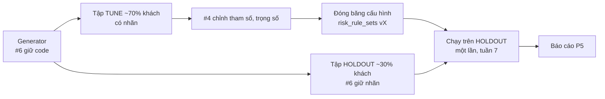

# Fraud Detection — Hướng dẫn chi tiết

> **Status:** Draft · **Owner:** #4 · **Cặp đôi:** #1, #6 · **Verified against code:** n/a (chưa có code) · **Cập nhật:** 2026-10-06 · sẽ tách thành 02/03/06 sau khi nộp P2

> Tài liệu làm việc nội bộ cho mảng **Fraud** (#4) và người làm bộ dữ liệu (#6).
> Dựa trên: `docs/01` (BR-06, BR-11, BR-13), `docs/02` (UC-9, UC-10, UC-12, FR-RSK-*, NFR-FRD-*), `docs/03` (mục 9, 10, 15).
> Mọi tham số đánh dấu *(GĐ)* là giả định ban đầu, sẽ được chỉnh bằng tập dữ liệu tune.

---

## 1. Mảng này làm gì

### 1.1 Một câu

> Sau mỗi giao dịch, **trong vòng vài giây**, chấm điểm rủi ro bằng 6 luật có giải thích; giao dịch đáng ngờ được **gắn cờ** để nhân viên xem và quyết định. Kèm theo là **bằng chứng định lượng** rằng các luật thực sự bắt được gian lận mà không làm nhân viên ngập trong báo nhầm.

### 1.2 Làm và không làm

| ✅ Làm | ❌ Không làm (v1) |
|---|---|
| Chặn cứng giao dịch vượt hạn mức, tài khoản bị khóa (**sync guard**) | Chặn giao dịch vì "đáng ngờ" |
| Chấm điểm mọi lệnh chuyển tiền sau khi hoàn tất (**async detection**) | Tự động khóa tài khoản |
| Gắn cờ kèm danh sách luật và lời giải thích | Đảo giao dịch, giữ tiền chờ duyệt |
| Cho nhân viên review: Gian lận thật / Báo nhầm | Cho khách hàng thấy cờ (BR-13) |
| Cấu hình luật có phiên bản | Machine learning (để mở rộng nếu còn thời gian) |
| Bộ dữ liệu tổng hợp + báo cáo đánh giá P5 | Dữ liệu thiết bị, IP, vị trí |

### 1.3 Thế nào là thành công

| Chỉ số | Mục tiêu | Nguồn |
|---|---|---|
| Thời gian từ giao dịch tới khi có cờ | p95 < 5 giây | NFR-FRD-01 |
| Số cảnh báo / 1.000 giao dịch | ≤ 20 *(GĐ — xem lưu ý 6.4)* | NFR-FRD-02 |
| Recall trên các kịch bản luật nhắm tới | ≥ 70 % *(GĐ)* | NFR-FRD-02 |
| Báo cáo precision, recall, F1 trên tập giữ lại | Có, kèm phân tích từng luật | NFR-FRD-03 |
| Chuyển tiền không chậm đi vì fraud | Sync guard thêm ≤ 5 ms | NFR-PERF-01 |
| Lỗi ở fraud không làm hỏng chuyển tiền | 0 ảnh hưởng | D-4 |

---

## 2. Bức tranh tổng thể



| Tầng | Ở đâu | Khi nào | Hậu quả | Vì sao đặt ở đây |
|---|---|---|---|---|
| **1. Sync guard** | `backend` (role `api`) · module `ledger` | Trong transaction, sau `FOR UPDATE` | `REJECTED` | Quy tắc cứng (BR-06, BR-12) phải đúng tuyệt đối kể cả khi đồng thời |
| **2. Async detection** | `backend` (role `worker`) · module `risk` | Vài giây sau commit | Gắn cờ | Phân tích lịch sử tốn truy vấn; không được làm chậm hay hỏng giao dịch |
| **3. Human-in-the-loop** | `backend` (role `api`) · module `risk` | Khi nhân viên xử lý | Kết luận, có thể khóa | Báo nhầm gây hại thật cho khách; quyết định cuối thuộc con người |

---

## 3. Tầng 1 — Sync guard

Viết **cùng #1** trong luồng chuyển tiền (`docs/03` mục 6.1). Chạy sau khi đã khóa hai tài khoản.

| Kiểm tra | Điều kiện từ chối | `reject_reason` |
|---|---|---|
| Trạng thái | Tài khoản nguồn hoặc đích không `ACTIVE` | `ACCOUNT_NOT_ACTIVE` |
| Hạn mức mỗi lần | `amount > TRANSFER_LIMIT_PER_TX` (50tr *(GĐ)*) | `LIMIT_PER_TX_EXCEEDED` |
| Hạn mức ngày | `đã chuyển hôm nay + amount > TRANSFER_LIMIT_PER_DAY` (200tr *(GĐ)*) | `LIMIT_PER_DAY_EXCEEDED` |
| Số dư | `balance < amount` | `INSUFFICIENT_FUNDS` |

**Tính "đã chuyển hôm nay"** (ngày theo giờ Việt Nam, chỉ tính tiền đi):

```sql
SELECT COALESCE(SUM(amount), 0)
FROM ledger_entries
WHERE account_id = $1
  AND direction = 'DEBIT'
  AND created_at >= date_trunc('day', now() AT TIME ZONE 'Asia/Ho_Chi_Minh') AT TIME ZONE 'Asia/Ho_Chi_Minh';
```

- Dùng index `ledger_entries(account_id, created_at)`.
- **Phải chạy sau `SELECT … FOR UPDATE`** tài khoản nguồn. Nếu chạy trước, hai lệnh đồng thời cùng thấy "còn hạn mức" và cùng lọt (AC-5.6).
- Nạp tiền (`DEPOSIT`) bỏ qua hạn mức và số dư của tài khoản SYSTEM.
- Ngân sách thời gian: ≤ 5 ms.

---

## 4. Tầng 2 — Async detection

### 4.1 Phạm vi chấm điểm

- Chỉ chấm `TransferCompleted` có `type = TRANSFER`. **Không chấm `DEPOSIT`** (tiền từ tài khoản ngân hàng).
- Chấm phía **người gửi** (tài khoản nguồn). Phía người nhận (nhiều người chuyển vào một tài khoản) là hướng mở rộng (mục 9).

### 4.2 Sáu luật

| ID | Luật | Điều kiện kích hoạt *(GĐ)* | Nguồn dữ liệu | Trọng số *(GĐ)* |
|---|---|---|---|---|
| **R1** | Velocity | > 5 lệnh chuyển từ tài khoản nguồn trong 10 phút (tính cả lệnh này) | Redis sorted set, dự phòng SQL | 30 |
| **R2** | Số tiền bất thường | `amount > 5 × trung vị` các lệnh chuyển 30 ngày trước của chính tài khoản; cần **≥ 5 lệnh lịch sử**, không đủ thì bỏ qua | SQL | 25 |
| **R3** | Tài khoản mới chuyển lớn | Tuổi tài khoản nguồn < 24 giờ **và** `amount > 10.000.000` | Snapshot `fromAccountCreatedAt` | 35 |
| **R4** | Chuyển vòng | Có lệnh `to → from` đã `COMPLETED` trong 1 giờ trước đó | SQL | 20 |
| **R5** | Fan-out (mule) | ≥ 5 người nhận **mới** trong 1 giờ (mới = chưa nhận tiền từ tài khoản này trong 30 ngày trước) | Redis sorted set + SQL kiểm tra "mới" | 40 |
| **R6** | Rút cạn | `amount ≥ 90% × fromBalanceBefore` **và** `fromBalanceBefore ≥ 1.000.000` | Snapshot `fromBalanceBefore` | 30 |

**Ngoại lệ chung:** chuyển giữa **hai tài khoản của cùng một khách hàng** không kích hoạt R5, R6 (chuyển tiền tiết kiệm sang tài khoản khác của mình là bình thường). Để làm được điều này, event cần thêm trường `sameOwner` (xem mục 5.2).

#### Logic từng luật (giả mã)

```ts
// R1 — velocity
count = countTransfersFrom(fromAccountId, window = 10m, until = occurredAt)
hit if count > 5
explain: `${count} lệnh chuyển trong 10 phút (ngưỡng 5)`

// R2 — số tiền bất thường
history = amountsFrom(fromAccountId, last = 30d, before = occurredAt)
skip if history.length < 5
median = percentile50(history)
hit if amount > 5 * median
explain: `Số tiền ${amount} gấp ${amount/median}× trung vị 30 ngày (${median})`

// R3 — tài khoản mới chuyển lớn
age = occurredAt - fromAccountCreatedAt
hit if age < 24h && amount > 10_000_000
explain: `Tài khoản mở ${age} trước, chuyển ${amount}`

// R4 — chuyển vòng
hit if exists transfer(from = toAccountId, to = fromAccountId, status = COMPLETED,
                       createdAt in [occurredAt - 1h, occurredAt))
explain: `Tài khoản đích đã chuyển ngược lại ${x} phút trước`

// R5 — fan-out
newRecipients = distinctNewRecipients(fromAccountId, window = 1h, until = occurredAt)
hit if !sameOwner && newRecipients >= 5
explain: `${n} người nhận mới trong 1 giờ (ngưỡng 5)`

// R6 — rút cạn
hit if !sameOwner && fromBalanceBefore >= 1_000_000 && amount >= 0.9 * fromBalanceBefore
explain: `Chuyển ${pct}% số dư (${amount}/${fromBalanceBefore})`
```

**Ví dụ SQL cho R2 và R4:**

```sql
-- R2: trung vị số tiền chuyển đi trong 30 ngày trước giao dịch
SELECT percentile_cont(0.5) WITHIN GROUP (ORDER BY amount) AS median, COUNT(*) AS n
FROM v_transfer_facts
WHERE from_account_id = $1 AND status = 'COMPLETED' AND type = 'TRANSFER'
  AND created_at >= $2 - interval '30 days' AND created_at < $2;

-- R4: có lệnh chuyển ngược trong 1 giờ trước
SELECT EXISTS (
  SELECT 1 FROM v_transfer_facts
  WHERE from_account_id = $1 AND to_account_id = $2 AND status = 'COMPLETED'
    AND created_at >= $3 - interval '1 hour' AND created_at < $3
);
```

### 4.3 Tính điểm và mức rủi ro

```
score = Σ trọng số các luật kích hoạt
```

| Điểm | Mức | Hành động |
|---|---|---|
| 0 – 39 | `LOW` | Không gắn cờ (vẫn ghi metric) |
| 40 – 69 | `MEDIUM` | Gắn cờ |
| ≥ 70 | `HIGH` | Gắn cờ, đưa lên đầu danh sách review |

**Ý tưởng của trọng số:** tín hiệu đủ mạnh một mình (R5 mule = 40) thì tự gắn cờ. Tín hiệu yếu một mình (R6 rút cạn = 30, R4 chuyển vòng = 20) chỉ gắn cờ khi **kết hợp**: R6 + R3 = 65 → MEDIUM là kịch bản chiếm tài khoản mới tạo.

| Ví dụ | Luật kích hoạt | Điểm | Mức |
|---|---|---|---|
| Khách chuyển 95% số dư sang người quen | R6 | 30 | LOW — không cờ |
| Tài khoản 3 giờ tuổi chuyển 20tr, gần hết số dư | R3 + R6 | 65 | MEDIUM |
| 6 người nhận mới trong 1 giờ | R5 | 40 | MEDIUM |
| 8 lệnh / 10 phút, toàn người nhận mới | R1 + R5 | 70 | HIGH |

Trọng số và ngưỡng là **điểm xuất phát**, sẽ chỉnh bằng tập tune (mục 6).

### 4.4 Cờ và lời giải thích

Mỗi cờ lưu: giao dịch, điểm, mức, **phiên bản luật đã dùng**, và từng luật kích hoạt kèm câu giải thích bằng tiếng Việt cho nhân viên.

```json
{
  "transferId": "8f3c…",
  "score": 65,
  "riskLevel": "MEDIUM",
  "ruleSetVersion": 3,
  "hits": [
    { "ruleId": "R3", "explanation": "Tài khoản mở 3 giờ trước, chuyển 20.000.000đ" },
    { "ruleId": "R6", "explanation": "Chuyển 96% số dư (20.000.000/20.800.000)" }
  ],
  "reviewStatus": "OPEN"
}
```

### 4.5 Review của nhân viên (UC-10)



| API | Mô tả |
|---|---|
| `GET /v1/operator/fraud-flags?status=OPEN&level=HIGH` | Danh sách cờ, HIGH lên trước, mới nhất trước |
| `GET /v1/operator/fraud-flags/{transferId}` | Chi tiết: giao dịch, các luật, giải thích, 10 giao dịch gần nhất của tài khoản nguồn |
| `POST /v1/operator/fraud-flags/{transferId}/review` | Body: `decision` (`CONFIRMED_FRAUD` / `FALSE_POSITIVE`), `note`. Chỉ review một lần |

Mọi lần xem chi tiết và review đều ghi nhật ký. Kết luận của nhân viên là **nhãn thật** dùng để chỉnh luật về sau.

### 4.6 Cấu hình luật có phiên bản (UC-12)

- Bảng `risk_rule_sets`: mỗi dòng là một **phiên bản bất biến** chứa tham số, trọng số và ngưỡng mức của cả 6 luật, kèm cờ bật/tắt từng luật.
- Đổi cấu hình = thêm phiên bản mới. Worker biết phiên bản hiện hành qua key Redis `cfg:risk:latest` (TTL 60 giây; miss hoặc lỗi thì `SELECT max(version)` từ `risk_rule_sets`), rồi đọc nội dung từ `cfg:risk:v{n}` (bất biến nên TTL dài). Phiên bản mới có hiệu lực sau tối đa 60 giây.
- Mỗi cờ ghi `ruleSetVersion`, để biết cờ được tạo theo cấu hình nào.
- **Công tắc khẩn cấp:** tắt một luật đang báo nhầm hàng loạt chỉ cần tạo phiên bản mới với luật đó `enabled = false`.

---

## 5. Làm như thế nào — hiện thực

### 5.1 Luồng xử lý một sự kiện



### 5.2 Đầu vào: event contract

Thống nhất với #3. Bản hiện tại ở `docs/03` mục 10, **đề xuất thêm `sameOwner`**:

| Trường | Dùng cho |
|---|---|
| `eventId` | Chống xử lý trùng |
| `transferId`, `type` | Khóa của cờ; bỏ qua `DEPOSIT` |
| `fromAccountId`, `toAccountId` | R1, R2, R4, R5 |
| `amount` (string) | R2, R3, R6 |
| `fromBalanceBefore` (string) | R6 — **phải** lấy từ snapshot, không đọc số dư hiện tại |
| `fromAccountCreatedAt` | R3 — **phải** lấy từ snapshot |
| `occurredAt` | Mốc thời gian cho mọi cửa sổ (không dùng giờ worker) |
| `sameOwner` *(đề xuất mới)* | Ngoại lệ cho R5, R6 |
| `correlationId` | Ghi nhật ký, truy vết |

**Vì sao dùng `occurredAt` chứ không dùng giờ hiện tại của worker:** sự kiện có thể tới trễ (worker restart, message được giao lại). Nếu tính cửa sổ theo giờ worker, cùng một giao dịch có thể cho kết quả khác nhau tùy lúc nào được xử lý.

### 5.3 Dữ liệu

Schema chính thức của `risk_rule_sets`, `fraud_flags`, `fraud_rule_hits`, `processed_events` chỉ nằm ở [database-design §4.6, §4.8](../_shared/database-design.md) (một sự thật, một chỗ). Điểm riêng của mảng fraud:

- Mỗi cờ ghi `rule_set_version` ở `fraud_flags`; `fraud_rule_hits` lưu `weight` (đóng góp vào điểm) và `explanation`, không lặp lại phiên bản.
- `risk` đọc lịch sử chuyển tiền qua view chỉ đọc `v_transfer_facts` do `ledger` sở hữu, không `SELECT` thẳng bảng `transfers`.
- Index cho truy vấn luật: `transfers(from_account_id, created_at) INCLUDE (amount, to_account_id)` và `transfers(from_account_id, to_account_id, created_at)`, cả hai chỉ chứa hàng `status = 'COMPLETED' AND type = 'TRANSFER'`.
- Quyền DB: worker chạy bằng role `dbs_worker` (đọc `v_transfer_facts`; ghi bảng fraud, `processed_events`, `audit_log`). Role riêng chỉ cho risk là hướng mở rộng (database-design §8.1).

### 5.4 Bộ đếm Redis (R1, R5)

| Luật | Key | Lệnh |
|---|---|---|
| R1 | `risk:vel:{accountId}` (sorted set, member = `transferId`, score = `occurredAt`) | `ZADD` → `ZREMRANGEBYSCORE key -inf (occurredAt−10m)` → `ZCOUNT key (occurredAt−10m) occurredAt` → `EXPIRE key 7200` |
| R5 | `risk:fan:{accountId}` (sorted set, member = `toAccountId`, score = `occurredAt`) | Chỉ `ZADD` khi người nhận là **mới** (kiểm tra bằng SQL) → `ZREMRANGEBYSCORE` cửa sổ 1 giờ → `ZCOUNT` → `EXPIRE` |

- Dùng `transferId` làm member nên nhận trùng sự kiện không đếm trùng.
- Gom các lệnh của một key vào **một `MULTI`/pipeline** để giảm round-trip.
- **Redis lỗi → dự phòng SQL:** đếm trực tiếp trên view `v_transfer_facts` (role `dbs_worker` không có quyền SELECT bảng `transfers`), cùng cửa sổ. Kết quả như nhau, chỉ tốn tải DB hơn. Ghi metric `risk_redis_fallback_total`.

### 5.5 Cấu trúc code

Một module `risk` duy nhất, vừa có phần API vừa có phần worker (xem `backend/src/modules/risk/README.md`). Consumer chỉ khởi động khi `runsWorkers()`.

```
backend/src/modules/risk/
├── risk.module.ts
├── risk-flags.controller.ts     # role api: danh sách cờ, review (UC-10)
├── risk-config.controller.ts    # role api: cấu hình luật có phiên bản (UC-12)
├── risk-scoring.consumer.ts     # role worker: nhận message, idempotency, transaction ghi cờ
├── scoring.service.ts           # chạy các luật, cộng điểm, ra mức
├── entities/                    # fraud-flag, fraud-rule-hit, risk-rule-set
├── rules/
│   ├── rule.ts                  # interface chung
│   ├── r1-velocity.rule.ts
│   ├── r2-unusual-amount.rule.ts
│   ├── r3-new-account-large.rule.ts
│   ├── r4-round-trip.rule.ts
│   ├── r5-fan-out.rule.ts
│   └── r6-drain.rule.ts
├── features/
│   ├── feature-provider.ts      # interface lấy đặc trưng
│   ├── online-feature-provider.ts   # Redis + SQL (chạy thật)
│   └── offline-feature-provider.ts  # tính từ dữ liệu trong bộ nhớ (đánh giá)
├── config/rule-set.repository.ts
└── index.ts                     # API công khai (gần như trống: không module nào gọi risk)
```

**Điểm thiết kế quan trọng nhất: luật là hàm thuần.**

```ts
interface RiskRule {
  id: 'R1' | 'R2' | 'R3' | 'R4' | 'R5' | 'R6';
  evaluate(event: TransferCompletedEvent, features: Features, params: RuleParams): RuleHit | null;
}
```

- Luật **không** gọi Redis hay DB. Mọi dữ liệu đến từ `FeatureProvider`.
- Nhờ vậy **cùng một code luật** chạy được ở hai nơi:
  - **Online:** `OnlineFeatureProvider` lấy đặc trưng từ Redis/SQL.
  - **Offline:** `OfflineFeatureProvider` lấy đặc trưng từ bộ dữ liệu tổng hợp đọc vào bộ nhớ → chạy đánh giá 100k giao dịch trong vài giây, không cần dựng cả hệ thống.
- Có một test **so khớp** hai provider trên cùng dữ liệu, để kết quả đánh giá offline phản ánh đúng hệ thống thật.

### 5.6 Xử lý lỗi

| Tình huống | Xử lý |
|---|---|
| Nhận trùng sự kiện | `processed_events` → bỏ qua; khóa chính `fraud_flags` chặn cờ trùng |
| Redis lỗi | Dự phòng SQL (mục 5.4) |
| DB lỗi | Không xóa message → SQS giao lại; quá 5 lần → DLQ + alarm |
| Message không đúng định dạng | Log + chuyển thẳng DLQ, không retry vô ích |
| Một luật ném lỗi | Ghi lỗi luật đó, các luật khác vẫn chạy; metric `risk_rule_error_total{rule}` |
| Worker chết | Giao dịch không bị ảnh hưởng; khi bật lại, message còn trong queue được xử lý tiếp |

### 5.7 Ngân sách hiệu năng

| Bước | Ngân sách *(GĐ)* |
|---|---|
| Redis (1 pipeline cho R1, R5) | ≤ 5 ms |
| SQL (R2, R4, kiểm tra người nhận mới) | ≤ 30 ms |
| Ghi cờ (1 transaction) | ≤ 15 ms |
| **Tổng xử lý một sự kiện** | **≤ 50 ms** |
| Thời gian chờ outbox relay (poll ≤ 1 giây) + SQS | ≤ 2 giây |
| **Từ giao dịch tới khi có cờ** | **p95 < 5 giây** |

Ở 25 lệnh chuyển/giây × 50 ms = 1,25 giây xử lý mỗi giây → 1 worker với concurrency 2–4 là đủ.

---

## 6. Đánh giá

Đây là phần **hội đồng hỏi nhiều nhất** (câu bảo vệ 12): "luật của các bạn tốt đến mức nào, và các bạn biết bằng cách nào?"

### 6.1 Bộ dữ liệu tổng hợp (do #6 làm)

**Quy mô:** ~2.000 khách hàng, mô phỏng 60 ngày, ~100.000 giao dịch, ~1% gian lận *(GĐ)*.

**Hành vi bình thường** — mỗi khách có "thói quen" riêng:

| Thành phần | Cách sinh |
|---|---|
| Số lệnh / ngày | Poisson, λ riêng mỗi khách trong khoảng 0,3 – 3 |
| Số tiền | Log-normal với trung vị riêng mỗi khách (từ 100k đến vài triệu) |
| Người nhận | "Vòng quen" 3–10 người chiếm ~80% lệnh; còn lại là người mới |
| Thời điểm | Nhiều vào giờ hành chính và buổi tối; đỉnh vào ngày lương |
| Số dư | Nạp tiền định kỳ (lương), số dư thay đổi theo giao dịch |

**Giao dịch hợp lệ nhưng trông đáng ngờ** (hard negatives — bắt buộc có, để đo báo nhầm thật):
- Trả tiền nhà hằng tháng, số tiền lớn gấp nhiều lần thường ngày (dễ dính R2).
- Chuyển gần hết số dư sang tài khoản khác **của chính mình** (dễ dính R6).
- Khách mới mở tài khoản, nhận lương rồi chuyển lớn ngay (dễ dính R3).
- Chia tiền ăn nhóm cho nhiều bạn mới quen trong một buổi (dễ dính R5).
- Mượn rồi trả lại tiền trong ngày (dễ dính R4).

**Kịch bản gian lận** (có nhãn `is_fraud = 1` và `scenario`):

| Kịch bản | Mô tả | Luật nên bắt |
|---|---|---|
| `ATO_DRAIN` | Chiếm tài khoản, chuyển gần hết tiền cho vài người nhận mới | R6, R5, R1 |
| `MULE_FANOUT` | Tài khoản trung gian nhận tiền rồi rải cho nhiều tài khoản mới | R5, R1 |
| `VELOCITY_BURST` | Nhiều lệnh nhỏ liên tiếp trong vài phút | R1 |
| `BUST_OUT` | Tài khoản mới mở, chuyển lớn ngay | R3, R6 |
| `ROUND_TRIP` | Chuyển qua lại giữa hai tài khoản để làm rối dòng tiền | R4 |
| `SLOW_DRIP` ⚠️ | Rút dần số tiền nhỏ trong nhiều ngày, dưới mọi ngưỡng | *Không luật nào cố ý bắt* |
| `STRUCTURING` ⚠️ | Chia nhỏ ngay dưới ngưỡng (ví dụ nhiều lệnh 9,9tr) | *Không luật nào cố ý bắt* |
| `FAN_IN` ⚠️ | Nhiều tài khoản cùng chuyển vào một tài khoản | *Không luật nào cố ý bắt* (chấm phía người gửi) |

Các kịch bản ⚠️ cố ý nằm ngoài khả năng của luật. Mục đích là **đo trung thực** recall, và chỉ ra giới hạn trong báo cáo, thay vì có con số đẹp giả tạo.

**Định dạng file** (CSV, sinh bằng seed cố định để chạy lại ra đúng kết quả):

```
tx_id, occurred_at, from_account, to_account, from_customer, to_customer,
amount, from_balance_before, from_account_created_at, to_account_created_at,
is_fraud, scenario
```

### 6.2 Chia tập và "bức tường" giữa #4 và #6



| Quy tắc | Lý do |
|---|---|
| Chia theo **khách hàng**, không chia ngẫu nhiên từng giao dịch | Tránh cùng một khách nằm ở cả hai tập → luật "học thuộc" thói quen của khách đó |
| #4 chỉ biết **tên và mô tả một câu** của kịch bản, không xem code generator | Tránh viết luật khớp đúng cách sinh dữ liệu |
| #6 giữ nhãn của tập holdout tới tuần 7 | Đánh giá cuối là trên dữ liệu #4 chưa từng thấy nhãn |
| Đóng băng cấu hình trước khi chạy holdout; **chỉ chạy holdout một lần** | Chạy nhiều lần rồi chỉnh = biến holdout thành tập tune |
| Ghi lại mọi lần chỉnh trên tập tune (phiên bản cấu hình + kết quả) | Có lịch sử để đưa vào báo cáo |

### 6.3 Chỉ số

**Ma trận nhầm lẫn:**

| | Thực tế: gian lận | Thực tế: bình thường |
|---|---|---|
| **Có cờ** | TP (bắt đúng) | FP (báo nhầm) |
| **Không cờ** | FN (bỏ sót) | TN |

| Chỉ số | Công thức | Ý nghĩa nghiệp vụ |
|---|---|---|
| **Precision** | TP / (TP + FP) | Trong các cảnh báo, bao nhiêu là thật → nhân viên có tin cảnh báo không |
| **Recall** | TP / (TP + FN) | Bắt được bao nhiêu % gian lận |
| **F1** | 2 · P · R / (P + R) | Cân bằng hai cái trên |
| **False positive rate** | FP / (FP + TN) | Bao nhiêu % khách bình thường bị làm phiền |
| **Cảnh báo / 1.000 giao dịch** | (TP + FP) / N × 1.000 | Khối lượng việc của nhân viên |

**Phân tích bắt buộc trong báo cáo:**

| Phân tích | Cách làm |
|---|---|
| Recall **theo từng kịch bản** | Bảng kịch bản × tỉ lệ bắt được; nêu rõ các kịch bản ⚠️ |
| Đóng góp từng luật (ablation) | Tắt lần lượt từng luật, đo Δ precision và Δ recall |
| Đường precision – recall | Quét ngưỡng gắn cờ từ 20 đến 90 điểm, vẽ đường; đánh dấu điểm đang chọn |
| Báo nhầm theo loại hard negative | Hard negative nào hay bị gắn cờ nhất → gợi ý cải tiến luật |
| So sánh trước / sau tune | Cấu hình ban đầu vs cấu hình đóng băng, trên tập tune |

### 6.4 Lưu ý về mục tiêu "≤ 10 cảnh báo / 1.000"

Với tỉ lệ gian lận 1% thì cứ 1.000 giao dịch có ~10 vụ gian lận. Giới hạn 10 cảnh báo nghĩa là gần như **mọi cảnh báo phải đúng**: muốn recall 80% (8 vụ) thì chỉ được tối đa 2 báo nhầm, tức precision ≥ 80%. Với luật thủ công, đây là mục tiêu rất khó.

**Đề xuất chốt lại với nhóm** một cặp mục tiêu thực tế hơn, ví dụ: **recall ≥ 70%** trên các kịch bản luật nhắm tới, **≤ 20 cảnh báo / 1.000** (precision ≥ ~35%). Cặp mục tiêu này đã được ghi vào NFR-FRD-02 (`docs/02`) và BG-4 (`docs/01`) ngày 2026-10-06, vẫn đánh dấu *(GĐ)* cho tới khi nhóm chốt.

### 6.5 Hai kiểu chạy đánh giá

| | Offline (chất lượng) | Online (vận hành) |
|---|---|---|
| Đo gì | Precision, recall, F1, ablation, đường PR | p95 thời gian tới khi có cờ, tải RDS, tác dụng của Redis |
| Chạy thế nào | Script đọc CSV → `OfflineFeatureProvider` → cùng code luật → tính chỉ số | Phát lại một phần dữ liệu qua API bằng k6 ở 120 RPS; đo `fraud_flags.created_at − transfers.created_at` |
| Thời gian | Vài giây | 15–30 phút |
| Người chạy | #4 | #6 + #4 |
| Khi nào | Mỗi lần chỉnh tham số (tập tune); một lần cuối (holdout) | Tuần 7, có và không có bộ đếm Redis |

### 6.6 Khung báo cáo P5

1. **Kiến trúc AI/Data:** hai tầng, luồng dữ liệu, vì sao rule-based (giải thích được, không cần dữ liệu huấn luyện, chi phí thấp).
2. **Bộ dữ liệu:** cách sinh, kịch bản, hard negative, cách chia tập, các giới hạn.
3. **Kết quả:** ma trận nhầm lẫn, các chỉ số, recall theo kịch bản, ablation, đường PR.
4. **Vận hành:** latency, tải DB, so sánh có/không Redis.
5. **Guardrails:** mục 7.
6. **Chi phí:** mục 7.
7. **Giới hạn và hướng phát triển:** mục 9.

---

## 7. Guardrails và chi phí

| Guardrail | Hiện thực |
|---|---|
| Con người quyết định cuối cùng | Hệ thống chỉ gắn cờ; chỉ nhân viên khóa tài khoản |
| Khách không biết mình bị gắn cờ | API khách hàng không trả bất kỳ trường nào về cờ (AC-10.2) |
| Quyền tối thiểu | DB role riêng cho worker; chỉ vai trò `operator` xem/review cờ; `auditor` chỉ đọc |
| Truy vết quyết định | Mỗi cờ ghi phiên bản luật; mọi review có người, thời điểm, ghi chú, nhật ký |
| Không lộ dữ liệu cá nhân | Log và Redis chỉ chứa id, số đếm; không ghi số tài khoản đầy đủ hay tên |
| Kiểm soát thay đổi luật | Cấu hình có phiên bản, đổi phải tạo phiên bản mới, có nhật ký |
| Công tắc khẩn cấp | Tắt từng luật bằng phiên bản cấu hình mới |
| Theo dõi báo nhầm | Metric cảnh báo / 1.000 giao dịch trên dashboard; alarm khi vượt ngân sách |
| Không ảnh hưởng chuyển tiền | Async + DLQ; worker chết thì giao dịch vẫn chạy bình thường |

**Chi phí:** rule-based **không tốn token**. Chi phí gồm:
- CPU worker: 1 task nhỏ (đã nằm trong chi phí ECS chung).
- Truy vấn DB: ~3–4 truy vấn mỗi sự kiện; đo tải phụ lên RDS ở 120 RPS.
- Redis: vài lệnh mỗi sự kiện; lợi ích đo bằng thí nghiệm bật/tắt.

Nếu sau này thêm LLM để viết lời giải thích tự nhiên hơn cho nhân viên, khi đó mới cần phân tích token. V1 không cần.

---

## 8. Cách làm việc

### 8.1 Ai làm gì

| Người | Vai trò trong mảng fraud |
|---|---|
| **#4** | Chủ mảng: sync guard (cùng #1), 6 luật, tính điểm, API review, cấu hình, đánh giá offline, báo cáo P5 |
| **#6** | Generator dữ liệu tổng hợp, giữ nhãn holdout, chạy đánh giá online cùng #4 |
| **#1** | Cặp đôi với #4: review sync guard, đảm bảo nằm đúng trong transaction |
| **#3** | Event contract, outbox, queue `risk-events` + DLQ, khung consumer idempotent |
| **#2** | Thu hồi phiên khi nhân viên khóa tài khoản sau review |
| **#5** | Redis, DB role riêng cho worker, alarm DLQ |

### 8.2 Các thỏa thuận cần chốt sớm (tuần 1–2)

| Với ai | Thỏa thuận | Hạn |
|---|---|---|
| #3 | Event contract `TransferCompleted` (gồm `sameOwner`, `fromBalanceBefore`, `fromAccountCreatedAt`) | Tuần 1 |
| #1 | Vị trí và mã lỗi của sync guard trong luồng chuyển tiền | Tuần 2 |
| #6 | Định dạng CSV, danh sách tên kịch bản, tỉ lệ chia tập, lịch giao tập tune | Tuần 2 |
| #5 | Key Redis, DB role của worker | Tuần 3 |
| Cả nhóm | Mục tiêu recall / số cảnh báo (mục 6.4) | Tuần 2 |

### 8.3 Lộ trình theo tuần

| Tuần | #4 làm | #6 làm | ✅ Xong khi |
|---|---|---|---|
| **1** | Chốt 6 luật, trọng số ban đầu; chốt event contract với #3 | Thiết kế mô hình hành vi bình thường | Bảng luật + contract được cả nhóm đồng ý |
| **2** | Bảng `risk_rule_sets`, `fraud_flags`, `fraud_rule_hits`; interface `RiskRule`, `FeatureProvider` | Bản đầu của generator (chỉ giao dịch bình thường) | Migration chạy được; code khung có test |
| **3** | Sync guard cùng #1 (trạng thái, hạn mức lần, hạn mức ngày) | Thêm kịch bản gian lận và hard negative | AC-5.6, 5.7 xanh trong CI |
| **4** | 6 luật + consumer + Redis + dự phòng SQL; unit test từng luật | Hoàn thiện generator, giao **tập tune** | Chuyển tiền → cờ tự xuất hiện; AC-9.1, 9.2 xanh |
| **5** | API review (UC-10); `OfflineFeatureProvider`; đánh giá lần đầu trên tập tune | Hỗ trợ đọc kết quả, kiểm tra dữ liệu có hợp lý không | Demo giữa kỳ có phần review cờ; có số liệu đầu tiên |
| **6** | Chỉnh tham số trên tập tune; test so khớp online/offline; cấu hình có phiên bản (UC-12 nếu kịp) | — | Có bảng "trước / sau tune" |
| **7** | **Đóng băng cấu hình** → chạy holdout một lần; ablation, đường PR | Giao nhãn holdout; chạy đánh giá online (latency, tải DB, có/không Redis) | Có toàn bộ số liệu cho P5 |
| **8** | Hỗ trợ P4: dashboard cảnh báo / 1.000, alarm | Failure injection cho worker (tắt Redis, DB lỗi) | Số liệu fraud có trong P4 |
| **9** | **Viết báo cáo P5**; chuẩn bị trả lời câu 12 | Viết phần mô tả bộ dữ liệu và giới hạn | Nộp P5 |

### 8.4 Kiểm thử

| Loại | Nội dung | Chạy ở đâu |
|---|---|---|
| Unit test từng luật | Mỗi luật: ≥ 1 ca kích hoạt, ≥ 1 ca không kích hoạt, các ca biên (đúng ngưỡng, thiếu lịch sử cho R2, `sameOwner`) | CI |
| Unit test tính điểm | Bảng ví dụ ở mục 4.3 | CI |
| Integration test | Gửi sự kiện vào ElasticMQ → consumer → kiểm tra cờ trong Postgres (Testcontainers) | CI |
| Test idempotency | Gửi cùng sự kiện 3 lần → 1 cờ (AC-9.2) | CI |
| Test dự phòng | Tắt Redis → kết quả luật R1, R5 không đổi | CI |
| Test so khớp | `OnlineFeatureProvider` và `OfflineFeatureProvider` cho cùng đặc trưng trên cùng dữ liệu | CI |
| Đánh giá offline | Script tính chỉ số trên tập tune | Thủ công, mỗi lần chỉnh |

### 8.5 Định nghĩa "xong" cho mảng fraud

- [ ] Luật là hàm thuần, có unit test đủ ca biên
- [ ] Mọi cửa sổ thời gian tính theo `occurredAt`
- [ ] Gửi trùng sự kiện không tạo cờ trùng
- [ ] Redis lỗi thì kết quả vẫn đúng
- [ ] Cờ có giải thích đọc được cho nhân viên
- [ ] Không có dữ liệu cá nhân trong log
- [ ] Mỗi lần đổi tham số có ghi phiên bản và kết quả trên tập tune

### 8.6 Rủi ro của mảng

| Rủi ro | Dấu hiệu | Xử lý |
|---|---|---|
| Kết quả "đẹp bất thường" | Precision/recall gần 100% | Kiểm tra lại bức tường #4/#6; xem có rò rỉ nhãn hoặc chia tập sai không |
| Báo nhầm quá nhiều | > 20 cảnh báo / 1.000 trên tập tune | Xem hard negative nào gây nhiều nhất; nâng ngưỡng hoặc thêm ngoại lệ |
| Generator trễ | Tuần 4 chưa có tập tune | #4 tự làm bộ dữ liệu nhỏ thủ công để test luật (không dùng cho đánh giá cuối) |
| Truy vấn luật chậm | p95 xử lý sự kiện > 50 ms | Kiểm tra index; chuyển thêm đặc trưng sang Redis |
| Event thiếu trường | Không có `sameOwner` | Tạm bỏ ngoại lệ, ghi rõ trong báo cáo; đề xuất bổ sung sớm ở tuần 1 |

---

## 9. Giới hạn và hướng phát triển

| Giới hạn hiện tại | Hướng phát triển |
|---|---|
| Chỉ chấm phía người gửi | Luật fan-in phía người nhận (nhiều người chuyển vào một tài khoản) |
| Không bắt được rút dần, chia nhỏ dưới ngưỡng | Luật tổng tiền theo cửa sổ dài (24h, 7 ngày); luật phát hiện số tiền sát ngưỡng |
| Không có dữ liệu thiết bị, IP, vị trí | Giả lập header `X-Device-Id`, thêm luật "thiết bị mới + chuyển lớn" |
| Phát hiện sau khi tiền đã đi | Giữ tiền chờ duyệt với giao dịch điểm `HIGH` |
| Trọng số chỉnh tay | Dùng nhãn review của nhân viên để học trọng số (logistic regression), hoặc thêm mô hình anomaly; so sánh với rule-based trên cùng holdout |
| Dữ liệu tổng hợp | Thử trên bộ dữ liệu công khai (ví dụ PaySim — kiểm tra giấy phép trước) |

---

## 10. Trả lời câu bảo vệ 12: "AI: chất lượng, an toàn, chi phí?"

> **Chất lượng:** chúng em đánh giá trên tập holdout ~30.000 giao dịch do người khác sinh, chưa từng thấy nhãn khi chỉnh luật. Recall đạt X% trên các kịch bản luật nhắm tới, precision Y%, Z cảnh báo trên 1.000 giao dịch. Chúng em cố ý đưa vào 3 kịch bản luật không phủ để đo trung thực; recall ở các kịch bản này thấp, và đó là giới hạn chúng em nêu rõ.
>
> **An toàn:** hệ thống không bao giờ tự chặn hay tự khóa — chỉ gắn cờ có giải thích, nhân viên quyết định. Khách không thấy cờ. Mỗi cờ ghi phiên bản luật, mỗi quyết định có nhật ký. Fraud chạy bất đồng bộ nên lỗi ở fraud không ảnh hưởng chuyển tiền.
>
> **Chi phí:** rule-based nên không tốn token. Chi phí là một task worker và khoảng 3–4 truy vấn mỗi giao dịch; bộ đếm Redis giảm tải RDS khoảng N% ở 120 RPS (số liệu đo được).

Các chữ X, Y, Z, N điền từ kết quả tuần 7.

---

## 11. Checklist nhanh

- [ ] Tuần 1: chốt bảng luật, event contract có `sameOwner`
- [ ] Tuần 2: chốt mục tiêu recall / cảnh báo; schema; interface luật
- [ ] Tuần 3: sync guard xanh (AC-5.6, 5.7)
- [ ] Tuần 4: 6 luật chạy end-to-end, idempotent, có dự phòng Redis
- [ ] Tuần 5: API review; đánh giá đầu tiên trên tập tune
- [ ] Tuần 7: đóng băng cấu hình, chạy holdout **một lần**, đo online
- [ ] Tuần 9: nộp P5, tập trả lời câu 12
