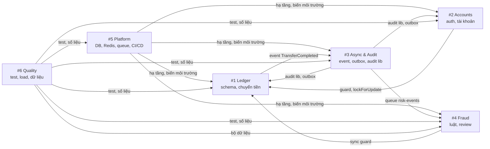

# Team Roles Playbook — Cách làm việc của từng vai

> **Status:** Active · **Owner:** #2 (cùng cả nhóm) · **Verified against code:** n/a · **Cập nhật:** 2026-10-03

> Tài liệu nội bộ, dùng kèm [`10_WEEK_PLAN.md`](10_WEEK_PLAN.md). Mỗi vai có cùng một khung: **sứ mệnh → sở hữu gì → phụ thuộc ai → thỏa thuận với ai → làm gì từng tuần → bằng chứng cần nộp → bẫy hay gặp**.
> Riêng mảng Fraud có hướng dẫn chi tiết ở [`FRAUD_DETECTION_GUIDE.md`](../components/risk/FRAUD_DETECTION_GUIDE.md).

---

## 0. Nhìn chung

### 0.1 Sáu vai trong một bảng

| # | Vai | Sứ mệnh một câu | Code sở hữu | Dẫn dắt | Câu bảo vệ | Cặp đôi |
|---|---|---|---|---|---|---|
| 1 | **Ledger** | Tiền không bao giờ sai | `backend/src/modules/ledger`, `database/` (schema, migration) | P2 | 4, 5 | #4 |
| 2 | **Accounts** | Đúng người, đúng quyền; nhóm chạy đúng lịch | `backend/src/modules/identity`, `accounts` | P1 | 1, 3, 9 | #3 |
| 3 | **Async & Audit** | Không mất sự kiện, không thiếu nhật ký | `backend/src/modules/outbox`, `notification`, `audit`; event contract | Đồng dẫn dắt P2 | 7 | #2 |
| 4 | **Fraud** | Phát hiện gian lận nhanh, giải thích được, đo được | `backend/src/modules/risk` (cả phần API review lẫn phần worker chấm điểm) | P5 | 12 | #1 |
| 5 | **Platform** | Hạ tầng tự động, an toàn, rẻ | `infra/`, `.github/workflows/`, Dockerfile | P3 | 8, 9, 11 | #6 |
| 6 | **Quality** | Chứng minh hệ thống đúng và đo được | Test tích hợp, `load-tests/`, dashboard, generator dữ liệu fraud | P4 | 2, 6, 10 | #5 |

### 0.2 Ai phụ thuộc vào ai



**Đường găng:** #5 (hạ tầng tuần 1–2) → #1 + #2 (chuyển tiền đúng tuần 3) → #3 (sự kiện tuần 4) → #4 (fraud tuần 4–5). Trễ ở đầu chuỗi thì cả chuỗi trễ.

### 0.3 Ma trận trách nhiệm (RACI)

**R** = làm · **A** = chịu trách nhiệm cuối (một người) · **C** = được hỏi ý kiến · **I** = được thông báo

| Hạng mục | #1 | #2 | #3 | #4 | #5 | #6 |
|---|---|---|---|---|---|---|
| P1 — Business & Architecture | R | **A** | R | R | R | R |
| P2 — App, Data & Integration | **A** | R | R | R | C | C |
| P3 — Security & DevOps | C | R | C | I | **A** | R |
| P4 — Production Engineering | R | R | R | R | R | **A** |
| P5 — AI Engineering | C | I | C | **A** | I | R |
| Schema database | **A** | C | C | C | I | I |
| Event contract | C | I | **A** | C | I | I |
| Hạ tầng, chi phí cloud | I | I | I | I | **A** | C |
| Nhất quán kiến trúc, duyệt ADR | **A** | C | C | C | C | C |
| Lịch, board, nộp bài | I | **A** | I | I | I | I |
| 5 demo bắt buộc chạy được | R | R | R | R | R | **A** |

---

## 1. Ledger (#1)

### Sứ mệnh
Mọi đồng tiền vào, ra, di chuyển trong hệ thống đều đúng — kể cả khi hàng trăm request đến cùng lúc, kể cả khi client gửi lại, kể cả khi server chết giữa chừng.

### Sở hữu

| Loại | Nội dung |
|---|---|
| Code | Module `ledger`: nạp tiền (UC-3), chuyển tiền (UC-5), idempotency, sync guard (cùng #4), query lịch sử/trạng thái cung cấp cho #2, job đối soát |
| Database | Toàn bộ schema và migration; review mọi migration của người khác |
| Tài liệu | `docs/03` mục 6.1, 8; ADR-01, 02, 04, 05, 07, 09 |
| Vai phụ | Giữ tài liệu kiến trúc nhất quán; duyệt mọi ADR |

### Thỏa thuận với người khác

| Với | Thỏa thuận | Hạn |
|---|---|---|
| #2 | `AccountsService.lockForUpdate(ids, tx)`, `applyBalanceChange(...)` — ledger gọi, truyền transaction vào | Tuần 2 |
| #2 | `LedgerQueryService` cho lịch sử và trạng thái (UC-6, 7) | Tuần 3 |
| #3 | Hàm ghi outbox và audit nhận transaction hiện tại | Tuần 2 |
| #4 | Vị trí sync guard, danh sách `reject_reason` | Tuần 2 |
| #6 | Cách seed dữ liệu test qua API nạp tiền (không `UPDATE balance` trực tiếp) | Tuần 2 |

### Lịch tuần

| Tuần | Việc | Bàn giao |
|---|---|---|
| 1 | Thiết kế schema bản đầu, migration đầu tiên | ERD + migration chạy được |
| 2 | Chuyển tiền bản thô, nạp tiền; viết ADR-01, 02; dẫn dắt P2 | Nộp P2; nạp → chuyển → xem số dư chạy được |
| 3 | `ON CONFLICT DO NOTHING`, khóa theo thứ tự id, lưu REJECTED, retry deadlock; ADR-04, 05 | AC-5.1 → 5.10 xanh trong CI |
| 4 | Job đối soát (tổng Nợ = tổng Có, tổng số dư = 0) | Đối soát chạy định kỳ, có alarm khi lệch |
| 5 | Sửa lỗi từ demo giữa kỳ | Danh sách nợ kỹ thuật phần ledger trống |
| 6 | Chốt ADR-07, 09; review threat model phần chuyển tiền | ADR ở trạng thái Accepted |
| 7 | Sửa lỗi lộ ra dưới tải: pool, deadlock, kế hoạch truy vấn | p95 chuyển tiền < 300 ms ở 120 RPS |
| 8 | Hỗ trợ giả lập sự cố: kill task giữa transaction | Bằng chứng AC-5.10 trên cloud |
| 9 | Tập trả lời câu 4, 5 | — |

### Bằng chứng cần có cho báo cáo
- Test AC-5.x xanh, chạy trên Postgres thật.
- Kết quả đối soát sau mỗi load test (ảnh chụp / log).
- Bảng so sánh database (ADR-02) và lý do chọn cơ chế khóa (ADR-04).

### Bẫy hay gặp
- Dùng `number` cho tiền → sai số. Luôn `bigint`/string.
- Kiểm tra hạn mức **trước** khi khóa tài khoản → hai lệnh song song cùng lọt.
- ORM tự mở transaction riêng cho từng câu lệnh → mất tính nguyên tử. Dùng một `QueryRunner` cho cả luồng.
- Gọi dịch vụ ngoài (Redis, HTTP) **bên trong** transaction đang giữ khóa → khóa bị giữ lâu, tài khoản nóng nghẽn.
- Pool kết nối không giới hạn → `số task × pool` vượt `max_connections` khi scale.

### Khi duyệt PR của người khác có chạm tới tiền, kiểm tra:
- [ ] Mọi thay đổi số dư đi qua `ledger` trong một transaction
- [ ] Không có `UPDATE` / `DELETE` trên `ledger_entries`, `audit_log`
- [ ] Có test chạy trên Postgres thật

---

## 2. Accounts (#2)

### Sứ mệnh
Đúng người được làm đúng việc trên đúng dữ liệu — và cả nhóm biết mình đang ở đâu so với deadline.

### Sở hữu

| Loại | Nội dung |
|---|---|
| Code | Module `identity` (xác minh JWT, guard vai trò, mốc thu hồi phiên), `accounts` (UC-1, 2, 4, 11), API lịch sử/trạng thái (UC-6, 7) dùng `LedgerQueryService` của #1 |
| API | Chất lượng OpenAPI/Swagger của cả hệ thống: tên endpoint, mã lỗi, ví dụ |
| Tài liệu | `docs/03` mục 6.2, 7, 12 (phần ứng dụng); ADR-06 (phần Cognito); ADR-12 (phần rate limit, thu hồi phiên, cùng #4) |
| Vai phụ | Lịch họp, board công việc, theo dõi deadline, ghép và nộp bài |

### Thỏa thuận với người khác

| Với | Thỏa thuận | Hạn |
|---|---|---|
| #5 | Tên nhóm Cognito (`customer`, `operator`, `auditor`, `admin`), thời gian sống token | Tuần 1 |
| #1 | Interface `lockForUpdate`, `applyBalanceChange`, `LedgerQueryService` | Tuần 2–3 |
| Cả nhóm | Định dạng lỗi `problem+json`, header `X-Correlation-Id` (đã có sẵn trong `backend/src/common`) | Tuần 2 |
| #5 | Key Redis `revoked_at:{userId}`, giới hạn rate limit | Tuần 3 |

### Lịch tuần

| Tuần | Việc | Bàn giao |
|---|---|---|
| 0 | Dựng board, lịch họp, kênh chat, file theo dõi deadline | Board có đủ issue tuần 1–2 |
| 1 | Ghép P1; thiết kế Cognito cùng #5 | Nộp P1 |
| 2 | Onboarding, mở tài khoản, guard vai trò | Đăng ký → mở tài khoản chạy được |
| 3 | Kiểm tra sở hữu ở mọi endpoint, lịch sử, trạng thái, rate limit | AC-5.8 xanh |
| 4 | Khóa / mở khóa, thu hồi phiên ngay | AC-11.1 → 11.3 xanh |
| 5 | Làm sạch OpenAPI; điều phối demo giữa kỳ | Swagger đầy đủ ví dụ; video demo |
| 6 | Threat model STRIDE cùng #5; chốt ADR-06 | Threat model trong P3 |
| 7 | Dashboard cùng #6 | Dashboard có SLI chính |
| 8 | Ghép tài liệu P4 | P4 bản ghép |
| 9 | Điều phối tổng duyệt; tập trả lời câu 1, 3, 9 | Kịch bản buổi bảo vệ |
| 10 | Ghép bản cuối, nộp bài | Nộp |

### Việc PM hằng tuần

| Khi | Việc |
|---|---|
| Thứ Hai | Họp đứng 15 phút: mỗi người nói *xong gì / làm gì / vướng gì*; cập nhật board |
| Thứ Năm | Họp gỡ vướng 15 phút: chỉ bàn việc đang bị chặn |
| Chủ Nhật | Điều phối demo 15–20 phút, ghi hình, lưu link |
| Cuối tuần | Gửi tin nhắn tình trạng tuần vào nhóm (mẫu ở mục 7) |
| Liên tục | Theo dõi deadline P1–P5; nhắc trước hạn 1 tuần và 2 ngày |

### Bẫy hay gặp
- Chỉ kiểm tra vai trò mà quên kiểm tra **sở hữu** → khách A đọc được tài khoản của B.
- Trả `403` cho tài khoản của người khác → lộ rằng tài khoản đó tồn tại. Dùng `404`.
- Tin vào JWT mà không kiểm tra mốc thu hồi → tài khoản bị khóa vẫn dùng được tới khi token hết hạn.
- Quên ghi nhật ký cho lần **bị từ chối** quyền.
- Vai PM chiếm hết thời gian code: giới hạn việc PM ~20% thời gian, việc ghép tài liệu thì mỗi người tự viết phần của mình.

---

## 3. Async & Audit (#3)

### Sứ mệnh
Mọi sự kiện đã xảy ra đều tới được nơi cần tới (ít nhất một lần, xử lý đúng một lần), và mọi thao tác ghi đều để lại dấu vết không xóa được.

### Sở hữu

| Loại | Nội dung |
|---|---|
| Code | Module `outbox` (relay + bảng định tuyến queue; khung consumer `processed_events`, retry, DLQ), `notification`, `audit` (thư viện + API tra cứu UC-8), event contract |
| Tài liệu | `docs/03` mục 10, 11; ADR-03 |
| Vai phụ | Đồng dẫn dắt P2 (phần integration, event model) |

### Thỏa thuận với người khác

| Với | Thỏa thuận | Hạn |
|---|---|---|
| #1, #4 | Event contract `TransferCompleted` (gồm snapshot, đề xuất thêm `sameOwner`) | Tuần 1 |
| Cả nhóm | API thư viện audit: `audit.record(tx, { actor, action, target, correlationId })` | Tuần 2 |
| #5 | Tên queue, DLQ, số lần retry, visibility timeout (khớp `infra/local/elasticmq.conf`) | Tuần 3 |
| #6 | Cách giả lập consumer lỗi để test DLQ | Tuần 4 |

### Lịch tuần

| Tuần | Việc | Bàn giao |
|---|---|---|
| 1 | Event contract, schema `outbox_events`, `processed_events` | Contract được #1, #4 đồng ý |
| 2 | Module `audit` (`AuditService.record`); viết ADR-03; phần integration của P2 | #1, #2 dùng được audit |
| 3 | Relay (`SKIP LOCKED`), gửi theo bảng định tuyến, chạy với ElasticMQ | Chuyển tiền → message vào đúng 2 queue |
| 4 | Khung consumer idempotent, notification, DLQ, API audit (UC-8) | AC-8.1, 8.2 xanh; demo tắt/bật worker |
| 5 | `correlationId` xuyên suốt API → outbox → consumer → audit | Tra được một giao dịch end-to-end |
| 6 | Alarm DLQ > 0, tuổi message cũ nhất | Alarm hoạt động |
| 7 | Tối ưu relay dưới tải: chu kỳ poll, kích thước lô | p95 tới khi có cờ < 5 giây |
| 8 | Giả lập sự cố: consumer lỗi liên tục, message hỏng, notification chết | Bằng chứng trong P4 |
| 9 | Tập trả lời câu 7 | — |

### Bẫy hay gặp
- Gửi message **trước** khi transaction commit → rollback rồi mà sự kiện vẫn đi.
- Xóa message khỏi queue **trước** khi ghi DB xong → sự cố giữa chừng là mất sự kiện.
- Consumer không idempotent → nhận trùng là xử lý trùng.
- Message hỏng định dạng bị retry vô hạn → đưa thẳng vào DLQ.
- Ghi audit **ngoài** transaction nghiệp vụ → có thao tác thành công mà không có nhật ký.
- Dùng một queue cho nhiều consumer → mỗi message chỉ tới một consumer.

---

## 4. Fraud (#4)

### Sứ mệnh
Đưa giao dịch đáng ngờ tới nhân viên trong vài giây, mỗi cảnh báo có lý do rõ ràng, và chứng minh bằng số liệu rằng cách phát hiện thực sự hiệu quả.

### Sở hữu

| Loại | Nội dung |
|---|---|
| Code | Sync guard (cùng #1), module `risk`: 6 luật + tính điểm (worker), review và cấu hình (api), script đánh giá offline; phần ML nếu nhóm chốt |
| Tài liệu | `docs/03` mục 15; ADR-08; ADR-12 (phần bộ đếm); báo cáo P5 |

### Thỏa thuận với người khác

| Với | Thỏa thuận | Hạn |
|---|---|---|
| #3 | Event contract có đủ snapshot | Tuần 1 |
| #1 | Vị trí sync guard, mã lỗi | Tuần 2 |
| #6 | Định dạng CSV, tên kịch bản, cách chia tập, lịch giao dữ liệu | Tuần 2 |
| #5 | Key Redis, DB role riêng cho worker | Tuần 3 |
| Cả nhóm | Mục tiêu recall / số cảnh báo trên 1.000 giao dịch | Tuần 2 |

### Lịch tuần (tóm tắt)

| Tuần | Việc | Bàn giao |
|---|---|---|
| 1–2 | Chốt luật, schema, interface `RiskRule` / `FeatureProvider` | Migration + code khung |
| 3 | Sync guard cùng #1 | AC-5.6, 5.7 xanh |
| 4 | 6 luật + consumer + Redis + dự phòng SQL | Chuyển tiền → cờ tự xuất hiện |
| 5 | API review, đánh giá lần đầu trên tập tune | Số liệu đầu tiên |
| 6 | Chỉnh tham số; (ML: train model, xuất ONNX) | Bảng trước / sau tune |
| 7 | Đóng băng cấu hình, chạy holdout **một lần** | Toàn bộ số liệu P5 |
| 9 | Viết P5, tập câu 12 | Nộp P5 |

### Quy tắc riêng
- **Không xem code generator của #6**; chỉ biết tên kịch bản.
- **Chỉ chạy holdout một lần**, sau khi đã đóng băng cấu hình.

Chi tiết đầy đủ: [`FRAUD_DETECTION_GUIDE.md`](../components/risk/FRAUD_DETECTION_GUIDE.md).

### Bẫy hay gặp
- Đọc số dư hiện tại thay vì snapshot trong sự kiện → R6 sai.
- Tính cửa sổ thời gian theo giờ worker thay vì `occurredAt` → kết quả phụ thuộc lúc xử lý.
- Chỉnh luật nhiều lần trên holdout → kết quả không còn giá trị.
- Báo cáo con số tổng mà không chia theo kịch bản → che mất điểm yếu.

---

## 5. Platform (#5)

### Sứ mệnh
Code merge vào `main` là tự lên cloud, có thể quay lui trong vài phút, không lộ bí mật, và không đốt tiền ngoài ý muốn.

### Sở hữu

| Loại | Nội dung |
|---|---|
| Hạ tầng | `infra/terraform` (VPC, ECR, ECS, RDS, ElastiCache, SQS, Cognito, WAF, KMS, CloudWatch), `infra/local` |
| CI/CD | `.github/workflows`, Dockerfile, quét image, quét secret, OIDC tới AWS |
| Tài khoản | Tài khoản AWS, IAM user cho từng thành viên, MFA, AWS Budget, quyền repo GitHub |
| Tài liệu | `docs/03` mục 12, 13; ADR-06 (Fargate vs EKS), 10, 11; dẫn dắt P3 |

### Thỏa thuận với người khác

| Với | Thỏa thuận | Hạn |
|---|---|---|
| Cả nhóm | Tên biến môi trường (`.env.example` là chuẩn) | Tuần 1 |
| #1, #2 | Endpoint health check `/health/live`, `/health/ready` | Tuần 1 |
| #2 | Nhóm Cognito, thời gian sống token | Tuần 1 |
| #3 | Tên queue, DLQ, cấu hình retry | Tuần 3 |
| #4 | DB role riêng cho worker | Tuần 4 |

### Lịch tuần

| Tuần | Việc | Bàn giao |
|---|---|---|
| 0 | Tài khoản AWS, Budget alarm, IAM user + MFA, Student Pack, bảo vệ nhánh `main` | Mọi người đăng nhập được, có cảnh báo chi phí |
| 1 | Terraform nền (state S3, VPC, ECR, ECS), CI build + push, deploy `/health` | Push code → tự lên cloud |
| 2 | RDS, Secrets Manager, app kết nối DB trên cloud | Luồng đầu tiên chạy trên cloud |
| 3 | ElastiCache, SQS + DLQ; chốt ADR-10 (egress) | Hạ tầng đủ thành phần |
| 4 | IAM quyền tối thiểu cho từng task, DB role | Rà quyền xong |
| 5 | Ổn định môi trường cho demo giữa kỳ | Demo chạy trên cloud |
| 6 | **P3:** cấu hình production, WAF, KMS, quét image, demo rollback, threat model cùng #2 | Nộp P3 |
| 7 | Đo chi phí thật | Bảng chi phí tuần |
| 8 | Bật Multi-AZ, demo RDS failover, so sánh chi phí hai cấu hình | Bằng chứng HA trong P4 |
| 9 | Hỗ trợ tổng duyệt; tập câu 8, 9, 11 | — |
| 10 | Xóa tài nguyên thừa, kiểm tra hóa đơn | Chi phí về ~0 |

### Việc định kỳ

| Khi | Việc |
|---|---|
| Hằng ngày làm việc | Dựng môi trường dev khi cần, `terraform destroy` phần dựng/xóa khi xong |
| Thứ Hai | Báo chi phí tuần trước vào nhóm |
| Khi có người mới / rời | Cấp / thu hồi quyền AWS và GitHub |

### Bẫy hay gặp
- Commit `terraform.tfstate` hoặc `*.tfvars` → lộ bí mật.
- Lỡ tạo NAT Gateway → ~$30+/tháng âm thầm.
- Quên `destroy` cuối tuần → mất cả chục đô.
- Lưu access key AWS trong GitHub Secrets thay vì dùng OIDC.
- Chạy migration lúc app khởi động → nhiều task cùng chạy migration một lúc.
- Một người giữ mọi quyền và mật khẩu → #6 (cặp đôi) phải có quyền dự phòng.

---

## 6. Quality (#6)

### Sứ mệnh
Biến mọi lời hứa trong tài liệu (NFR, tiêu chí chấp nhận) thành **test chạy được và số liệu đo được** — để khi hội đồng hỏi, nhóm trả lời bằng bằng chứng chứ không bằng lời.

### Sở hữu

| Loại | Nội dung |
|---|---|
| Test | Khung Testcontainers, test tích hợp, test đồng thời, test chống trùng, test bảo mật, test sự cố |
| Đo lường | `load-tests/` (k6), dashboard và alarm (cùng #2), định nghĩa SLI/SLO |
| Dữ liệu | Generator dữ liệu fraud; giữ nhãn tập holdout |
| Tài liệu | `docs/03` mục 14, 17; dẫn dắt P4 |

### Thỏa thuận với người khác

| Với | Thỏa thuận | Hạn |
|---|---|---|
| #1 | Seed dữ liệu test qua API nạp tiền; script kiểm tra bất biến | Tuần 2 |
| #4 | Định dạng CSV, tên kịch bản, chia tập, lịch giao — **không chia sẻ code generator** | Tuần 2 |
| Cả nhóm | Tên metric, nhãn log | Tuần 5 |
| #5 | Môi trường và khung giờ chạy load test trên cloud | Tuần 6 |

### Lịch tuần

| Tuần | Việc | Bàn giao |
|---|---|---|
| 1 | Khung test với Testcontainers (Postgres, Valkey) chạy trong CI | Test mẫu xanh trong CI |
| 2 | Thiết kế mô hình hành vi cho generator; khung test API | Bản đầu generator |
| 3 | Test đồng thời (N luồng, tài khoản nóng, kiểm tra bất biến), test request trùng song song | AC-5.4, 5.6, 5.9 xanh |
| 4 | Test tắt/bật worker, DLQ; hoàn thiện generator, **giao tập tune** cho #4 | Demo phục hồi; #4 có dữ liệu |
| 5 | Metric SLI cơ bản; kiểm tra dữ liệu generator có hợp lý | Dashboard bản đầu |
| 6 | Test bảo mật: truy cập chéo, kiểm toán viên chỉ đọc, khách không thấy cờ | AC-8.1, 10.2 xanh |
| 7 | Load test 1× / 5× / 10× + tài khoản nóng + stress; bật/tắt Redis; **giao nhãn holdout**; đo fraud online cùng #4 | Báo cáo load test đầu tiên |
| 8 | **P4:** giả lập sự cố đầy đủ, SLO chính thức, ghép báo cáo | Nộp P4; 5 demo chạy lại được |
| 9 | Chạy lại toàn bộ test và load test; tập câu 2, 6, 10 | Số liệu cuối cùng |

### Bằng chứng cần có cho báo cáo
- Kết quả k6 (p95, p99, error rate) ở từng mốc tải, kèm cấu hình môi trường lúc chạy.
- Kết quả kiểm tra bất biến sau **mỗi** lần load test.
- Ảnh dashboard lúc chạy tải và lúc giả lập sự cố.
- Bảng kịch bản sự cố: làm gì → hệ thống phản ứng ra sao → phục hồi sau bao lâu.

### Bẫy hay gặp
- Mock database trong test đồng thời → test xanh nhưng không chứng minh được gì.
- Chạy load test từ laptop qua mạng nhà → đo cả độ trễ mạng. Chạy từ một máy cùng region.
- Load test xong không kiểm tra bất biến → có thể đang "nhanh" mà tiền sai.
- Bỏ qua test lúc xanh lúc đỏ → thường đó chính là lỗi đồng thời.
- Lỡ cho #4 xem code generator → mất giá trị đánh giá.

---

## 7. Quy tắc chung cho mọi vai

### 7.1 Nhịp tuần

| Ngày | Hoạt động | Thời lượng |
|---|---|---|
| Thứ Hai | Họp đứng: xong gì / làm gì / vướng gì | 15 phút |
| Thứ Năm | Họp gỡ vướng (chỉ việc đang bị chặn) | 15 phút |
| Chủ Nhật | Demo cuối tuần, ghi hình | 15–20 phút |
| Cuối tuần | Mỗi người gửi tình trạng tuần | 2 phút |

### 7.2 Mẫu tin nhắn tình trạng tuần

```
[Tuần N] #x — <Vai>
✅ Xong: ...
🔨 Đang làm: ...
⛔ Vướng: ... (cần ai: #y)
📅 Tuần sau: ...
```

### 7.3 Quy tắc giao tiếp

- **Bị chặn quá một buổi làm việc → báo ngay** trong nhóm, ghi rõ cần ai. Đừng ngồi chờ tới buổi họp.
- **Quyết định ảnh hưởng người khác** (đổi schema, đổi contract, đổi biến môi trường) phải ghi vào issue hoặc ADR, không chỉ chốt trong tin nhắn riêng.
- **Đổi contract đã thống nhất** (event, interface, API) → báo trước cho mọi người dùng nó và cập nhật tài liệu cùng PR.
- **Không im lặng.** Bận đột xuất thì báo sớm, cặp đôi nhận tạm.

### 7.4 Khi vắng mặt — mẫu bàn giao cho cặp đôi

```
Bàn giao từ #x cho #y (từ ngày ... đến ...)
- Đang làm: <issue, nhánh>
- Trạng thái: <đã xong gì, còn gì>
- Cần chú ý: <bẫy, quyết định đang chờ>
- Liên hệ khi cần: <cách liên lạc, giờ có thể trả lời>
```

### 7.5 Mỗi vai tự giữ cho mình

- [ ] README trong thư mục mình sở hữu luôn đúng với code
- [ ] Phần tài liệu `docs/` của mình cập nhật cùng PR thay đổi thiết kế
- [ ] ADR của mình viết ngay khi chốt quyết định
- [ ] Có ít nhất một bằng chứng (test, số liệu, ảnh, video) cho mỗi câu bảo vệ được giao
- [ ] Cặp đôi hiểu đủ phần của mình để thay thế khi cần
